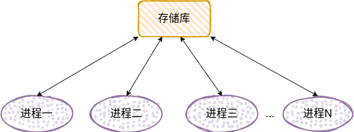
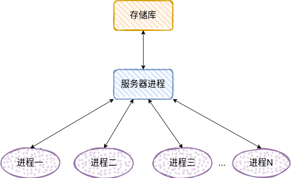

这里的集中式架构，并不意味着将所有的逻辑都融合到一个进程里面，而是引入了"存储库"的概念。

集中式存储库架构没有核心进程的概念，或者说，这个系统中的所有进程都依赖于一个中心过程或者数据结构，该过程(或结构)在系统中担当控制或信息的枢纽(hub)。

在大规模系统中，任务可能分配给若干个枢纽进程(hub process)，当这些进程需要协同访问共享资源的信息或资源时，就会用到集中式存储库架构。

当集中式存储库和访问它的应用程序作为独立的进程运行时，这个架构模型通常也称为客户端-服务器模型。

许多集中式存储库方案都将关系数据库作为其数据结构的容器来实现。客户端可以通过数据库的结构化查询语言(SQL)访问数据库，或通过一个单独服务器进程所提供的高层的、面向任务的服务来访问。这两种方式分别称为两层架构和三层架构。

某些情况下，一个单独的中间服务器会被用做事务监听器，具有集中式的事务收集点，通常提供弹性、冗余、负载分配，以及信息排列等功能。

即使没有数据持久化(由数据库提供)的需求，也会经常用到集中式存储库。在这种情况下，存储库通常作为大量不同代码元素的通信枢纽(communication hub)。通过访问存储库，不相关的代码块之间可以传递信息，却不需要对程序进行组织来适应数据流。这样的存储库也叫做黑板系统(blackboard system)。它通常将松散的数据存储为键/值对，使用公共键命名约定在通信代码间交换信息(比如利用 redis 作为公共缓存)。

若进程位于不同的系统进程当中，则常会用中心服务器及请求-应答(request-reply)机制来对黑板系统进行远程访问。
