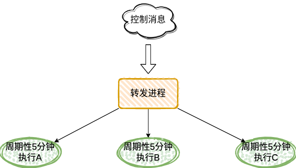
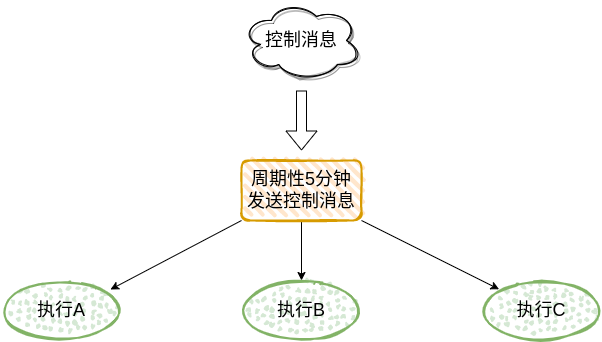

拥有多个可选的同级子系统(peer subsystem)的架构，可以按照分层结构进行组织。在这种架构中，每个独立的层为其上层提供一个定义明确的接口，并使用一个不同但标准的接口与其下层进行通信。在这样一个框架中，每一层可以使用不同的技术或方式来实现，却不会影响整体的架构完整性。

分层架构通常通过堆叠(stack)具有标准化接口的软件组件来实现。在某种意义上，每一层为其上一层提供一个虚拟接口。

在`逻辑松散`的系统架构中，可以将具体的功能分散到每一层的子系统下，在一定程度上实现独立自治。不过在逻辑比较统一的情况下，将逻辑下放到下层，在实现上容易造成重复及不统一的问题，不利于维护。更有甚至，当逻辑复杂时，对整个系统的鲁棒性及处理同步将造成挑战，而要考虑处理这些问题，将不得不花费巨大的精力。

例如像下面这样的架构:

转发进程在收到控制消息后，只是单纯的将消息发送给下游所有子系统。每个子系统在收到这个消息后，执行同样的逻辑(周期性地执行相应地动作)。

这里就会产生几个问题。

一个是每个子系统虽然执行的逻辑是相同的，但实现的方式却可能不同。如果后期在修改逻辑时，每个系统都要维护一份修改。即使实现方式相同，也要维护一份同样的拷贝。

另一个是当其中一个子系统因某些原因退出重启时，因为没有再次收到控制消息，所以不会继续相应的动作，造成处理不同步问题。

可以尝试将逻辑上移，比如在上面的架构系统中，可以将周期性控制的逻辑放到转发进程中实现。

这种方式很适合用于逻辑统一或简单的系统中。
