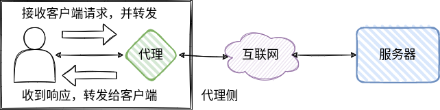
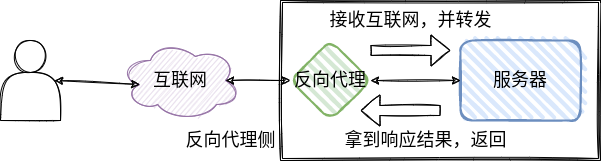

### 代理

代理会隐藏客户端的真实信息(IP、端口)，以自己的身份代替客户端在互联网上发起请求，并将返回结果转发给客户端。

代理可以保护客户端、代理可以帮助客户端访问自己无法到达的网络。

客户端需要将特定请求或全部请求主动配置为请求代理服务器。

### 反向代理

反向代理会隐藏服务端真实信息(IP、端口)，把自己作为服务端暴露在互联网中，通过把请求转发给真实服务器处理，拿到结果后再返回，来对外提供服务。

反向代理客户有效保护服务端，隔离网络环境，并进行多个真实服务器的负载均衡。

服务端需要将自己配置到反向代理中，然后将反向代理暴露在公网。

