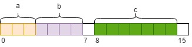
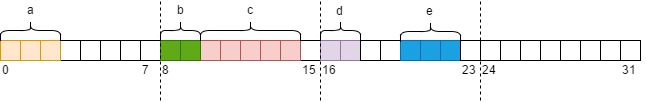

## 位域

类和结构可包含比整型类型占用更少存储空间的成员。 这些成员被指定为位域。 位字段 成员声明符 的语法如下所示:
```
    声明符: 常数表达式
```
声明符是在程序中访问该成员时所依据的名称。它必须是整型类型(包括枚举类型)。常数表达式指定成员成员在结构中所占用的位数。


声明符可以定义为有符号符(signed)，也可以定义为无符号型(unsigned)，但一般情况下一般定义为无符号型，这也是通常使用到的情况。

```c
    typedef struct _bit_struct {
        unsigned char a:3;
        unsigned char b:4;
        unsigned char c:7;
    } bit_struct;
```
位域结构体 `bit_struct` 占用 2 两个字节。其中 a 占用 3 位，最大取值 7 = 2^3 - 1; b 占用 4 位，最大取值 15 = 2^4 - 1; c 占用 7 位，最大取值 127 = 2^7 - 1。

<h1 align="center">
    
</h1>

如对于  bit_struct，位域 a 和 b 共用一个字节，第一个字符虽然最后还有一个空位，但无法存放 c 域，所以 c 单独使用一个字节。整个位域结构体共占用两个字节。

[最大取值测试](t/01_bit_max_value.cpp)


## 使用说明

```c
    typedef struct _bit_st {
        int a:3;    // 第一个字节的 0~2 位
        int  :0;    // 空域。下一个位域 b 将会从下一个字节开始，位 3~7 为全 0。
        int b:2;    // 下一个字节也就是第二个字节的 0~1 位
        int c:5;    // 第二个字节紧接 b 之后的 2~6 位
        int d:2;    // d 占用第三个字节的 0~1 位，因为前面一个字节只剩下一位不能存放 d，所以另起一个字节存放
        int  :2;    // d 域后的两个位 2~3 不能使用
        int e:3;    // 存放在第三个字节的第 4~6 位
    } bit_st;
```

<h1 align="center">
    
</h1>

1. 位域必须存储在同一个类型中，不能跨类型。

2. 位域的长度不能超过所定义类型的长度。
   ```c
    struct {
        int a: 33;
    };
   ```
   int 类型共 32 位，但这里却使用了 33 个位，是不允许的。

3. 如果一个定义类型单元里所剩空间无法存放下一个域，则下一个域应该从下一单元开始存放。

   bit_st 结构中位域 c 后的当前内存单元只剩 1 个位，但紧跟其后的位域元素 d 却要占用 2 个位，所以 d 在下一个存储单元中存放。

4. 如果位域的位域长度为 0 表示是个空域，同时下一个域应当从下一个字节单元开始存放。

   注意，是从下一个字节单元存放，而不是下一个类型。

5. 使用无名的位域来作为填充和调整位置，切记该位域是不能被使用的。

6. 位域的本质上就是一种结构体类型，不同的是其成员是按二进制位来分配的。


## 是否线程安全

非线程安全

[粗糙测试](t/01_bit_multi_thread.cpp)
