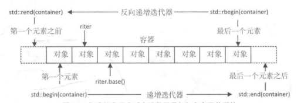

迭代器适配器是一个类模板，既然是适配器，那么它的底部仍然是一个标准迭代器，只是在此基础上提供了一些特殊的行为。

适配器类模板定义了三种不同的迭代器:
- 反向迭代器(reverse iterators, 对应模板类为 reverse_iterator)
- 插入迭代器(insert iterators, 对应模板类为 insert_iterator)
- 移动迭代器(move iterators, 对应模板类为 move_iterator)


### 反向迭代器

基于 5 种标准迭代器的类型特征，可以提供双向或随机迭代器版本的反向迭代器。

容器的成员函数 rbegin() 和 rend()，分别返回一个指向最后一个元素的反向迭代器，以及一个指向最开始元素的前一个位置的反向迭代器。

下图显示了容器的反向迭代器和标准迭代器的关系:

<h1 align="center">
    
</h1>

从图中可以看出，反向迭代器是基于标准迭代器实现的。每个反向迭代器对象都有一个成员函数base()，用于返回对应的标准迭代器。需要注意的是，这个base()返回的迭代器总是指向反向迭代器指向的下一个位置。

[反向迭代器测试](04_reverse_iterator/reverse_iterator.cpp)


### 插入迭代器

插入迭代器通常用于在容器的任何位置添加新的元素，但其不能被运用到标准数组和 std::array<T,N> 这样的容器上，因为它们的元素个数是固定的。

一共有 3 种插入迭代器，如下:

- 后插入迭代器(back_insert_iterator): 本质上调用成员函数 push_back() 将一个新的元素添加到容器的尾部。也就是说，如果容器没有定义 push_back() 函数，那么后向插入迭代器无法使用。

- 前插入迭代器(front_insert_iterator): 本质上通过调用成员函数 push_front() 将一个新的元素添加到容器的头部。如果容器没有定义 push_front() 函数，那么前向插入迭代器无法使用。

- 普通插入迭代器(insert_iterator): 向任何有 insert() 函数的容器中插入一个新的元素。

使用示例如下:
```c++
    std::vector<int> foo{1, 2, 3, 4, 5}, bar{6, 7, 8, 9, 10};
    std::back_insert_iterator<std::vector<int>> back_it(foo);

    std::copy(bar.begin(), bar.end(), back_it); // foo: 1 2 3 4 5 6 7 8 9 10
```

看上去书写起来有些麻烦呢...

类似于全局首尾迭代器获取函数 begin 和 end 一样，C++ 也提供了适用于插入迭代器的全局函数，分别是 std::back_inserter(), std::front_inserter() 和 std::inserter() 。

有了这些，让使用插入迭代器变得简单。


### 移动迭代器

先写个示例吧:
```c++
    std::vector<std::string> words_copy{ std::make_move_iterator(std::begin(words)),
                                         std::make_move_iterator(std::end(words)) };
```
执行过后，words 中的元素被移动到 words_copy 中，此时，words 数组中的字符串现在都是空字符串。
