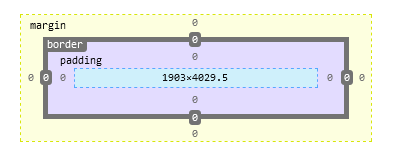

盒子模型是由 `content`(内容)、`padding`(内边距)、`border`(边框)和`margin`(外边距)四个属性组成的。此外，在盒子模型中，还有宽度`width`和高度`height`两大辅助性属性。

### content

内容区是 CSS 盒子模型的中心，它呈现了盒子的主要信息内容，这些内容可以是文本、图片等多种类型。内容区是盒子模型必备的组成部分，其他的 3 个部分是可选的。

内容区有 3 个属性: `width`、`height`和`overflow`。使用 width 和 height 属性可以指定盒子内容区的高度和宽度。

注意，width 和 height 这两个属性是针对内容区而言，并不包括 padding 部分。

当内容信息太多时，超出内容区所占范围时，可以使用 `overflow` 溢出属性来指定处理方法。

### padding

内边距，指的是内容区和边框之间的空间，可以被看作是内容区的背景区域。

关于内边距的属性有 5 种，即 `padding-top`、`padding-bottom`、`padding-left`、`padding-right`以及综合了以上 4 个方向的简洁内边距属性 `padding`。使用这 5 种属性可以指定内容区域各方向边框之间的距离。

### border

在 CSS 盒子模型中，边框属性有 `border-width`、`border-style`、`border-color` 以及综合了 3 类属性的快捷边框属性 `border`。它们分别指定了边框的宽度、类型和颜色。

### margin

外边距，指的是两个盒子之间的距离，它可能是子元素与父元素之间的距离，也可能是兄弟元素之间的距离。外边距使得元素之间不必紧凑地连接在一起，是 CSS 布局的一个重要手段。

外边距的属性也有 5 种，即 `margin-top`、`margin-bottom`、`margin-left`、`margin-right`以及综合了以上 4 个方向的简洁内边距属性 `margin`。

同时，CSS 允许给外边距属性指定负数值，当指定负外边距值时，整个盒子将向指定负值的相反方向移动，以此可以产生盒子的重叠效果。

[盒子示例](t/01_box.html)
