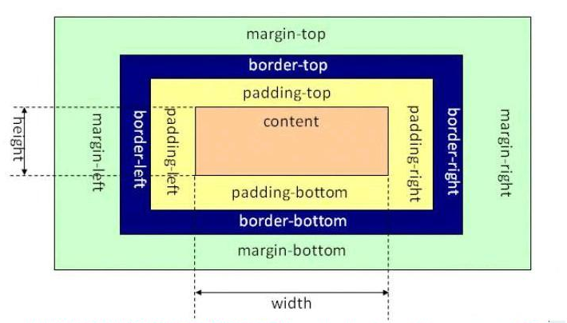

[CSS padding margin border属性详解](https://www.cnblogs.com/linjiqin/p/3556497.html)

在 CSS 盒子模型理论中，页面的所有元素都可以看成一个盒子，并且占据着一定的页面空间。一个盒子的具体结构如下:



一个页面由很多这样的盒子组成，这些盒子之间会相互影响，因此掌握盒子模型需要从两个方面来理解: 一是理解单独一个盒子的内部结构(往往是padding)，二是理解多个盒子之间的相互关系(往往是margin)。

每个元素都看成一个盒子，盒子模型是由 `content`(内容)、`padding`(内边距)、`border`(边框)和`margin`(外边距)四个属性组成的。此外，在盒子模型中，还有宽度`width`和高度`height`两大辅助性属性。

| 属性 | 说明 |
|:----|:------|
| content | 内容，可以是文本或图片 |
| padding | 内边距，用于定义内容与边框之间的距离 |
| margin | 外边距，用于定义当前元素与其他元素之间的距离 |
| border | 边框，用于定义元素的边框 |


### content

内容区是 CSS 盒子模型的中心，它呈现了盒子的主要信息内容，这些内容可以是文本、图片等多种类型。内容区是盒子模型必备的组成部分，其他的 3 个部分是可选的。

内容区有 3 个属性: `width`、`height`和`overflow`。使用 width 和 height 属性可以指定盒子内容区的高度和宽度。

注意，width 和 height 这两个属性是针对内容区而言，并不包括 padding 部分。

当内容信息太多时，超出内容区所占范围时，可以使用 `overflow` 溢出属性来指定处理方法。
```css
    #main
    {
        display:inline-block;
    }
    .div1
    {
        width:300px;
        height:100px;
        overflow: auto;
        font-size:15px;
        text-indent:30px;
    }
```


### padding

内边距，指的是内容区和边框之间的空间，可以被看作是内容区的背景区域。

关于内边距的属性有 5 种，即 `padding-top`、`padding-bottom`、`padding-left`、`padding-right`以及综合了以上 4 个方向的简洁内边距属性 `padding`。使用这 5 种属性可以指定内容区域各方向边框之间的距离。

`padding` 写法有四种，不过常用只有 3 种:
```csss
    padding: 像素值;
    padding: 像素值1 像素值2;
    padding: 像素值1 像素值2 像素值3 像素值4;
```
* `padding: 20px;` 表示四个方向的内边距都是 20px 。
* `padding: 20px 40px;` 表示 padding-top 和 padding-bottom 为 20px，padding-right 和 padding-left 为 40px 。
* `padding: 20px 40px 60px 80px;` 从 padding-top 开始按顺序针旋转的 4 个方向上的内边距属性。

```css
    #main
    {
        padding:15px;
        display:inline-block;
    }
    .div1
    {
        width:300px;
        height:100px;
        padding:10px;
    }
```

### margin

外边距，指的是两个盒子之间的距离，它可能是子元素与父元素之间的距离，也可能是兄弟元素之间的距离。外边距使得元素之间不必紧凑地连接在一起，是 CSS 布局的一个重要手段。

外边距的属性也有 5 种，即 `margin-top`、`margin-bottom`、`margin-left`、`margin-right`以及综合了以上 4 个方向的简洁内边距属性 `margin`。

同时，CSS 允许给外边距属性指定负数值，当指定负外边距值时，整个盒子将向指定负值的相反方向移动，以此可以产生盒子的重叠效果。

当只有父元素时，该元素设置的 margin 就是相对于父元素之间的距离。

[父-子示例](t/01_margin_1.html)

当既有父元素，也有兄弟元素时，该元素会先看看四个方向有没有兄弟元素存在。如果该方向有兄弟元素，则这个方向的 margin 就是相对于兄弟元素而言。如果该方向没有兄弟元素，则这个方向的 margin 就是相对于父元素而言。

[兄弟示例](t/01_margin_2.html)

与 padding 一样，`margin` 写法也有四种，不过常用也只有 3 种，其解释与 padding 相同。


### border

在 CSS 盒子模型中，边框属性有 `border-width`、`border-style`、`border-color` 以及综合了 3 类属性的快捷边框属性 `border`。它们分别指定了边框的宽度、类型和颜色。

```css
    #main
    {
        border:10px groove red;
        display:inline-block;
    }
    .div1
    {
        width:300px;
        height:100px;
        border:5px solid green;
    }
```
