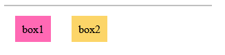

了解 "正常文档流" 和 "脱离文档流"，是学习浮动布局和定位布局的理论前提。


### 文档流

简单来说，文档流就是指元素在页面中出现的先后顺序。

正常文档流，又称为"普通文档流"，是将一个页面从上到下分为一行一行的，其中块元素独占一行，相邻行内元素在每一行中按照从左到右排列直到该行排满。也就是说，正常文档流指的就是缺省情况下页面元素的布局情况。

脱离文档流，指的是脱离正常文档流。正常文档流就是没有使用浮动或者定位去改变的缺省情况下的 HTML 文档结构。换句话说，如果想要改变正常文档流，可以使用两种方法: `浮动`和`定位`。

页面弹框是 `脱离文档流` 的一种应用。

### 浮动

通过设置 `float` 属性让元素向左或向右浮动，以便让周围的元素或文本环绕着这个元素。
```css
    float: 取值;
```

float 属性取值只有 2 个:

| 属性值  | 说明  |
|:-------|:------|
| left   | 元素向左浮动 |
| right  | 元素向右浮动 |


[未设置浮动示例](02_float_non.html)

[只设置一处浮动示例](02_float_one.html)


关于设置一处浮动示例，由于 box1 设置了 float 脱离了文档流，父元素的内容区实际上是 box2 撑起来的。

[设置所有浮动示例](02_float_all.html)



关于设置所有浮动示例，上面有一条线，下面有两个 box。因为两个 box 全部都设置了 float 属性，脱离了文档流，所以两个 box 都不再占据父元素的内容区部分，也就无法撑起整个内容区。而那条线其实是父元素设置的边框大小，为 1 个像素。

### 清除浮动

浮动会影响周围元素，并且还会引发很多意想不到的问题。在 CSS 中，可以使用 `clear` 属性来清除浮动带来的影响。
```css
    clear: 属性值;
```

`clear` 属性值及意义如下:

| 属性值  | 意义 |
|:-------|:-----|
| left   | 清除左浮动 |
| right  | 清除右浮动 |
| both   | 左右浮动一起清除 |

清除浮动的使用方式是在浮动元素后面再增加一个空元素，然后为这个空元素定义 `clear: both;` 来清除浮动。说白了，就是前面小弟干了太多坏事，后面需要大哥出面解决。

在实际开发中，使用浮动之后如果发现有什么不对劲的地方，首先检查有没有清除浮动。

[示例](t/02_clear.html)
