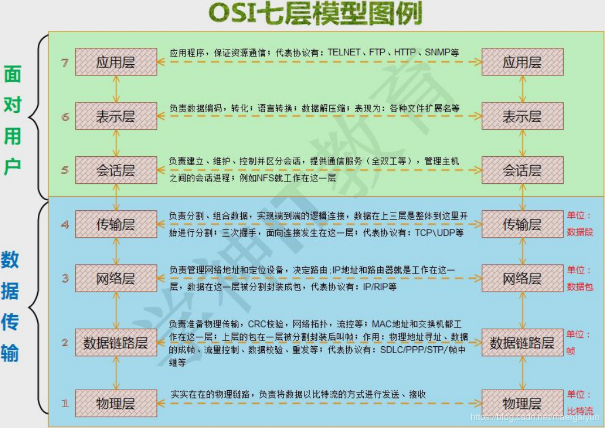
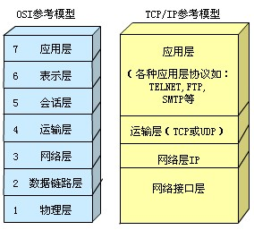

### OSI 七层模型

OSI(pen System Interconnection)开放系统互连参考模型是国际标准化组织(ISO)制定的一个用于计算机或通信系统间互联的标准体系。

<h1 align="center"></h1>

| 分层 |   名字   |     功能                        |  工作在该层的设备                           |
|:-----|:--------|:-------------------------------|:-------------------------------------------|
|  7   |  应用层  | 用户层通信                      |  一些用户层软件                             |
|  6   |  表示层  | 编解码、加解密、压缩与解压缩    | 一些工具库，如 asn1, json, openssl, zlib 等 |
|  5   |  会话层  | 建立、维护、控制会话            | 一些工具库，如 libcurl 等                   |
|  4   |  传输层  | 分割、组合数据，实现端到端连接；三次握手 |   防火墙软件，如 iptables          |
|  3   |  网络层  | 负责网络地址和定位，路由        |  三层交换机，路由器                         |
|  2   |  链路层  | 物理传输，CRC校验，平面网络拓扑，流控 | 二层交换机，网卡                      |
|  1   |  物理层  | 物理链路                        | 集线器                                      |

分层的优点
- 把复杂的网络划分成更容易管理的层(**将整个庞大而复杂的问题划分为若干个容易处理的小问题**)；
- 独立完成各自该做的任务，互不影响，分工明确，上层不关心下层具体细节，**分层有益于网络排错功能与代表设备**。

### TCP/IP 四层模型

OSI 七层模型是理想模型，一般用于理论研究，它的分层有些冗余。实际应用选择 TCP/IP 的四层模型。实际使用时，OSI 模型中的表示层和会话层一般会包含到应用层中。

<h1 align="center"></h1>

### 常用的网络协议

|  名称  |  作用      |
|:-------|:----------|
|  ARP   | 地址解析协议，将 IP 地址解析成 MAC 地址 |
|  DNS   | 域名解析协议 |
|  SNMP  | 网络管理协议 |
|  DHCP  | 动态主机配置协议，在 TCP/IP 网络上使客户机获得网络配置信息的协议 |
|  FTP   | 文件传输协议 |
|  HTTP  | 超文本传输协议 |
|  HTTPS | HTTP 安全协议，HTTP 握手连接时添加身份认证以及数据传输时的加解密 |
|  ICMP  | Internet 控制报文协议，对网络状态进行检测 |
|  SMTP  | 简单邮件传输协议 |
|  TELNET| 虚拟终端协议 |
|  TFTP  | 文件传输协议 |
|  UDP   | 用户数据报协议，定义在互连网络环境中提供包交换的计算机通信的协议 |
|  TCP   | 传输控制协议，定义面向连接的、端到端的、可靠的、基于字节流的传输层通信协议 |

### 常见的网络接口

| 名称      | 说明                                  |
|:----------|:-------------------------------------|
| eth0~eth4 | 以太网接口(linux6)                    |
| wlan0     | 无线接口                              |
| eno177776 | 以太网接口(linux7)                    |
| ens33     | 以太网接口(linux7)                    |
| band0 team0 | 网卡绑定接口                        |
| virbr0    | 虚拟交换机桥接接口                    |
| br0       | 虚拟网桥接口                          |
| lo        | 本地回环接口                          |
| vnet      | KVM 虚拟网卡接口                      |

### 网络管理常用命令示例

- 查看网卡连接情况
  ```s
    nmcli device status
  ```
  打印如下:
  ```s
    DEVICE  TYPE      STATE         CONNECTION 
    ens33   ethernet  connected     ens33      
    ens38   ethernet  disconnected  --         
    ens39   ethernet  disconnected  --         
    lo      loopback  unmanaged     --         
  ```
  其他示例:
  ```s
    nmcli connection reload         # 重载网卡
    nmcli connection down ens33     # down 掉网卡 ens33
    nmcli connection up ens33       # 启用网卡 ens33
  ```

- 查看 IP 地址信息
  ```s
    ifconfig
    ifconfig ens33 down             # down 掉网卡 ens33
    ifconfig ens33 up               # 启用网卡 ens33
  ```

- 查看系统中网络连接状态
  ```s
    netstat -tlunp
  ```

- 查看路由信息
  ```s
    route -n
  ```

- 检查设备硬件地址；测试一个 ip 地址是否在网络上已经被使用
  ```s
    arping -I ens33 192.168.43.235
  ```

### 相关文件

- 端口对应的服务配置文件
  ```s
    /etc/services
  ```

- 网卡配置文件(以 CentOS 系列为例)
  ```s
    /etc/sysconfig/network-scripts/ifcfg-ens33
  ```

- DNS 配置文件
  ```s
    /etc/resolv.conf
  ```
  查看 DNS 解析顺序:
  ```s
    cat /etc/nsswitch.conf
  ```

- 优化 TCP 连接，快速释放 TCP 连接(Linux 下默认 MSL 等待时间是60秒)
  ```s
  # cat /proc/sys/net/ipv4/tcp_fin_timeout
  60
  # echo 30 > /proc/sys/net/ipv4/tcp_fin_timeout
  # cat /proc/sys/net/ipv4/tcp_fin_timeout
  30
  ```
