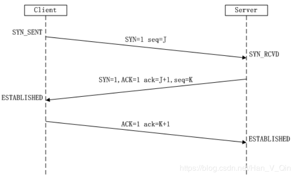

## 认识 TCP 协议
- TCP 的主要特性
    + 连接的建立与终止；
    + 可靠(确认)的数据包传送；
    + 顺序数据包传送；
    + 防止主机数据溢出的流量控制；
    + 对丢失或重复数据包错误的纠正；
    + 给定主机多个应用程序之间的多路分解；
- TCP 是 IP 的一个客户机，IP 为 TCP 应用程序发送和接收信息提供工具。IP 为 TCP 应用程序提供
  的主要服务包括:
    + 寻址，用于识别不同网络上的源结点和目的结点；
    + 通过不同网络路由数据报的能力；
    + 数据报分段及后续的重装能力，以便通过小型数据包网络进行数据传送；
    + 基于协议号的多路分解能力；
    + 生存期(TTL)，用于限制数据报在因特网上保留的时间；
    + 服务类型(ToS)，表明路由器应该提供的服务质量(QoS)
- TCP 报文格式
    + TCP 应用程序在两个应用进程之间传送数据的传输单元称为报文段。TCP 应用程序收集应用层递
      交的数据后，将其组成报文段。一个 TCP 报文段由 TCP 报头和数据两部分组成。
      ```shell
        |<-----------------------------20~65535B------------------------------->|
        |<-20~60B->|                                                            |
        +----------+------------------------------------------------------------+
        |   报头   |                          数据                              |
        +----------+------------------------------------------------------------+
      ```
    + TCP 报头内容如下:
      ```shell
        +---------------------------------+---------------------------------+
        |            源端口号             |             目的端口号          |
        +---------------------------------+---------------------------------+
        |                               序列号                              |
        +-------------------------------------------------------------------+
        |                               确认号                              |
        +--------+------------+-+-+-+-+-+-+---------------------------------+
        |报头长度|  保留长度  |U|A|P|R|S|F|           窗口大小              |
        +--------+------------+-+-+-+-+-+-+---------------------------------+
        |            校验和               |           紧急指针              |
        +---------------------------------+---------------------------------+
        |                            选项和填充                             |
        +-------------------------------------------------------------------+
      ```
      说明:
        + 源端口号:
          占用 16 比特，标识主机上发起传送的应用程序；
        + 目的端口号字段:
          占用 16 比特，标识主机上传送要到达的应用程序；
        + 序列号字段:
          占用 32 比特，标识报文段内第一个数据字节的序列号(存在同步序列号时除外)。存在同步序
          列号(SYN)时，该序列号字段为初始序列号(ISN)，因此第一个数据字节的序列号是 ISN+1。
        + 确认号字段:
          占用 32 比特，仅用于设置了 ACK 控制位的情况。ACK 号是数据段接送者预期接收的下一个序
          列号。例如，如果主机接收的序列号为 101，它将回送一个确认号设为 102 的段，表示希望接
          着接收序列号为 102 的段。不过，只有当标志位中的ACK标志为1时该确认序列号的字段才有效，
          该字段主要用来解决丢包的问题。
    + 报头长度字段:
      占用 4 比特，用来说明 TCP 报头共有多少个字节，1 个单位表示 4 个字节的长度。
    + 保留字段:
      占用 6 比特，通常设置为 0。
    + 控制位字段:
      占用 6 比特，定义了 6 种不同的控制位或标志，在同一时间可设置一位或多位标志。
        + URG - 值为 1 时表示紧急指针有效。告诉系统此报文段需要紧急处理；
        + ACK - 值为 1 时表示确认号有效，值为 0 时表示确认号无效。TCP 规定在连接建立后传送的所
          有报文段都必须把 ACK 置 1；
        + PSH - 值为 1 时表示有数据传输，当接收方收到 PSH=1 的报文段后，会立即将数据交付给应用
          程序，而不等到缓冲区满后再提交。一些交互式应用需要这样的功能，降低命令的响应时间；
        + RST - 值为 1 时表示 TCP 连接存在严重的错误，需要重新进行连接；
        + SYN - 值为 1 时表示这是一个连接请求或连接接受报文。当 SYN=1,ACK=0 时，表示当前报文段
          是一个连接请求报文，当 SYN=1,ACK=1 时，表示当前报文段是一个同意建立连接的应答报文；
        + FIN - 值为 1 时表示是一个释放连接的请求报文；
    + 窗口大小字段:
      占用 16 比特，用于端到端的流控制。该字段表明接收者可接收的字节数，从确认字段中的 1 开始
      。该字段具有双向性，也就是说，发送方和接收方都可以设置该字段的值。因此，连接的两端分别都
      能够控制另一端的数据流。
    + 校验和字段:
      占用 16 比特，证明分段传送无误。设备对 TCP 报头和应用程序数据的校验和进行计算。对错误分
      段丢弃处理。
    + 紧急指针字段:
      占用 16 比特，只在设置了 URG 位时才有效。此值是序列号的一个正偏移，它表示非紧急数据的开
      始，也就是紧急数据的结束。
    + 选项字段:
      占用 8 的倍数位比特，表示 TCP 选项长度可变的字段。
    + 填充项字段:
      附加 0 位，保证报头以 32 位结束。
- 序列号
  + 在 TCP 报文段中，没有关于报文段编号的字段，但是有序列号和确认号两个字段。这两个字段涉及字
    节的编号而不是报文段的编号。
  + 所谓字节编号，是指 TCP 应用程序把一个连接中发送的所有数据字节都编上号。当 TCP 应用程序从
    进程接收数据字节时，就把它们存储在发送缓存中，并为每个输出的数据字节分配一个唯一的序列号。
    初始序列号的选择是随机的。
  + 当数据字节都被编号之后，TCP 应用程序就给每一个报文段指派一个序号。每个报文段的序号就是这
    个报文段中的第一个数据字节的序号。
  + TCP 并不会对每个字节的序列号进行确信，而是采用了一种累积式确认机制。TCP 接收方向发送方发
    送一个带有序列号为 X 的确认(ACK)段，表示目的主机已接收到截至X(但不含X)的所有字节。
  + TCP 是一种全双工的字节流传输服务，其连接的每一方都有一个自己的序列号组。
- TCP 选项
    + TCP 通过最大报文段长度(MSS)选项来允许接收方指出自己愿意接受的最大报文段长度。可以规定一
      个 MSS 来限制报文段的大小，使之能装入缓冲区中。
    + 当两台计算机连接到同一个物理网络时，TCP 通常会出一个最大的报文段长度，从而使形成的 IP   
      数据报能够与网络的 MTU 相适应。    如果连接的两端不在同一个物理网络上，它们可尝试找到两者之间路径沿线上的最小 MTU，或选择
      把 536 作为最大报文长度。
    + 为适应更大的窗口大小(如卫星信道)，提议在 TCP 中使用窗口扩大选项。
    + TCP 时间戳选项是为了帮助 TCP 计算下层网络上的时延，也用于处理 TCP 序号超过 2^32 的情况，
      后者称为防止序号绕回。
    + 发送方在发送一个分组时把当前时钟的时间值放入时间戳字段；接收方在返回这个分组的确认前，把
      时间戳字段值复制到回送回答字段。因此，在确认到达后，发送方可以准确地计算出自报文段发送以
      来总共经历了多长时间。

## 连接建立与数据传送
- 连接建立过程示意
    <h1 align="center">
        
    </h1>
- TCP 的连接建立也称为"三次握手"。
    + **第一次握手**: 建立连接时，客户端发送 SYN 包(SYN=J)到服务器，并进入 SYN_SENT 状态，等待服
      务器确认。
        + 主动方向被动方发送一个初始同步(SYN)数据包并设置一个重传计时器，然后等待计时器达到指定时
          刻或接收到来自远程 socket 的确认(ACK)数据包。
        + SYN 数据包由一个空的 TCP 段(该段无数据，只有报头)和设置在 TCP 报头中的 SYN 位构成。
    + **第二次握手**: 服务器收到 SYN 包，必须确认客户的SYN(ACK=J+1)，同时自己也发送一个SYN包
      (SYN=k)，即 SYN+ACK 包，此时服务器进入 SYN_RECV 状态。
        + 当 SYN 数据包到达线路的被动方时，被动方 TCP 进程验证段的 SYN 标志位是否存在，以及校验和
          是否正确。如果数据包是一个有效的连接请求，TCP 进程就可从 IP 消息中提取本地及远程 IP 地
          址和端口号，并将输入缓冲器的指针指向初始 SYN 数据包，从而使接收方在等待下一个数据段的过
          程中一直保留该位置。
        + 被动方记录来自主动端的初始序列号(ISN)，并向主动方回送一个 SYN-ACK 数据包。它也设置一个
          重传计时器，并等待计时器达到指定时刻或接收到一个 ACK 数据包。
    + **第三次握手**: 客户端收到服务器的 SYN+ACK 包，向服务器发送确认包ACK(ACK=K+1），此包发送完
      毕，客户端和服务器进入 ESTABLISHED (TCP连接成功)状态，完成三次握手。
        + 发起连接的主动方收到来自被动方的 SYN-ACK 段时，就回送一个 ACK 数据包，确认收到了 SYN-ACK
          段。被动方接收到此 ACK 段时，连接即被建立。
- 连接建立时的重传机制
    + 如果在发起连接的 TCP 进程收到 SYN-ACK 数据包之前，重传计时器就到达了指定时刻，TCP 进程将重传
      初始 SYN 数据包并重置重传计时器。同样，如果被动方未在指定时刻收到对其 SYN-ACK 段的确认(ACK)，
      它也会重新发送 SYN-ACK 数据包并重置计时器。
    + 当重传到达了指定次数（由用户设置）却仍未获得成功时，TCP 进程向对端发送一条消息表示放弃该连接，
      并释放资源，退出。
    + 数据传送阶段的重传机制也大致如此。
- 在 TCP 连接建立阶段可提供以下 4 种主要功能：
    + 通过交换连接请求和响应数据包，使连接的每一端都能确认另一端的存在；
    + 为交换提供了可选参数，如数据包大小、窗口大小和服务类型等；
    + 分配传送资源，如缓冲器空间；
    + 在连接表中建立条目
- 如何确定重传计时器时间 - 平滑往返时间
    + 重传计时器基于"平滑往返时间"进行动态设置。当一个数据包被发送时，发送 TCP 进程记录下传送时间和
      数据包序列号。发送 TCP 进程接收到该序列号的 ACK 时，再记录下接收的时间，然后利用其时间差计算平
      滑往返时间。 TCP 进程将该平均往返时间作为加权平均值，并用新的平滑往返时间来逐渐调整该平均值。
- 滑动窗口管理
    + 一个简单的正面确认(ACK)会浪费大量的网络带宽，因为它在收到前一个分组的确认之前必须推迟下一个分组
      的发送。
    + 滑动窗口机制允许 TCP 进程在确认(ACK)到达之前发送多个数据段，以保证高效地进行数据传送。
    + 最初的窗口大小是在连接建立过程中确定的。
    + 源 TCP 进程将窗口内的所有字节顺序地组织成段，并试图无延迟地发送这些段。窗口由 3 个指针定义；
        + "左"指针标记窗口的左边。此指针左侧数据流中的所有字节都是已经发送并被确认过的。此指针右侧的
          字节包含在传送窗口之中。
        + "右"指针标记窗口的右边。此指针右侧的所有字节位于传送窗口外，无法被 TCP 进程发送。位于此指针
          与"左"指针之间的数据流中的所有字节都包含在传送窗口之中。
        + "传送边界"指针定义窗口内的边界。窗口内位于此指针与"左"指针之间的所有字节已被发送，但是还没
          有得到确认。窗口内位于此指针与"右"指针之间的所有字节在接收到 ACK 之前可以发送。
        + 如果"传送边界"指针到达标记窗口右边界的"右"指针，发送 TCP 进程必须停止段发送，并要等待 ACK
          到达后窗口才能继续向右移动。
    + 每个 TCP 连接维持着两个窗口。一个窗口随着数据的发送而滑动，另一个窗口则随着数据的接收而滑动。由于
      TCP 连接属于全双工方式，两个连接的窗口可同步移动，用于发送和接收。
    + 滑动窗口协议的性能与窗口大小和网络接收分组的速度有关。通过增加窗口大小，就有可能完全消除网络的空
      闲时间，解决高效传输和流量控制的问题。
- 流量控制
    + 接收主机伴随每个确认(ACK)返回一个接收窗口，表明目的结点还能从源结点接收多少字节。
    + 利用滑动窗口可以控制端到端的流量。接收方在每次确认之后会通过一个窗口通告来指出接收方缓冲区当前可
      用大小，发送方根据窗口通告值调节发送量大小，实现流量控制。
    + 如果 TCP 进程不能再接收更多的数据，它通过发送一个通知窗口大小为 0 的 ACK 数据包来关闭接收窗口。
    + TCP 进程在关闭窗口之后可以继续接收数据段，但这些段将不会得到确认。
- 拥塞控制
    + TCP 使用**慢启动**和**加速递减**来避免拥塞。
    + TCP 通过设置拥塞窗口界限(或称拥塞窗口)来在发生拥塞时把数据流量限制为小于接收方的缓冲区大小(窗口通
      告)。
    + 避免拥塞的加速递减策略: 在连接未发生拥塞的稳定状态下，拥塞窗口与接收方的窗口一样大。一旦发现丢失
      报文段，立即将拥塞窗口的大小减半(最后减到最小值为1)。对于保留在发送窗口中的报文段，将重传定时器的
      时限加倍(或称为按指数规律对重传定时器进行补偿)。
    + 慢启动增加恢复: 在启动新连接的传输或在拥塞之后增加通信量时，仅以一个报文段作为拥塞窗口的初始值，
      而每当收到一个确认之后，将拥塞窗口大小增加 1。
    + 慢启动技术使得互联网不会在拥塞清除之后或新连接突然建立时被增加的通信量淹没。
- 通过 push 强迫数据即时交付
    + TCP 可以在缓冲区中积累足够的八位组来构造长度合理的报文段，这降低了由于报文段仅仅携带了少量数据而
      造成的过高的网络负载(降低了通信量)，提高了网络的吞吐率。
    + TCP 通过推(push)操作强迫 TCP 发送当前数据流中八位组而不必等到填满缓冲区，以适应交互式用户需求。
    + 发送方将报文段中码元字段的 PSH 比特置 1 来实现 push 操作。
- 糊涂窗口综合征与短分组
    + 发送方 TCP 软件缓冲区处于饱和状态，接收方从饱和缓冲区中读取 1 八位组数据后，就有 1 八位组的可用缓
      冲空间。此时 TCP 软件就会生成一个确认，使用窗口通告通知给发送方。发送方得知空间可用后，会向接收方
      发送 1 八位组数据的报文段。如此循环，造成了一系列短的数据段。
    + 传输短的报文段(即有效数据少的报文段)浪费了网络带宽，同时带来了不必要的计算负载。
    + 糊涂窗口综合征：每个确认报文通告了少量的可用空间(接收缓冲区)，而每个报文段仅仅携带少量的数据。
- 糊涂窗口综合征解决策略
    + 接收方策略: 通告零窗口之后，直到缓冲区可用空间至少达到总空间的一半或达到最大报文段长度之后才发送
      更新的窗口通告。
    + 推迟确认策略: 相比立即确认，推迟确认是在数据到达时只发送一个确认，不再发送一个窗口通告。
        + 推迟确认能够降低通信量并提高吞吐率。
        + 缺点是当接收方的确认迟延太大时，发送方会进行报文段的重传，重传浪费了带宽，降低了吞吐率，加重
          了计算负载。
        + TCP 使用确认的到达来估计往返时间，为了尽量估计准确，TCP 推荐接收方按照至少每隔一个报文段使用
          正常的方式对报文段进行确认。
    + 发送方策略: 发送方通过组块技术多次调用写操作，以形成一个较长的报文段来传输。完成这个操作需要延迟。
      具体是在一个连接上已经传输的数据还未被确认的情况下，发送方的应用程序又生成了后续数据，并照常将数
      据送到输出缓冲区。但这时并不发送后续报文段，而是等到数据足以填满一个达最大长度的报文段之后再把缓
      冲区中的数据发送出去。该策略适用于任何情况，包括推操作在内。
    + 现行的 TCP 要求收发双方实现避免糊涂窗口综合征的启发式策略。接收方要避免小窗口通告，而发送方要使用
      自适应机制来推迟传输，以便将数据组块形成较长的大报文段。
        
- 全局性同步性丢失
    + 路由器的尾部丢弃策略: 如果数据报到达时输入队列已被填满，则丢弃该数据报。
    + 数据报一般是多路复用的，连续的数据报各来自不同的源站。因此，尾部丢弃策略可能使路由器丢弃来自 N 
      个连接的一个报文段，而不是来自一个连接的 N 个报文段。这种全局性同步丢失造成 TCP 的 N 个实例同时
      进入慢启动状态。
- 路由器随机早期丢弃(RED)策略
    + 路由器通过 RED 来避免全局性同步丢失。
    + 实现 RED 的路由器使用两个阈值标记队列中的位置，称为下限阈值和上限阈值。
    + 路由器的 RED 策略: 当数据报到达时，如果输入队列未满且大小低于下限阈值，则把新数据报添加到队列中；
      当数据报到达时，如果输入队列已满，则丢弃这个数据报；如果输入队列未满，但大小超过了上限阈值，则通
      过按概率 p 丢弃数据报来避免同步。
    + 上下限阈值之差必须大于队列在一个 TCP 往返期间的典型增长大小来避免全局性同步丢失。
    + 使用 RED 策略允许出现短期猝发通信量而不会造成不必要地丢弃数据报。
    + 转发数据报需要的时间是与大小成正比的，以八位组来度量队列比用数据报更有意义。这样丢弃概率正比于发
      送方放在流中的数据量，而不是正比于报文段数目。
    + 与较大的数据报(例如携带文件传输通信量)相比，较小的数据报(例如携带远程登录通信量或对服务器的请求)
      被丢弃的概率较低。
      
## 连接终止
- 连接终止示意
  ```shell
                主动方                        被动方
                 |                               |
                 |         FIN.SN 34567          |
    发送断开连接请求+------------------------------>+接收断开连接请求
                 |           ACK 34568           |
    接收断开连接确认+<------------------------------+发送断开连接确认
                 |   FIN.SN 87654 / ACK 34568    |
    接收断开连接请求+<------------------------------+发送断开连接请求
                 |           ACK 87655           |
    发送断开连接确认+------------------------------>+接收断开连接确认
                 |                               |
  ```
  TCP 连接属于全双工方式，具有两个独立的数据流。为了终止一个连接，两端的 TCP 进程必须关闭两个数据流。
- 连接关闭过程说明
    + 发起关闭连接的机器 A 发送一个将码元字段的 FIN 比特置为 1 的报文段，之后单向关闭这个连接。接收方 B 
      的 TCP 软件对 FIN 报文段进行确认，并通知本端应用程序：通信结束。虽然 A 拒绝该连接上的数据，但 B 还
      可以继续发送数据直到本方连接关闭，且 B 的确认信息还是会反馈给 A。(关闭连接不等同于物理断开连接)
    + 当连接的两个方向都已关闭后，该连接的两个端点的 TCP 软件就会删除这个连接的记录。
    + 收到第一个 FIN 报文段之后，TCP 不是立即发送第二个 FIN 报文段，而是先发送一个确认，并通知相应的应用
      程序：对方要求关闭连接。通知应用程序并获得反馈信息要用去可观的时间(这可能涉及人机交互操作)。先发送
      的确认是为了防止对方重传原先的 FIN 报文段。最后应用程序指示 TCP 软件彻底关闭这个连接，于是 TCP 软件
      发送第二个 FIN 报文段，而发起关闭的机器回送最后一个报文段，即确认报文段 ACK。
- 连接复位
    + 正常情况下，应用程序使用完连接之后才关闭这个连接。异常情况下，应用程序要求立即断开这个连接，称为复
      位。
    + 连接复位时，发起方送出一个将码元字段的 RST 比特置为 1 的报文段，接收方收到此报文后立即退出连接。两
      方立即停止传输，立即释放该传输所有的缓冲区之类的资源。
- 连接关闭时的 TIMEWAIT 状态
    + 为了避免把以前连接的报文段与当前连接的报文段混淆起来，TCP 在关闭一个连接之后就进入超时等待状态。它
      在这个状态中停留的时间达到最长报文段寿命的两倍时，就删去该连接的记录。
    + 为了处理上一个确认丢失的情况，TCP 对有效的报文段进行确认并重设定时器。定时器可以通过辨别新旧连接来
      防止本端以一个复位 RST 操作响应另一端过时的重传 FIN 请求。

## 通过抓包进行说明
- 通过 tcpdump 进行抓包，该命令在数据链路层之上进行抓包，也就是说可以抓到 IP 层及以上的数据包
  。本次抓包命令如下:
  ```shell
    tcpdump -i any port 8090
  ```
- 抓包数据如下:
  ```shell
    09:52:49.902365 IP localhost.localdomain.41050 > localhost.localdomain.8090: Flags [S], seq 3069171565, win 43690, options [mss 65495,sackOK,TS val 39875822 ecr 0,nop,wscale 7], length 0
    09:52:49.902405 IP localhost.localdomain.8090 > localhost.localdomain.41050: Flags [S.], seq 4175015679, ack 3069171566, win 43690, options [mss 65495,sackOK,TS val 39875822 ecr 39875822,nop,wscale 7], length 0
    09:52:49.902422 IP localhost.localdomain.41050 > localhost.localdomain.8090: Flags [.], ack 1, win 342, options [nop,nop,TS val 39875822 ecr 39875822], length 0
    09:52:49.902531 IP localhost.localdomain.41050 > localhost.localdomain.8090: Flags [P.], seq 1:98, ack 1, win 342, options [nop,nop,TS val 39875822 ecr 39875822], length 97
    09:52:49.902543 IP localhost.localdomain.8090 > localhost.localdomain.41050: Flags [.], ack 98, win 342, options [nop,nop,TS val 39875822 ecr 39875822], length 0
    09:52:49.903148 IP localhost.localdomain.8090 > localhost.localdomain.41050: Flags [P.], seq 1:4030, ack 98, win 342, options [nop,nop,TS val 39875823 ecr 39875822], length 4029
    09:52:49.903166 IP localhost.localdomain.41050 > localhost.localdomain.8090: Flags [.], ack 4030, win 1365, options [nop,nop,TS val 39875823 ecr 39875823], length 0
    09:52:49.903440 IP localhost.localdomain.41050 > localhost.localdomain.8090: Flags [P.], seq 98:195, ack 4030, win 1365, options [nop,nop,TS val 39875823 ecr 39875823], length 97
    09:52:51.903122 IP localhost.localdomain.41050 > localhost.localdomain.8090: Flags [F.], seq 195, ack 8059, win 2388, options [nop,nop,TS val 39877823 ecr 39875824], length 0
    09:52:51.903254 IP localhost.localdomain.8090 > localhost.localdomain.41050: Flags [F.], seq 8059, ack 196, win 342, options [nop,nop,TS val 39877823 ecr 39877823], length 0
    09:52:51.903270 IP localhost.localdomain.41050 > localhost.localdomain.8090: Flags [.], ack 8060, win 2388, options [nop,nop,TS val 39877823 ecr 39877823], length 0
  ```
- 分析
    + [S] [S.] [.] 表示端口 41050 到端口 8090 的一次完整的握手请求，其中:
        + [S] 41050 发起握手，告知对端自己的序列号 seq=3069171565 。因为是同步序列号，所以该序
          列号也是初始序列号 ISN。
        + [S.] 8090 收到 41050 的连接请求，并将自己的序列号 seq=4175015679 发送给对端，同时记
          下了 41050 端口下次期望接收到的数据序列号是 ISN+1=3069171566 。注意，后续 8090 一端的
          ack 号都是相对于此 ISN+1 的相对偏移位置。
        + [.] 41050 端口表示自己会从序列号 1 开始发送数据，握手到此完成。
    + 收发数据
        + [P.] 41050 向 8090 发送请求，tcp 报文段长度为 length=97，本次发送的序列区间为 seq 1:98 。
        + [.] 8090 收到数据，并期望下次接收到的数据序列号为 98。
        + [P.] 8090 将请求在本地处理后，将结果发回给 41050。发送的 tcp 报文段长度为 length=4029，
          本次发送的序列区间为 seq 1:4030。
        + [.] 41050 收到数据，并期望下次接收到的数据序列号为 4030 。
    + 第二次收发数据
        + 第二次抓包时，tcpdump 没有抓全，这是抓包工具的锅，因为通过序列号和确认号可以看出，传输
          是没有问题的。
    + 连接断开阶段
        + [F.] 41050 发起的断开请求，没什么好说的。
        
## 阅读
- [TCP的拥塞控制](https://blog.csdn.net/sicofield/article/details/9708383)
