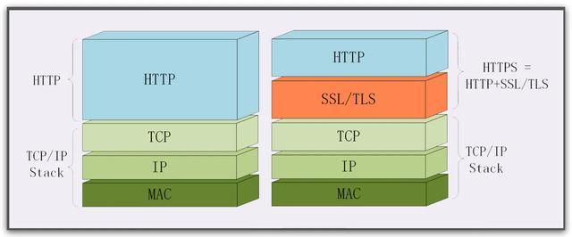

## 参考
- [http和https区别](https://mparticle.uc.cn/article.html?uc_param_str=frdnsnpfvecpntnwprdssskt&btifl=100&app=uc-iflow&title_type=1&wm_id=e92e61f7af8c4afe8fb2c0cc2829973d&wm_cid=368128080595650560&pagetype=share&client=&uc_share_depth=1)

## HTTPS 和 HTTP 的关系
- HTTPS 它把 HTTP 下层的传输协议由 TCP/IP 换成了 SSL/TLS，由 「"HTTP over TCP/IP"」 变成了 「"HTTP over SSL/TLS"」，让 HTTP 运行在了安全的 SSL/TLS 协议上，收发报文不再使用 「Socket API」，而是调用专门的「安全接口」。
- HTTPS 为 HTTP 增加了「四大安全特性」。规定了"https"默认端口号 443，至于其他的什么请求 - 应答模式、报文结构、请求方法、URI、头字段、连接管理等等都完全沿用 HTTP 。
- 示意
<h1 align="center">
    
</h1>

## HTTPS 的安全特性
- 机密性
    + 是指对数据的"保密"，只能由可信的人访问，对其他人不可见。
    + 通过对称加密和非对称加密算法来实现机密性。
- 完整性
    + 是指数据在传输过程中没有被篡改。
    + 通过摘要算法(散列函数)来实现完整性。
    + 真正的完整性必须要建立在机密性之上，在混合加密系统里用会话密钥加密消息和摘要。
- 身份认证
    + 是指确认对方的真实身份。
    + 通过数字签名和CA认证来实现身份认证。
- 不可否认
    + 也叫不可抵赖，意思是不能否认已经发生过的行为。
    + 通过数字签名来实现不可否认。

## TLS 握手过程
- 大体上分为三个阶段
    + 明文共享阶段
    + CA 认证阶段
    + 生成主秘钥阶段

    <h1 align="center">
        
    </h1>

- 第一阶段：明文共享阶段

    1. 在 TCP 建立连接之后，浏览器会首先发一个"Client Hello"消息，里面有客户端的版本号、支持的密码套件，还有一个随机数（Client Random），用于后续生成会话密钥。
    
    2. 服务器收到"Client Hello"后，会返回一个"Server Hello"消息。把版本号对一下，也给出一个随机数（Server Random），然后从客户端的列表里选一个作为本次通信使用的密码套件以及公钥。
    
    3. 服务器为了证明自己的身份，就把证书也发给了客户端（Server Certificate）。
    
    4. Server Done 。

这样第一个消息往返就结束了（两个 TCP 包），结果是客户端和服务器通过明文共享了三个信息：Client Random、Server Random 和 公钥。

- 第二阶段：证书验证

    客户端拿到服务器的证书后，开始走证书链逐级验证，确认证书的真实性，再用证书公钥验证签名，就确认了服务器的身份。

- 第三阶段：主密钥生成

    1. 客户端通过 RSA 公钥对生成的 pre-master 进行加密，并发送给服务端。
    
    2. 现在客户端和服务器手里有了三个随机数：Client Random、Server Random 和 Pre-Master。用这三个作为原始材料，就可以生成用于加密会话的主密钥，叫"Master Secret"。
    
    3. 有了主密钥和派生的会话密钥，客户端发一个"Change Cipher Spec"，然后再发一个"Finished"消息，把之前所有发送的数据做个摘要，再加密一下，让服务器做个验证。
    
    4. 服务器也发送"Change Cipher Spec"和"Finished"消息，双方都验证加密解密 OK，握手正式结束，后面就收发被加密的 HTTP 请求和响应 。
    
## 会话复用
- HTTPS 建立连接的过程：先是 TCP 三次握手，然后是 TLS 一次握手。这后一次握手的重点是算出主密钥“Master Secret”，而主密钥每次连接都要重新计算，未免有点太浪费了，如果能够把“辛辛苦苦”算出来的主密钥缓存一下“重用”，不就可以免去了握手和计算的成本了吗？
- 这种做法就叫“会话复用”（TLS session resumption），和 HTTP Cache 一样，也是提高 HTTPS 性能的“大杀器”，被浏览器和服务器广泛应用。
- 会话复用分两种，其中一种叫"Session ID"，就是客户端和服务器首次连接后各自保存一个会话的 ID 号，内存里存储主密钥和其他相关的信息。当客户端再次连接时发一个 ID 过来，服务器就在内存里找，找到就直接用主密钥恢复会话状态，跳过证书验证和密钥交换，只用一个消息往返就可以建立安全通信。
- 示意
    <h1 align="center">
        
    </h1>
