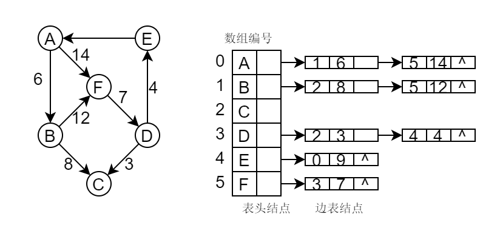

### 邻接矩阵表示法

- 也称为数组表示，图的邻接矩阵就是利用两个数组来实现的。其中一个是一维数组，用来存储图中的顶点信息；另一个是二维数组，用来存储图中的顶点之间的关系，该二维数组被称为`邻接矩阵`。

- 对于无权图(有向或无向)，则邻接矩阵表示为:
  ```shell
    A[i][j] = 1, 当 <vi,vj>∈E 或 (vi,vj)∈E
    A[i][j] = 0, 其他
  ```
  无向图的邻接矩阵中，如果边 (A, B) 存在，需要将 <A, B> 和 <B, A> 的对应位置都置为 1 。
- 对于带权图(有向或无向)，则邻接矩阵表示为:
  ```shell
    A[i][j] = Wij, 当 <vi,vj>∈E 或 (vi,vj)∈E
    A[i][j] = ∞,   其他
  ```
  其中，Wij 表示顶点 i 与顶点 j 构成的弧或边的权值，如果顶点之间不存在弧或边，则用 ∞ 表示。
- 图的邻接矩阵数据存储结构(C语言描述):
  ```c
    // 边或弧结点
    typedef struct
    {
        VRType adj;     /** 对于无权图，用 1 表示相邻，0 表示不相邻；对于带权图，存储权值 */
        void * info;    /** 可选顶。与弧或边相关的信息 */
    } ArcNode;
    
    // 邻接矩阵(交点表示顶点，横、纵坐标表示弧尾、弧头)
    typedef ArcNode AdjMatrix[MAXSIZE][MAXSIZE];
    
    // 邻接矩阵图
    typedef struct {
        VertexType vex[MAXSIZE];    /** 顶点数组   */
        AdjMatrix arc;              /** 邻接矩阵   */
        int vexnum;                 /** 顶点数目   */
        int arcnum;                 /** 边或弧数目 */
    } MGraph;
  ```
  邻接矩阵可以很形象地表示一个图，但占用内存较大。

### 邻接表表示法

- 一种链式存储方式。
- 在图的邻接表中，对图中的每个顶点都建立一个单链表，用来表示弧或边，这种表示顶点之间关系的链表称为`边表`。相应地，结点称为`边结点`。
- 在每个单链表前面设置一个头结点，存放图中的各个顶点结点，这种表称为`表头结点表`，相应地，结点称为`表头结点`。
    + 通常情况下，表头结点采用顺序存储结构来实现，这样可以随机访问任意顶点。
    + 表头结点由两个域组成: 数据域和指针域。其中，数据域用来存放顶点信息，指针域用来指向边表中的第一个结点。
      ```shell
                数据域 指针域
        头结点: [data][firstarc]
      ```
    + 边表结点由三个域组成: 邻接点域、数据域和指针域。其中，邻接点域表示与相应的表头顶点邻接点的位置(如数组索引)，数据域存储与边或弧相关的信息，指针域用来指示下一个边或弧的结点。
      ```shell
                邻接点域 数据域 指针域
        表结点: [adjvex][data][nextarc]
      ```
- 图的邻接表数据存储结构(C语言描述):
  ```c
    // 边结点类型定义
    typedef struct ArcNode {
        int adjvex;                 /** 弧指向的顶点的位置，即当前表结点所对应的某个邻接点 */
        void * info;                /** 可选顶。与弧相关的信息 */
        struct ArcNode * nextarc;   /** 指示下一个与该顶点相邻接的顶点。存储结构上看是下一个边结点 */
    } ArcNode;
    
    // 表头结点的类型定义
    typedef struct VNode {
        VertexType data;    /** 存储顶点 */
        ArcNode * firstarc; /** 指示第一个与该顶点邻接的顶点。存储结构上看是第一个边结点 */
    } VNode;
    
    // 顶点数组
    typedef VNode AdjList[MAXSIZE];
    
    // 邻接表图
    typedef struct {
        AdjList vertex;
        int vexnum;     /** 顶点数目 */
        int arcnum;     /** 弧的数目 */
    } AdjGraph;
  ```
  邻接表比较抽象，但占用内存相对较小。
- 邻接表示例
  
  有向无权图
  

  无向无权图
  

  有向带权图
  
