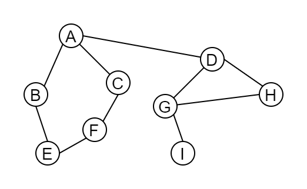

### 深度优先遍历(DFS)

- 图的深度优先遍历是树的`先根遍历的推广`。
- 图的深度优先遍历的思想是: 从图中某个顶点 v0 出发，访问顶点 v0。访问顶点 v0 的第一个邻接点，然后以该邻接点为新的顶点，访问该顶点的邻接点。重复执行以上操作，直到当前顶点没有邻接点为止。之后返回到上一个已经访问过但还有未被访问的邻接点的顶点，按照以上步骤继续访问该顶点的其他未被访问的邻接点。以此类推，直到图中所有的顶点都被访问过。
- 关键字: `递归` 和 `堆栈(回溯)`

以上图为例，图的深度优先遍历过程如下:
1. 首先访问 A，顶点 A 的邻接点有 B、C、D, 然后访问 A 的第一个邻接点 B 。
2. 顶点 B 未访问的邻接点只有顶点 E, 因此访问顶点 E 。
3. 顶点 E 的邻接点只有 F 且未被访问过，因此访问顶点 F 。
4. 顶点 F 的邻接点只有 C 且未被访问过，因此访问顶点 C 。
5. 顶点 C 的邻接点只有 A 但已经被访问过，因此要回溯到上一个顶点 F 。
6. 同理，顶点 F、E、B 都已经被访问过，且没有其他未访问的邻接点，因此，回溯到顶点 A 。
7. 顶点 A 的未被访问的顶点只有顶点 D，因此访问顶点 D 。
8. 顶点 D 的邻接点有顶点 G 和顶点 H，访问第一个顶点 G 。
9. 顶点 G 的邻接点有顶点 H 和顶点 I，访问第一个顶点 H 。
10. 顶点 H 的邻接点只有 D 且已经被访问过，因此回溯到上一个顶点 G 。
11. 顶点 G 的未被访问过的邻接点有顶点 I，因此访问顶点 I 。
12. 顶点 I 已经没有未被访问的邻接点，因此回溯到顶点 G 。
13. 同理，顶点 G、D 都没有未被访问的邻接点，因此回溯到顶点 A 。
14. 顶点 A 也没有未被访问的邻接点。因此，图的深度优先遍历的序列为: A、B、E、F、C、D、G、H、I。

### 广度优先遍历(BFS)

- 图的广度优先遍历`与树的层次遍历类似`。
- 图的广度优先遍历的思想是: 从图的某个顶点 v 出发，首先访问顶点 v，然后按照次序访问顶点 v 的未被访问的每一个邻接点，接着访问这些邻接点的邻接点，并保证遵循先被访问的邻接点的邻接点先访问，后被访问的邻接点的邻接点后访问的原则，依次访问邻接点的邻接点。按照这种思想，直到图的所有顶点都被访问，这样就完成了对图的广度优先遍历。
- 关键字: `队列`

以上图为例，图的广度优先遍历过程如下:
1. 首先访问顶点 A，顶点 A 的邻接点有 B、C、D，然后访问 A 的第一个邻接点 B 。
2. 访问顶点 A 的第二个邻接点 C，再访问顶点 A 的第三个邻接点 D 。
3. 顶点 B 邻接点只有顶点 E，因此访问顶点 E 。
4. 顶点 C 的邻接点只有 F 且未被访问过，因此访问顶点 F 。
5. 顶点 D 的邻接点有 G 和 H，且都未被访问过，因此先访问第一个顶点 G，然后访问第二个顶点 H 。
6. 顶点 E 和 F 不存在未被访问的邻接点，顶点 G 的未被访问的邻接点有 I，因此访问顶点 I 。至此，所有的顶点已经被访问完毕，图的广度优先遍历序列为: A、B、C、D、E、F、G、H、I 。
