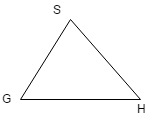
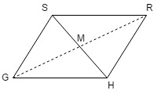
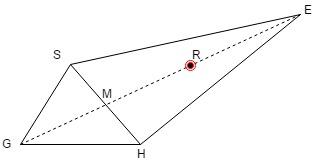
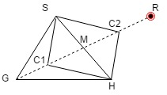
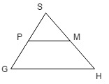

## 说明

Nelder-Mead(NM) 算法又称下山单纯形(Simplex)算法，用于查找多元变量函数的局部最小值，是一种常用的非线性优化算法。

NM 算法不需要任何求导计算，所以算法比较简单，但收敛较慢。


## 实现原理

对于拥有 N 变量的函数，NM 算法可把它表示为一个具有 N+1 个顶点的多面体，每个顶点的坐标由该函数的 N 变量构成。

例如，对于两个变量的函数 f(x,y)，所对应的单纯形是一个三角形，每个顶点的坐标分别为 (x1,y1)、(x2,y2)、(x3,y3)。由这 3 个顶点可以分别计算一个函数值，**最大值的顶点将被一个新的顶点代替**，这样将产生一个新的三角形，并继续寻找函数值最小点。

这样的搜寻将产生一序列的三角形，**顶点的函数值和三角形的尺寸越来越小，最后收缩到函数值最小的点**。


## 实现过程

NM 算法的关键是如何查找单纯形的最小值顶点。

这里以一个 f(x,y) 为例，说明如何查找到这个函数最小值点。最小值点确定了，函数的最小值也就被确定了。

> 1. 单纯形顶点初始化

设由 f(x,y) 构成的三角形的 3 个顶点: Vk=(xk,yk), k=1,2,3，将使用这 3 个顶点值来计算函数的值，zk=f(xk,yk), k=1,2,3。设 z1<=z2<=z3，为了说明方便，令 S=z1,H=z2,G=z3，分别表示这三个点中的最小值点(Smallest)、较高值点(Higher)和最大值点(Greatest)，即:
```
    S=(x1,y1), H=(x2,y2), G=(x3,y3)
```

<h1 align="center">
    
</h1>

需要注意的是，单纯形顶点的坐标值如何选取，对查找最小点有一定的影响，这里稍后会进行说明。

> 2. 计算中点 M

实际上是计算出一个平均值。习惯上，我们通常会去掉值最大的点，将其余的点进行计算。

这里把 S 和 H 两点坐标相加，然后平均即可得到:
```
    M = (S + H) / 2 = ((x1+x2)/2, (y1+y2)/2)
```
对于多个顶点，中点 M 是除了最大值顶点外的其余各点坐标值的平均值。

> 3. 反射(Reflection)

连接 G 与 M 点，以 SH 边为对称轴，把 G 点反向成 R 点，一般把反射长度乘以一个系数 α 。可以用下面的公式计算 R 点的坐标:
```
    R = M + α(M - G) = (1 + α)M - αG
```

<h1 align="center">
    
</h1>

反射点 R 是一个关键点。如果 R 点的函数值小于或等于 S 点的值，则要进行扩展处理；如果比 S 点的值大，则要进行收缩处理。

> 4. 扩展(Extension)

<h1 align="center">
    
</h1>

如果反射点 R 的函数值小于或等于 S 点的值，说明最小点在离反射点更远的位置，此时，将沿原来的方向，以一定的线段长度 `γ(R - M)` 把 R 点扩展到 E 点。可以用下面的公式计算扩展点 E 的坐标:
```
    E = R + γ(R - M) = (1 + γ)R - γM
```

> 5. 压缩(Contract)

<h1 align="center">
    
</h1>

如果 R 点的函数值比 H 点的大，则需要进行压缩处理，同样按照一定的线段比例 β 计算压缩点。压缩点不能是中点 M，因为使用 G 点替代 M 点，就不能构成一个三角形。因此，对它只能在线段 GM 和 MR 中查找。可以用如下公式计算压缩点 C 的坐标:
```
    C = M + β(G - M) = βG + (1 - β)M
```

> 6. 收缩(Shrink)

经过反射、扩展和压缩过程，若没有找到比 G 点函数值小的点，则要进行收缩计算。

<h1 align="center">
    
</h1>

如果 C 点的函数值比 G 点的大，则计算 SG 线段的中点 P，然后将把 H 点收缩到 M，把 G 点收缩到 P 点。


## NM 算法关于初始值的设定

合理地给出初始值，可以提高函数收敛速度，以及避免计算结果局部收敛的发生。

对于 NM 算法，有两种类型的初始值需要设定，**一种是变量的初值，另一种是单纯形基点的初值**。

对于变量的初值，也是迭代求解的初值。这种初值一般是猜想值，根据实际情况，应合理地给出估计值，然后根据这个初值进行迭代求解。

对于单纯形顶点，由于顶点不能重合，因此初始值不能相同。一般方法是，把初始单纯形的顶点在空间上看成是均匀分布的，即各个顶点之间的距离是相等的。

[示例程序](code/nelder_mead.c)
