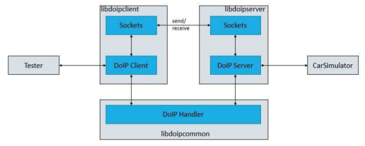

从上面的架构上可以大致看出，libdoip 可以创建两种实体，分别是 DoIP Client 和 DoIP Server，后者运行在 CarSimulator 上，而前者作为测试应用。它们之间通过 Sockets 进行消息的发送(send)和接收(receive)，并通过 DoIP Handler 处理消息。

### DoIP Client

DoIP Client 所有的功能由 DoIPClient 组件进行处理，主要负责:
- 初始化、开启和关闭通信套接字
- 接收和发送 DoIP 消息

| 成员变量 | 描述 |
|:--------|:----|
| sockaddr_in _serverAddr | serverAddr 用于 TCP 通信，它由服务端 IP 地址和端口(默认 13400)组成 |
| sockaddr_in _clientAddr | clientAddr 用于 UDP 通信，它由客户端 IP 地址和端口(默认 13400)组成 |
| int _sockFd | TCP 套接字描述符 |
| int _SockFd_udp | UDP 套接字描述符 |
| int _connected | 用于连接到服务端的本客户端的套接字 |

`void DoIPClient::startTcpConnection()`
- 创建一个 TCP 套接字，并尝试连接到服务端。
----

`void DoIPClient::closeTcpConnection()`
- 关闭连接到服务端的活跃的 TCP 连接。
----

`int DoIPClient::getSockFd()`
- 返回 TCP 套接字描述符。
----

`int DoIPClient::getConnected()`
- 如果客户端连接到了服务端，会返回一个值。
----

`void DoIPClient::startUdpConnection()`
- 创建一个 UDP 套接字，会在 13400 端口上进行监听。
----

`void DoIPClient::closeUdpConnection()`
- 关闭 UDP 在 13400 端口上监听的套接字。
----

`void DoIPClient::receiveMessage()`
- 接收来自服务端的 TCP 连接的 DoIP 消息，比如路由激活响应(Routing Activation Response)、诊断消息(Diagnostic Message)、诊断消息积极/消积应答(Diagnostic Message Positive/Negative Ack)。
----

`void DoIPClient::receiveUdpMessage()`
- 接收来自服务端的 UDP 的 DoIP 消息。比如车辆标识响应(Vehicle Identification Response)。
----

### DoIP Server

DoIP Server 所有的功能由 DoIPServer 组件进行处理，主要负责:
- 初始化、设置和关闭通信套接字
- 接收和发送 DoIP 消息
- 配置参数(见配置 DoIP 服务器小节)

具体如下。

#### Sockets

由于一个套接字在同一时间仅能支持一种协议，服务端会各使用一个套接字用于 TCP 和 UDP 通信。为此，DoIPServer 组件必须管理一些成员变量，这些是套接字功能的基本要素。

| 成员变量 | 描述 |
|:--------|:----|
| sockaddr_in serverAddress | 结构体，定义了服务端 IP 地址和端口的组合 |
| sockaddr_in clientAddress | 结构体，定义了客户端 IP 地址和端口的组合，用于 UDP |
| int server_socket_tcp | TCP 套接字描述符 |
| int server_socket_udp | UDP 套接字描述符 |
| int client_socket_tcp | 已建立的 TCP 连接上的套接字描述符 |

`setupTcpSocket` 方法可以应用到一个 UDP 套接字上来设置成一个 TCP 套接字。

`void DoIPServer::setupTcpSocket()`
- 内部通过 socket() 系统调用并关联 TCP/IP 参数(AF_INET, SOCK_STREAM)创建一个 TCP 套接字。必需的 sockaddr_in 结构 serverAddress 默认设置为 ISO-13400-2 的规定值。将 serverAddress 中指定的地址和端口绑定到套接字描述符上。
----

`void DoIPServer::setupUdpSocket()`
- 内部通过 socket() 系统调用并关联 UDP 参数(AF_INET, SOCK_DGRAM)创建一个 UDP 套接字。必需的 sockaddr_in 结构 serverAddress 默认设置为 ISO-13400-2 的规定值。将 serverAddress 中指定的地址和端口绑定到套接字描述符上。由于 UDP 是一种无连接协议，所以不需要监听和接受即将到来的连接。
----

对于 TCP，服务端套接字需要监听并接受一条连接，这通过 `listenTcpConnection` 方法实现。

`void DoIPServer::listenTcpConnection()`
- 该方法将阻塞当前进程进行监听(listem)和接受(accept)。成员变量 client_socket_tcp 包含了代表接受连接的文件描述符。
- 调用完该方法后，套接字预备接收和发送数据。
----

可以通过 `closeSocket` 和 `closeUdpSocket` 关闭一个 TCP 或 UDP 套接字。

`void DoIPServer::closeSocket()`
- 关闭代表一条 TCP 连接的套接字。
----

`void DoIPServer::closeUdpSocket()`
- 关闭代表一条 UDP 连接的套接字。
----

#### Receive

服务端作为两端通信的被动参与者，应该只对客户端的请求进行回应(react)，以及必要时的关闭连接。为了保证 DoIPServer 应用程序对服务端的完全控制，TCP 和 UDP 接收方法应该另外开辟线程运行。

`int DoIPServer::receiveTcpMessage()`
- 从客户端接收 TCP 消息。如果接收到的字节数大于 0 会调用 `reactToReceivedTcpMessage`。这个方法会返回发回给客户端的字节数，失败时返回 -1。
----

`int DoIPServer::reactToReceivedTcpMessage(int readedBytes)` readedBytes 表示接收到的字节数。
- 决定消息荷载类型，会在 Negative Acknowledge 节进行描述，并处理消息。
- 对于一些荷载类型，这个方法还将通过 UDP 发回合适的响应给客户端。下面的荷载类型就是通过 UDP 接收并由这个方法进行处理的:
  ```s
    Vehicle identification request(见 Vehicle identification request 节)
  ```
- 如果确定是一个消极应答，该方法将发起(initiate)一个消极应答消息的传输。
- 该方法会返回发回给客户端的字节数，失败时返回 -1。
----

如果运行在一个线程里，服务端将等待一个新消息的到来。在收到和处理一个 TCP 或 UDP 消息后，会重复此流程处理下一个消息。

#### Send

因为服务端是通信双方的被动参与者，它一般不会主动发送消息(除了 Vehicle Announcment 消息)。服务端使用 `sendMessage` 和 `sendUdpMessage` 方法仅是对于已收到的 DoIP 消息发回一个响应。

`int DoIPServer::sendMessage(unsigned char* message, int messageLength)`
- 将给定的消息发送给 TCP 客户端。参数 message 指定了要发回的消息，messageLength 是要发送的消息的长度。
- 成功时返回发回的字节数，失败时返回 -1 。
----

`int DoIPServer::sendUdpMessage(unsigned char* message, int messageLength)`
- 将给定的消息通过 UDP 套接字发送。参数参考 `sendMessage`。
- 成功时返回发回的字节数，失败时返回 -1 。
----

如果应用需要发送一个消息，例如在处理完一个诊断消息后，服务端会可以通过几种方法发送这个结果。这些方法的细节会在各自小节中详述。
