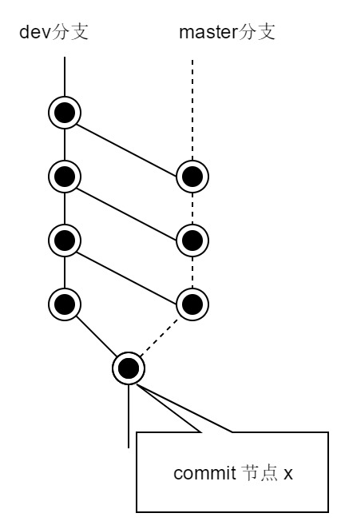

### 子模块

- 首次将某个分支作为子模块添加到项目中
  ```shell
    git submodule add -b revert-236-master git@github.com:oktal/pistache.git
  ```
- 重新克隆项目后，默认子模块目录无任何内容，执行这个拉取子模块
  ```shell
    git submodule update --init --recursive
  ```
- 子模块提交更新后，使用子模块的项目必须手动更新才能包含最新的提交
  ```shell
    git submodule foreach git pull
  ```
- 子模块维护地址发生变化，或者需要替换子模块，就需要删除原有的子模块
  ```shell
    rm -rf 子模块目录        ## 删除子模块目录及源码
    vi .gitmodules          ## 删除项目目录下 .gitmodules 文件中子模块相关条目
    vi .git/config          ## 删除配置项中子模块相关条目
    rm .git/module/*        ## 删除模块下的子模块目录，每个子模块对应一个目录，注意只删除对应的子模块目录即可
  ```
  执行完成后，再执行添加子模块命令即可，如果仍然报错，执行如下：
  ```shell
    git rm --cached 子模块名称
  ```
  完成删除后，提交到仓库即可。


### 删除远程仓库提交

- 假如有四次 commit, 其id(按时间由近到远排序)如下:
  ```shell
    3a762960dee
    470854039cb
    4b7502dbfd3
    39b2d73f309
  ```
  现在要删除 `4b7502dbfd3` 之后的所有提交(即 `470854039cb` 和 `3a762960dee`)，可以这样操作:
  ```shell
    git reset --hard 4b7502dbfd3
    git push -f
  ```
  注意: 该操作不可挽回(工作区将会回滚到提交 `4b7502dbfd3` 后的状态，在 `4b7502dbfd3` 之后的修改不会保存，这之后的提交也无法找回)，谨慎使用。
- 如果想撤销 `4b7502dbfd3` 之后的提交并产生一次新的提交，但 `4b7502dbfd3` 之后的历史提交也想保留在提交历史中，可以这样操作:
  ```shell
    git revert 4b7502dbfd3
  ```


### 放弃本地改动

- 将本地改动过的追踪文件替换为 HEAD 中的内容
  ```sh
    git checkout -- certain_filename
    git checkout -- *
  ```
- 丢弃所有本地改动过的追踪文件(也就是使用本地最新提交 HEAD 替换这些文件)
  ```sh
    git reset --hard
  ```
- 丢弃所有本地改动过的追踪文件与只存在于本地的提交，拉取远程服务器上的最近提交替换之
  ```sh
    git fetch origin
    git reset --hard origin/master
  ```

### cherry-pick指令

cherry-pick指令用于处理对于分支上某个提交节点的合并。

git merge 会进行分支与分支之间的合并，如下图所示，如果在 master 分支上执行 `git merge dev` 指令，其执行结果是将 dev 分支的最新版本 85fc373 与 master 分支上的最新版本 26673a0 进行3-way合并。

<h1 align="center">
    
</h1>

有的时候，我们不想将某个分支全部合并到目标分支上来，比如上图中 dev 分支 f604ca7 版本合并到 master 上，这时就可以通过 cherry-pick 指令处理:
```shell
    git checkout master
    git cherry-pick f604ca7
```
执行时，如果出现文件冲突，可能会出现如下信息:
```
    error: could not apply f604ca7... (commit message)
    hint: after resolving the conflicts, mark the corrected paths
    hint: with 'git add <paths>' or 'git rm <paths>'
    hint: and commit the result with 'git commit'
```
这时可以通过 `git status` 获取更详细的信息，以便处理冲突文件。

如果想要放弃这次合并，可以执行如下指令:
```shell
    git cherry-pick --abort
```
执行之后，工作区和版本库均会恢复到原来的状态。

冲突处理完毕后，根据是否生成新的提交节点，后续可以采用两种处理方式:

1.创建新节点
```shell
    git add .
    git commit -m "cherry pick merge"
```

2.不创建新节点
```shell
    git add .
    git cherry-pick --continue
```

两种方式并不存在优先取舍，个人更建议使用第 1 种。


### revert指令

很多参考书或文章会对 reset 与 revert 进行对比来说明二者的使用区别。

我觉得 reset 更好一些，它能让我明确地知道，自己究竟在做些什么。

所以，这里不会对 revert 指令的用法进行说明。


### rebase指令

情景，从某个节点开始分出来两个分支。两个分支都在移动，其中一个分支需要及时获得另一个分支上的更新。比如从主分支产生一个开发分支，开发分支在产生节点的同时，也需要及时获得主分支上的更新。

如果使用 merge 将主分支上的节点合并到开发分支上，会产生相互交织的网状形态，程序项目的提交节点演进图也会变得比较复杂。如下图从 dev 分支上看演进图:

<h1 align="center">
    
</h1>

为了避免这种情况，可以使用 rebase 指令代替 merge 指令。

rebase 指令的功能也是把另一个分支的修改运用到当前的分支，但是它的执行结果会变成如下图所示的状态:

<h1 align="center">
    
</h1>

使用 rebase 指令也可能出现冲突的情况。可以使用指令 `git rebase --abort` 恢复到还没有执行 rebase 之前的状态，或者编辑冲突的文件之后重新提交。如下:
```sh
  git add .
  git rebase --continue
```

通过 rebase 同步远程分支代码:
```sh
  git fetch
  git rebase origin/master
```


### 远程仓库操作

常用于在 fork 之后得到的文档库上同步原文档库操作。

添加远程仓库追踪分支路径
```sh
  git remote add new-repo https://github.com/libeio/tcw
  git remote update
```

删除远程仓库追踪分支路径
```sh
  git remote rm new-repo
```

修改远程仓库名称
```sh
  git remote rename old-repo new-repo
```

修改修改远程仓库 uri
```sh
  git remote set-url origin https://github.com/libeio/ldev
```

查看远程仓库的设置信息
```sh
  new-repo https://github.com/libeio/ldev (fetch)
  new-repo https://github.com/libeio/ldev (push)
  origin   https://github.com/libeio/justfortest (fetch)
  origin   https://github.com/libeio/justfortest (push)
```

将远程仓库中的某一个分支删除掉
```sh
  git push ldev --delete temp-branch
```

获取 protobuf 文档库的新内容，然后运用到我的 fork 文档库上
```sh
  git remote add upstream https://github.com/protocolbuffers/protobuf
  git fetch upstream
  git checkout master
  git merge upstream/master   // 或者 git rebase upstream/master
```
