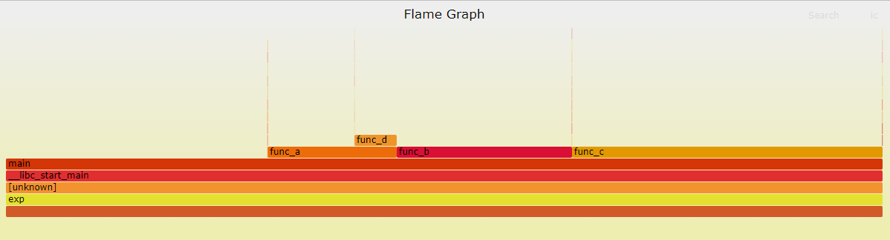
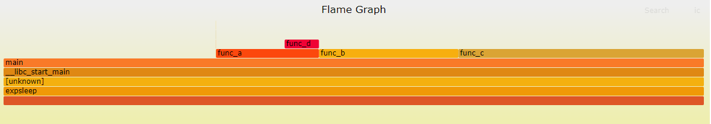

### 说明

- 文件[stackcollapse-perf.pl](t/stackcollapse-perf.pl)和[flamegraph.pl](t/flamegraph.pl)拷贝自[FlameGraph项目](https://github.com/brendangregg/FlameGraph)。
- [more read](https://queue.acm.org/detail.cfm?id=2927301)
- [工具脚本](t/fg.sh)

工具脚本下载和使用
```sh
    wget https://raw.githubusercontent.com/wenfh2020/shell/master/fg.sh
    bash fg.sh <pid>
```

### perf 的安装

在控制台执行 perf 命令，如果没有安装，会输出如下信息:
```sh
The program 'perf' is currently not installed. You can install it by typing:
apt install linux-tools-common
```

根据输出提示执行如下命令:
```sh
    apt install linux-tools-common
```

查看版本:
```sh
    perf --version
```
如果输出如下信息:
```sh
WARNING: perf not found for kernel 4.4.0-186

  You may need to install the following packages for this specific kernel:
    linux-tools-4.4.0-186-generic
    linux-cloud-tools-4.4.0-186-generic

  You may also want to install one of the following packages to keep up to date:
    linux-tools-generic
    linux-cloud-tools-generic
```

尝试执行如下命令:
```sh
    apt-get install linux-tools-4.4.0-186-generic
```

再次查看版本:
```sh
    perf version 4.4.228
```

### 阅读火焰图

X 轴:
- 由多个方块组成，每个方块表示一个函数
- 函数在 X 轴占据的宽度越宽，表示它被采样到的次数越多，可以简单粗暴地近似理解为执行时间

Y 轴:
- 表示函数调用栈，调用栈越深，火焰就越高
- 顶部是 CPU 正在执行的函数，下方都是它的父函数

### 生成火焰图

以这个[程序](t/exp.cpp)作为示例，叙述火焰图生成的步骤。

1. 采集堆栈

执行 `perf record` 命令。该命令会将性能信息记录到 perf.data 文件中，该文件会在执行目录下生成，而控制台并不输出任何信息。

Using Linux perf\_events (aka "perf") to capture 60 seconds of 99 Hertz stack samples, both user- and kernel-level stacks, all processes:
```s
    perf record -F 99 -a -g -- sleep 90
```
以 99 赫兹频率对所有进程栈(包括用户栈和内核栈)采样 60 秒。

Now only capturing PID 181:
```s
    perf record -F 99 -p 181 -g -- sleep 60
```
以 99 赫兹频率对进程号为 188 的栈采样 60 秒。

```s
    perf record -F 99 -p 181 -g -- sleep 60  # 监控 pid 为 181 的进程 60s
```

使用 `perf record` 注意:
- 由于该命令将性能信息输出到文件而不是标准流中，所以不能将命令添加到 pipeline 中。
- 执行该命令时，目标程序正在运行，也就是说进程必须存在。只有进程存在才能看到堆栈。

执行 `perf script` 命令。该命令会读取 perf.data 文件(由 perf record 产生)，输出栈信息。
```s
    perf script > stacks.unfold
```

也可以通过参数指定要读取的 perf.data 文件路径:
```s
    perf script -i /root/perf.data > stacks.unfold
```

2. 折叠堆栈

```s
    ./stackcollapse-perf.pl stacks.unfold > stacks.folded
```

3. 生成火焰图

```s
    ./flamegraph.pl stacks.folded > stacks.svg
```

### 示例 & 测试

```sh
    gunzip -c example-perf-stacks.txt.gz | ./stackcollapse-perf.pl --all | ./flamegraph.pl --color=java --hash > example-perf.svg
```
产生的[svg文件](img/example-perf.svg)。

进一步的测试。对于如下的程序:
```c++
    void func_d() { for (int i = 5 * 10000; i--; ); }
    void func_a() { for (int i = 10 * 10000; i--; ); func_d(); }
    void func_b() { for (int i = 20 * 10000; i--; ); }
    void func_c() { for (int i = 35 * 10000; i--; ); }

    int main()
    {   
        while (1) {
            for (int i = 30 * 10000; i--; );
            func_a();
            func_b();
            func_c();
        }

        return 0;
    }
```
将上面的程序编译成可执行程序之后，运行。获取进程 id，通过 fg.sh 脚本可以产生一个 perf.svg 文件。
```js
    bash fg.sh <pid>
```
在浏览器中打开 perf.svg 文件，如下(对应的 svg 文件在[这里](img/exp.perf.svg)):


fg.sh 脚本会监控某个进程 20s。为上面的 main 函数添加代码变成:
```c++
    std::this_thread::sleep_for (std::chrono::seconds(30));
    
    while (1) {
        for (int i = 30 * 10000; i--; );
        func_a();
        func_b();
        func_c();
    }
```
假设重新编译后的文件在 9:00:00 启动，而 fg.sh 脚本在 9:00:05 对其监控，那么 fg.sh 脚本退出的时刻在 9:00:25。这个时候程序还在休眠，直到 9:00:30 才会运行堆栈，之前 fg.sh 运行产生的 .svg 文件中是没有数据的。

如果在 9:00:30 之后再运行 fg.sh 脚本监控，这个时候是有堆栈的。如下(对应的[svg文件](img/awake.perf.svg)):


