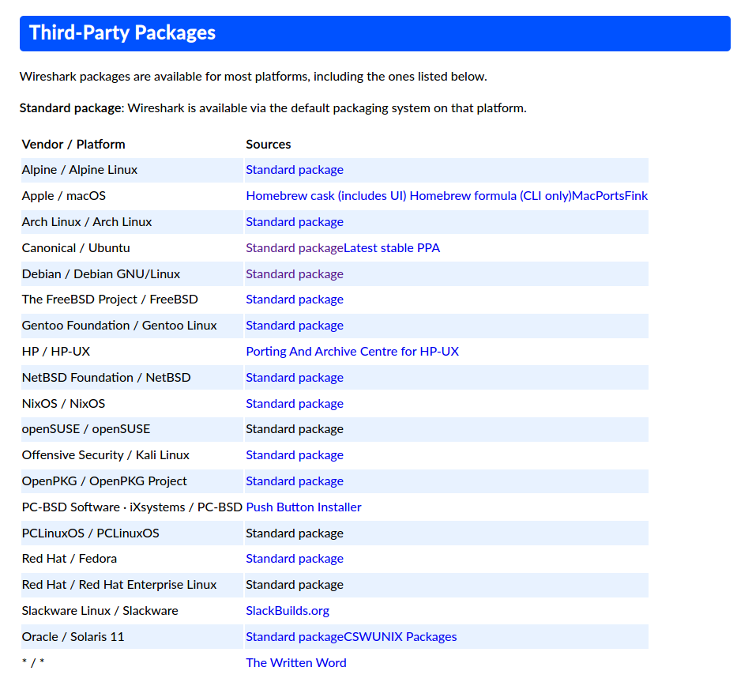
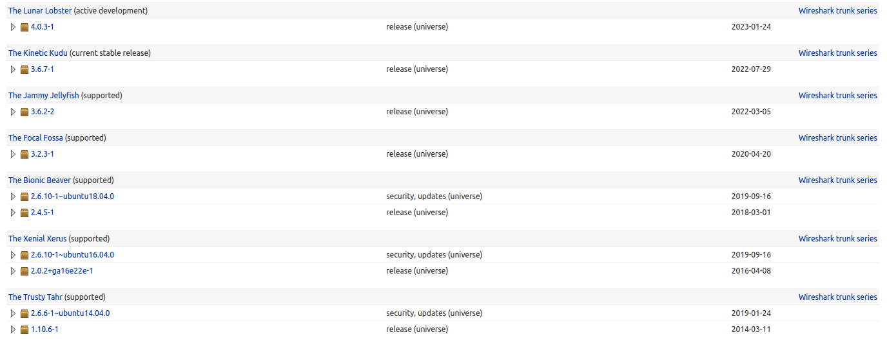
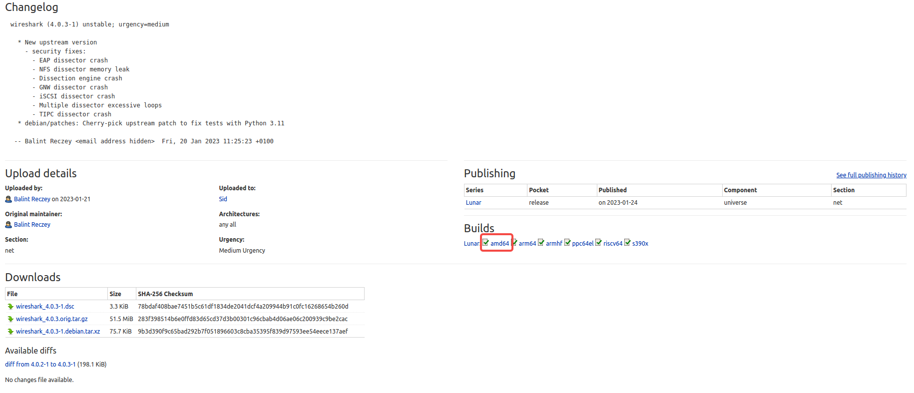
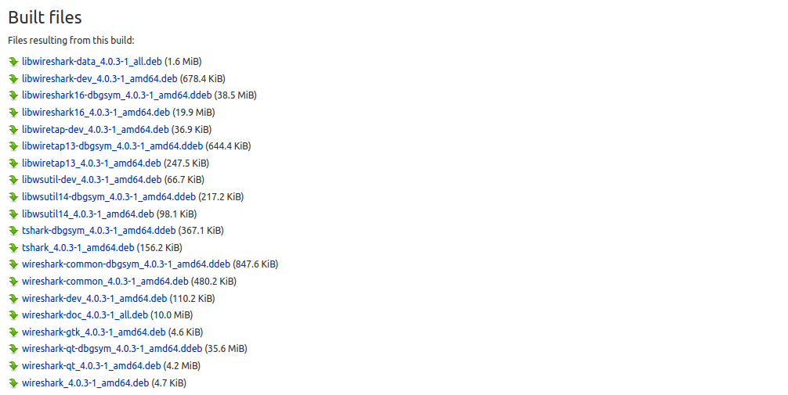
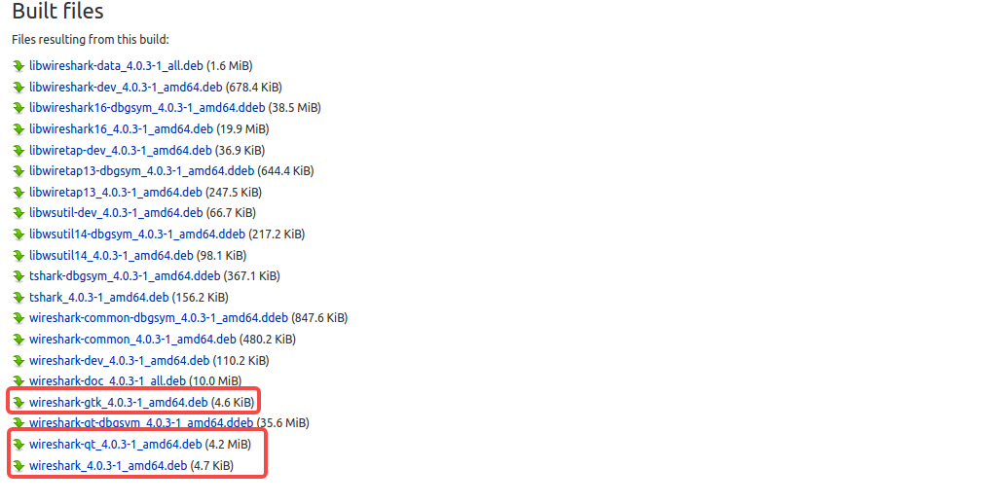
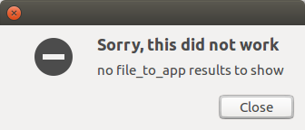
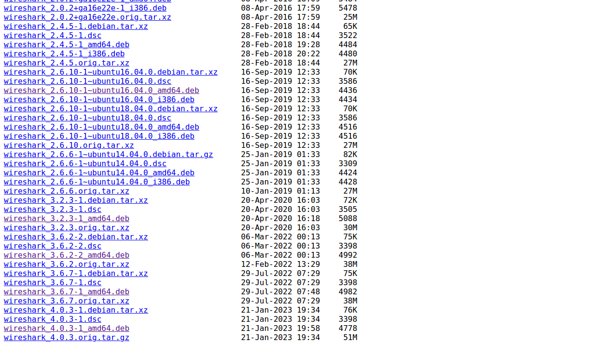

通过 apt 方式安装的 wireshark 可能版本比较低，无法解析一些特殊的协议。比如笔者通过 apt 方式在 ubuntu 16.04 系统上安装的 2.6.10 就无法解析 some/ip 协议报文。

现在尝试通过在 wireshark 官网下载 wireshark 相应包后进行安装。因为是一次尝试，所以并不能保证一定会成功。尝试仍在笔者的操作系统上(ubuntu 16.04)进行。

1. 下载文件

进入 wirkshark 官网，打开[下载页](https://www.wireshark.org/download.html)，如下:



这里可以使用 ubuntu，也可以尝试 debian。这里选择 `Canonical / Ubuntu	Standard packageLatest stable PPA`，点击进入。下拉，找到最新的版本:



这里选择 4.0.3-1 进入，如下:



左下方的 Downloads 下载的并不是 deb 包，这里选择右方的 `amd64` 进入，下拉至低部，如下:



这么多的文件，实在不清楚要安装哪一个，怎么办？进入第 2 步...

2. 安装思路

在使用 apt 方式安装时，会下载相应的安装包，比如 ubuntu 系的 .deb 包。这里笔者的系统上通过 apt 安装 wireshark 进行探路...

安装过程中的控制台输出如下:
```s
    libei@libei-ThinkPad-E14:/var$ sudo apt-get install wireshark
    Reading package lists... Done
    Building dependency tree       
    Reading state information... Done
    The following packages were automatically installed and are no longer required:
    libsdl-image1.2 libva-drm1 libxcb-composite0 libxcb-xv0 vlc-plugin-notify vlc-plugin-samba
    Use 'sudo apt autoremove' to remove them.
    The following additional packages will be installed:
    wireshark-gtk wireshark-qt
    The following NEW packages will be installed:
    wireshark wireshark-gtk wireshark-qt
    0 upgraded, 3 newly installed, 0 to remove and 79 not upgraded.
    Need to get 4,203 kB of archives.
    After this operation, 10.8 MB of additional disk space will be used.
    Do you want to continue? [Y/n] y
    Get:1 http://cn.archive.ubuntu.com/ubuntu xenial-updates/universe amd64 wireshark-gtk amd64 2.6.10-1~ubuntu16.04.0 [680 kB]
    Get:2 http://cn.archive.ubuntu.com/ubuntu xenial-updates/universe amd64 wireshark-qt amd64 2.6.10-1~ubuntu16.04.0 [3,518 kB]
    Get:3 http://cn.archive.ubuntu.com/ubuntu xenial-updates/universe amd64 wireshark amd64 2.6.10-1~ubuntu16.04.0 [4,436 B]
    Fetched 4,203 kB in 4s (858 kB/s)     
    Selecting previously unselected package wireshark-gtk.
    (Reading database ... 318938 files and directories currently installed.)
    Preparing to unpack .../wireshark-gtk_2.6.10-1~ubuntu16.04.0_amd64.deb ...
    Unpacking wireshark-gtk (2.6.10-1~ubuntu16.04.0) ...
    Selecting previously unselected package wireshark-qt.
    Preparing to unpack .../wireshark-qt_2.6.10-1~ubuntu16.04.0_amd64.deb ...
    Unpacking wireshark-qt (2.6.10-1~ubuntu16.04.0) ...
    Selecting previously unselected package wireshark.
    Preparing to unpack .../wireshark_2.6.10-1~ubuntu16.04.0_amd64.deb ...
    Unpacking wireshark (2.6.10-1~ubuntu16.04.0) ...
    Processing triggers for gnome-menus (3.13.3-6ubuntu3.1) ...
    Processing triggers for desktop-file-utils (0.22-1ubuntu5.2) ...
    Processing triggers for bamfdaemon (0.5.3~bzr0+16.04.20180209-0ubuntu1) ...
    Rebuilding /usr/share/applications/bamf-2.index...
    Processing triggers for mime-support (3.59ubuntu1) ...
    Processing triggers for man-db (2.7.5-1) ...
    Setting up wireshark-gtk (2.6.10-1~ubuntu16.04.0) ...
    Setting up wireshark-qt (2.6.10-1~ubuntu16.04.0) ...
    Setting up wireshark (2.6.10-1~ubuntu16.04.0) ...
```
从上面可以看出，本次安装过程中会下载三个包。在 ubuntu 系统上，它们一般会被缓存到 `/var/cache/apt/archives` 目录下。现在进入这个目录当中，需要特别关注对应 .deb 包的名称和大小，如下:
```s
    -rw-r--r-- 1 root root 4.4K 9月  16  2019 wireshark_2.6.10-1~ubuntu16.04.0_amd64.deb
    -rw-r--r-- 1 root root 664K 9月  16  2019 wireshark-gtk_2.6.10-1~ubuntu16.04.0_amd64.deb
    -rw-r--r-- 1 root root 3.4M 9月  16  2019 wireshark-qt_2.6.10-1~ubuntu16.04.0_amd64.deb
```

再回到步骤 1 中的下载页面上，根据其名称和大小，可以找到如下对应的三个包:



除了 gtk 相比有点小之外，其他的看起来都差不多，先不管那么多了。

将这三个文件进行下载后，集中放到同一个目录下:
```s
    -rw-rw-r-- 1 root root 4.7K 3月  14 11:51 wireshark_4.0.3-1_amd64.deb
    -rw-rw-r-- 1 root root 4.6K 3月  14 11:52 wireshark-gtk_4.0.3-1_amd64.deb
    -rw-rw-r-- 1 root root 4.2M 3月  14 11:52 wireshark-qt_4.0.3-1_amd64.deb
```
根据 apt 安装输出信息，暂定安装顺序为: wireshark-gtk, wireshark-qt, wireshark 。

不过在安装的时候，出了一点状况，如下:



尝试通过命令行(`dpkg -i ???.deb`)，仍有报错:
```s
dpkg-deb: error: archive 'wireshark-qt_4.0.3-1_amd64.deb' uses unknown compression for member 'control.tar.zst', giving up
dpkg: error processing archive wireshark-qt_4.0.3-1_amd64.deb (--install):
 subprocess dpkg-deb --control returned error exit status 2
Errors were encountered while processing:
 wireshark-qt_4.0.3-1_amd64.deb
```
怎么办呢？

这里选择尝试降低安装版本。

3. 确定版本

这里选择另外一种方式进行 wireshark 历史版本的下载，通过 163 镜像站方式，进入如下[页面](http://mirrors.163.com/ubuntu/pool/universe/w/wireshark/):



这里选择 `3.2.3-1` 版本进行尝试。将文件下载集中到一个目录下:
```s
    -rw-rw-r--  1 root root 5.0K 3月  14 12:29 wireshark_3.2.3-1_amd64.deb
    -rw-rw-r--  1 root root 4.9K 3月  14 12:28 wireshark-gtk_3.2.3-1_amd64.deb
    -rw-rw-r--  1 root root 3.6M 3月  14 12:29 wireshark-qt_3.2.3-1_amd64.deb
```

进入该目录下进行安装:
```s
    sudo dpkg -i *.deb
```
结果输出信息如下:
```s
dpkg: warning: downgrading wireshark from 3.6.7-1 to 3.2.3-1
(Reading database ... 320317 files and directories currently installed.)
Preparing to unpack wireshark_3.2.3-1_amd64.deb ...
Unpacking wireshark (3.2.3-1) over (3.6.7-1) ...
dpkg: warning: downgrading wireshark-gtk from 3.6.7-1 to 3.2.3-1
Preparing to unpack wireshark-gtk_3.2.3-1_amd64.deb ...
Unpacking wireshark-gtk (3.2.3-1) over (3.6.7-1) ...
dpkg: warning: downgrading wireshark-qt from 3.6.7-1 to 3.2.3-1
Preparing to unpack wireshark-qt_3.2.3-1_amd64.deb ...
Unpacking wireshark-qt (3.2.3-1) over (3.6.7-1) ...
dpkg: dependency problems prevent configuration of wireshark-qt:
 wireshark-qt depends on libc6 (>= 2.29); however:
  Version of libc6:amd64 on system is 2.23-0ubuntu11.3.
 wireshark-qt depends on libgcc-s1 (>= 3.0); however:
  Package libgcc-s1 is not installed.
 wireshark-qt depends on libgcrypt20 (>= 1.8.0); however:
  Version of libgcrypt20:amd64 on system is 1.6.5-2ubuntu0.6.
 wireshark-qt depends on libqt5core5a (>= 5.12.2); however:
  Version of libqt5core5a:amd64 on system is 5.5.1+dfsg-16ubuntu7.7.
 wireshark-qt depends on libqt5gui5 (>= 5.11.0~rc1) | libqt5gui5-gles (>= 5.11.0~rc1); however:
  Version of libqt5gui5:amd64 on system is 5.5.1+dfsg-16ubuntu7.7.
  Package libqt5gui5-gles is not installed.
 wireshark-qt depends on libqt5multimedia5 (>= 5.6.0~beta); however:
  Version of libqt5multimedia5:amd64 on system is 5.5.1-4ubuntu2.
 wireshark-qt depends on libqt5widgets5 (>= 5.12.2); however:
  Version of libqt5widgets5:amd64 on system is 5.5.1+dfsg-16ubuntu7.7.
 wireshark-qt depends on libwireshark13 (
dpkg: error processing package wireshark-qt (--install):
 dependency problems - leaving unconfigured
dpkg: dependency problems prevent configuration of wireshark:
 wireshark depends on wireshark-qt (= 3.2.3-1); however:
  Package wireshark-qt is not configured yet.

dpkg: error processing package wireshark (--install):
 dependency problems - leaving unconfigured
dpkg: dependency problems prevent configuration of wireshark-gtk:
 wireshark-gtk depends on wireshark-qt (>= 3.0.0~); however:
  Package wireshark-qt is not configured yet.

dpkg: error processing package wireshark-gtk (--install):
 dependency problems - leaving unconfigured
Processing triggers for gnome-menus (3.13.3-6ubuntu3.1) ...
Processing triggers for desktop-file-utils (0.22-1ubuntu5.2) ...
Processing triggers for bamfdaemon (0.5.3~bzr0+16.04.20180209-0ubuntu1) ...
Rebuilding /usr/share/applications/bamf-2.index...
Processing triggers for mime-support (3.59ubuntu1) ...
Processing triggers for man-db (2.7.5-1) ...
Errors were encountered while processing:
 wireshark-qt
 wireshark
 wireshark-gtk
```
本系统缺少相关依赖库，安装失败。

这里并不准备再进行安装其相关依赖库的尝试，因为害怕底层库(比如 glibc)的改变会对当前开发环境造成影响。