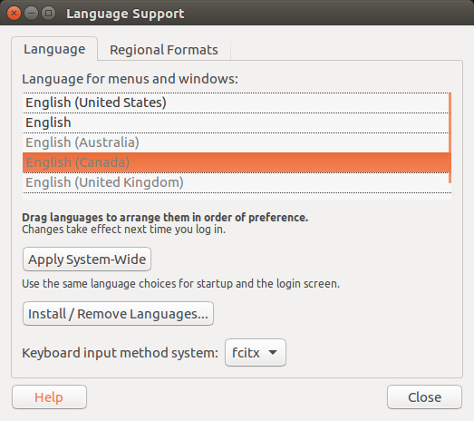
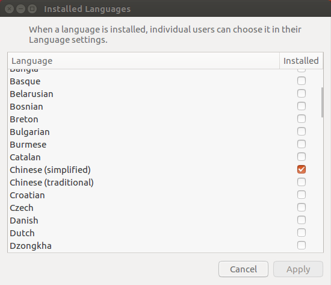
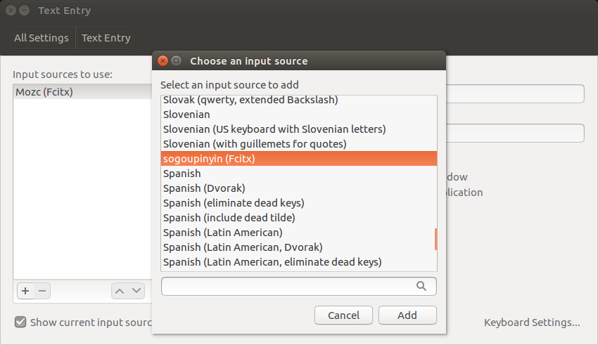

fcitx 是一种开源的输入法系统。

现在以 ubuntu 16.04 桌面版为例，对如何在上面安装 sougou 输入法进行说明。

1. 系统配置

首先点击 `system setting...` 进入系统配置界面


点击 `Language Support`，弹出相应对话框:



点击 `Install/Remove Languages...`，在弹出的 `Installed Languages` 对话框中找到并勾选如下选项:



之后点击 `Apply` 进行应用。

关闭该对话框，退回到 `Language Support` 对话框中，点击 `Apply System-Wide` 应用于系统。

最后点击 `Close` 关闭。

2. 下载安装

之后去搜狗官网上下载相应 deb 包，笔者这里下载的 deb 包如下:
```s
    sogoupinyin_4.0.1.2800_x86_64.deb
```
然后点击安装或通过如下命令行进行安装:
```s
    sudo dpkg -i sogoupinyin_4.0.1.2800_x86_64.deb
```

3. 选择添加

安装完成后，再次打开系统配置界面，点击 `Text Entry`，弹出如下对话框:



点击左下角 `+`，找到 sougoupinyin 选项进行添加(Add)即可。

重启机器。
