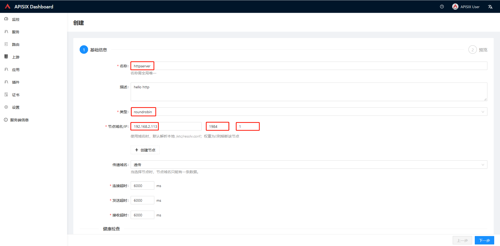
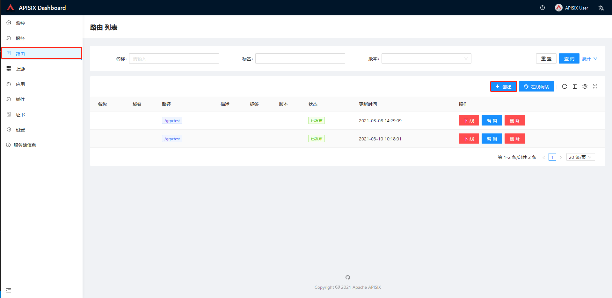
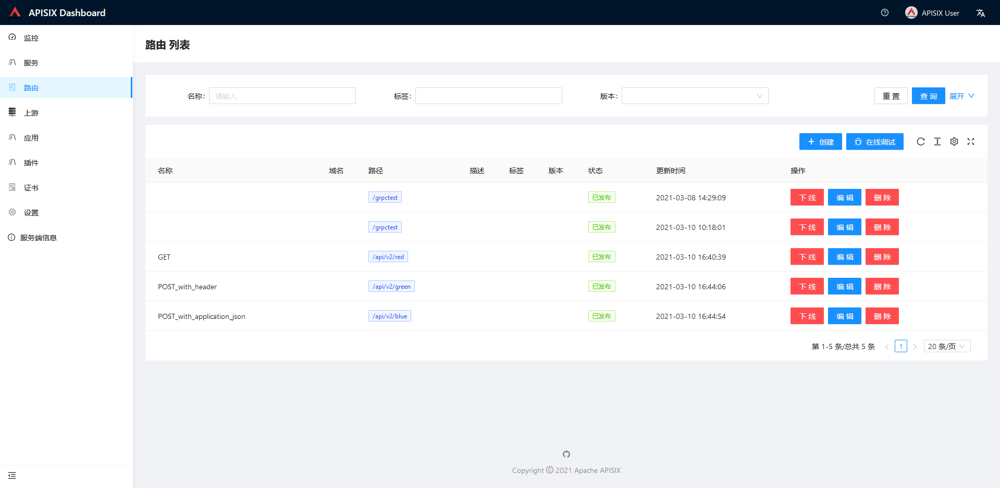

### 机器部署简述

|    角色  |     IP地址    | 服务名称          | 对应端口 | 是否要求全子网段访问  | 备注 |
|:---------|:--------------|:-----------------|:--------|:-------------------|:-----|
| 服务端   | 192.168.2.113 | http服务          | 1984    | 否，但建议是[是]    |      |
| 代理端   | 192.168.2.113 | apisix           | 9080     | 是                 |      | 
|          |               | etcd             | 2379    | 否                 | 要求与 apisix 部署在同一台机器上 |
| 管理端   | 192.168.2.113 | apisix-dashboard | 9000     | 是                 | 可能要求与 apisix 部署在同一台机器上 |
| 客户端   | 192.168.2.0/24| http请求          |         |                    |      |


假设`服务端`和`代理端`已经正常运行，`管理端`页面也可以正常显示。接下来只说明如何通过 `管理端` 配置路由访问。

### 上游配置

登录之后点击**上游**进入上游列表页面。

点击**创建**上游服务:


进行如下必要填充，点击进入**下一步**:



继续点击**提交**，上游列表中会新增一条记录:


### 路由配置

点击**路由**进入路由列表页面。

点击**创建**路由:



进行如下填充，点击进入**下一步**:


**选择上游**列表框中选择目标上游，进入**下一步**:


暂时不进行插件方面的配置。

配置完成后，可以看到新增一条路由记录，如下:


按同样的方式另外配置两条测试路由，完成后路由列表界面如下:




### 客户端访问

通过 `curl` 进行访问:
```sh
    curl http://192.168.2.113:9080/api/v2/red
    curl -X POST http://192.168.2.113:9080/api/v2/green
    curl -X POST http://192.168.2.113:9080/api/v2/blue -H "Content-Type:application/json" -d'{"username" : "ultraboy", "userage" : "20394"}'
```
