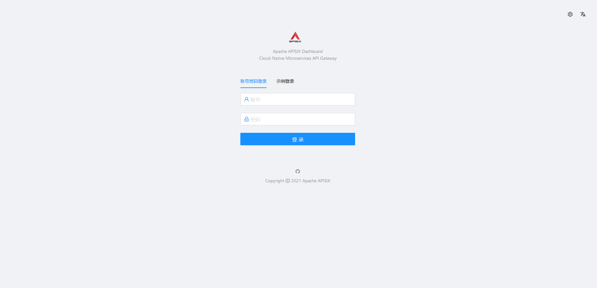
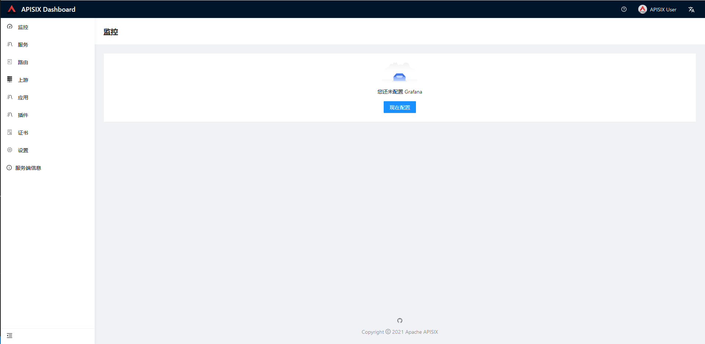

`apisix` 提供了专用的 web 面板进行控制，即 [apisix-dashboard](https://github.com/apache/apisix-dashboard.git)

`apisix-dashboard` 需要的基础编译环境: `node`, `npm`, `yarn`, `golang` 。

[源码方式部署apisix-dashboard参考](https://github.com/apache/apisix-dashboard/blob/v2.3/docs/deploy.md)


### node 安装

required version: Node.js 10.23.0+

```sh
    curl -sL https://deb.nodesource.com/setup_12.x | sudo -E bash -
    apt-get install -y nodejs
```

```sh
    node --version
    npm --version
```

### yarn 安装

[安装参考](https://yarn.bootcss.com/docs/install/#debian-stable)

```sh
    curl -sS https://dl.yarnpkg.com/debian/pubkey.gpg | sudo apt-key add -
    echo "deb https://dl.yarnpkg.com/debian/ stable main" | sudo tee /etc/apt/sources.list.d/yarn.list
```

```sh
    apt-get update
    apt-get install yarn
```

```sh
    yarn --version
```

### golang 安装

required version: 1.13+

采用官方提供的二进制包 go1.13.15.linux-amd64 。

[安装参考](https://golang.google.cn/doc/install)

将文件抽取到 `/usr/local` 目录下，目标是创建一个 `/usr/local/go` 。
```sh
    rm -rf /usr/local/go && tar -C /usr/local -xzf go1.13.15.linux-amd64.tar.gz
```

将 `/usr/local/go/bin` 添加到环境变量 `PATH` 中。

将下列命令写入到 `$HOME/.profile` 或 `/etc/profile` 中。
```sh
    export PATH=$PATH:/usr/local/go/bin
```

`source` 更新。

```sh
    go version
```


### apisix-dashboard 安装

这里 `apisix-dashboard` 与 `apisix` 版本保持一致。

```sh
    git clone -b v2.3 https://github.com/apache/apisix-dashboard.git
```

编译创建(需要一点时间):
```sh
    cd apisix-dashboard
    make build
```

创建完成之后，会在当前目录下产生个 `output/` 目录，确认存在 `manager-api`, `conf/conf.yaml` 和 `conf/schema.json` 。

`manager-api` 是接口管理后台服务启动命令，为了方便，这里将其链接到系统搜索路径下:
```sh
    ln -s /home/apisix-dashboard/output/manager-api /usr/bin/manager-api
```


### 测试

etcd required version: 3.4.0+

`manager-api` 服务依赖于 `etcd`，所以在启动之前确保 `etcd` 服务处于运行状态。

修改一下配置文件 `conf/conf.yaml`，将监听host改为 `0.0.0.0`，以便在其他机器上可以访问服务。

启动 `manager-api`
```sh
    nohup manager-api &
```

在浏览器地址栏中进行访问:
```sh
    http://192.168.a.bcd:9000
```
`192.168.a.bcd` 是 `manager-api` 服务所在机器网络地址。

预期会出现如下界面:



当然，也可以通过 `curl` 进行访问:
```sh
    curl http://192.168.a.bcd:9000
```

使用缺省用户名和密码(均为 `admin`)登录后，预期会出现如下界面:


