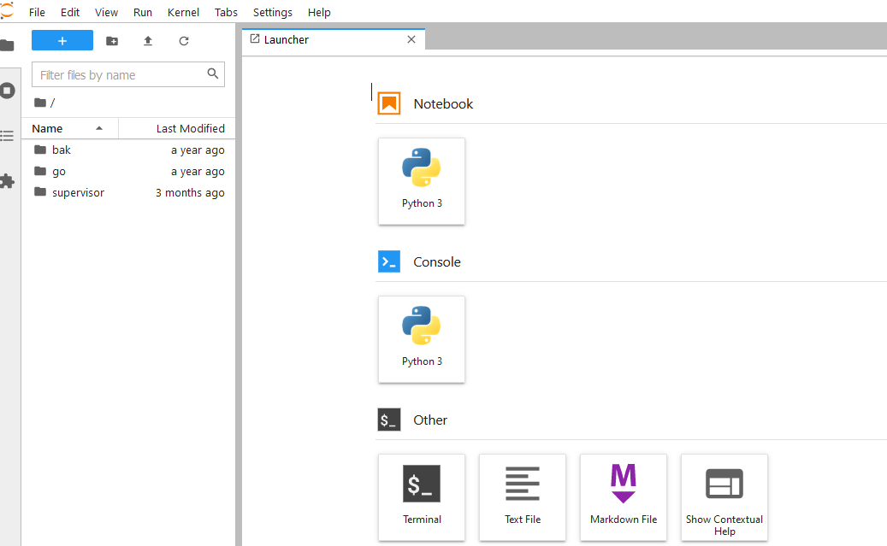

pip install jupyterlab

`jupyter-lab` 是一套具有完备设施的服务环境，它由服务端和客户端构成，服务端可以部署在 Windows 或 Linux 上，客户端可以是 B 端或 C 端。二者通过 http 进行通信。

这里以 Linux 服务端和浏览器 B 端为例，简单说明其部署方法及使用方法。

### 部署

主要是对服务端的部署进行说明。

部署的 Linux 在之前已经安装有 `anaconda3` 环境，该环境下已经安装有 `jupyter-lab`，如下:
```sh
    which jupyter-lab
    /home/pyer/anaconda3/bin/jupyter-lab
```

如果没有安装，可以执行如下命令进行安装:
```sh
    pip install jupyterlab
```

当然，更建议安装 anaconda3 环境，可能后续在 jupyterlab 中会用到 anaconda3 的多个依赖，避免单独安装和可能的版本不一致。


### 运行

顺利的话，在命令行执行 `jupyter-lab` 就会启动服务端，默认会在 8888 上建立监听端口。

官方不建议在 root 权限下运行服务端，这可以通过 `--allow-root` 来跨过这种限制。使用 root 只是权限更大一些，不会限制或影响服务的功能。

另外，最好在使用者想要对外开放的目录下执行该命令，这样客户端可以直接对该目录下的文件进行操作，比较方便，也安全。

这里进入 `/root` 目录下，以 root 身份执行如下命令:
```sh
    jupyter-lab --ip=0.0.0.0 --port=8888 --allow-root
```
顺利的话，会有如下输出:
```sh
    [I 2022-08-10 16:40:40.196 ServerApp] jupyterlab | extension was successfully linked.
    [I 2022-08-10 16:40:40.443 ServerApp] nbclassic | extension was successfully linked.
    [I 2022-08-10 16:40:40.514 LabApp] JupyterLab extension loaded from /home/pyer/anaconda3/lib/python3.8/site-packages/jupyterlab
    [I 2022-08-10 16:40:40.514 LabApp] JupyterLab application directory is /home/pyer/anaconda3/share/jupyter/lab
    [I 2022-08-10 16:40:40.518 ServerApp] jupyterlab | extension was successfully loaded.
    [I 2022-08-10 16:40:40.523 ServerApp] nbclassic | extension was successfully loaded.
    [I 2022-08-10 16:40:40.523 ServerApp] Serving notebooks from local directory: /root
    [I 2022-08-10 16:40:40.523 ServerApp] Jupyter Server 1.4.1 is running at:
    [I 2022-08-10 16:40:40.523 ServerApp] http://u2:8888/lab?token=42c3d1c1f9b69aa0b894966c2861351e569501b97a0c3638
    [I 2022-08-10 16:40:40.523 ServerApp]  or http://127.0.0.1:8888/lab?token=42c3d1c1f9b69aa0b894966c2861351e569501b97a0c3638
    [I 2022-08-10 16:40:40.523 ServerApp] Use Control-C to stop this server and shut down all kernels (twice to skip confirmation).
    [C 2022-08-10 16:40:40.528 ServerApp] 
        
        To access the server, open this file in a browser:
            file:///root/.local/share/jupyter/runtime/jpserver-1737527-open.html
        Or copy and paste one of these URLs:
            http://u2:8888/lab?token=42c3d1c1f9b69aa0b894966c2861351e569501b97a0c3638
        or http://127.0.0.1:8888/lab?token=42c3d1c1f9b69aa0b894966c2861351e569501b97a0c3638
```
将上面的 `http://127.0.0.1:8888/lab?token=42c3d1c1f9b69aa0b894966c2861351e569501b97a0c3638` 中的 '127.0.0.1' 改为运行服务器 ip 地址，然后将其拷贝到浏览器地址栏中，就可以访问了。

顺利的话，浏览器展示如下:



成功!
