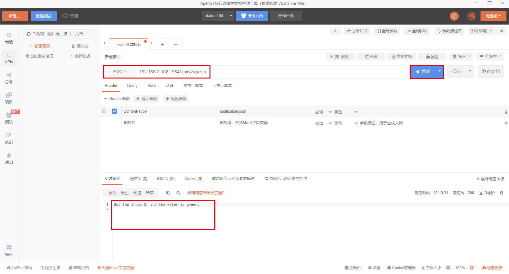
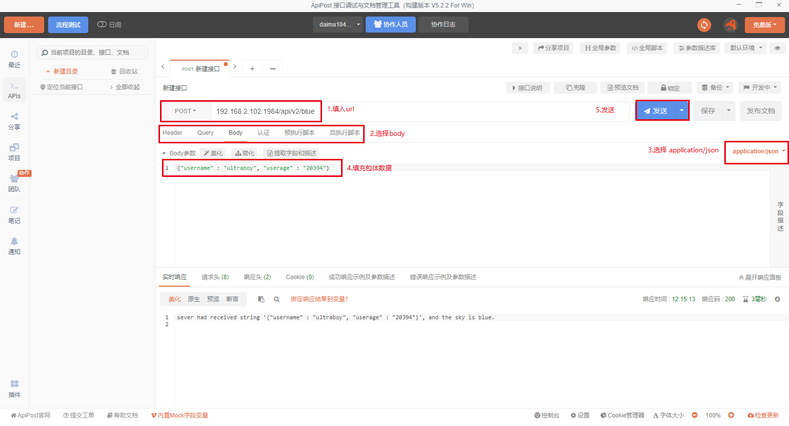
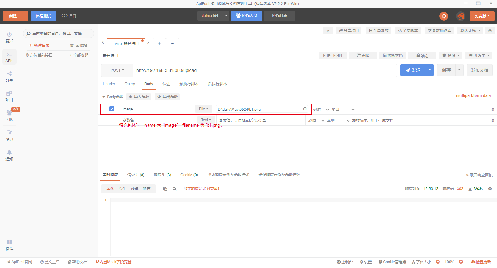
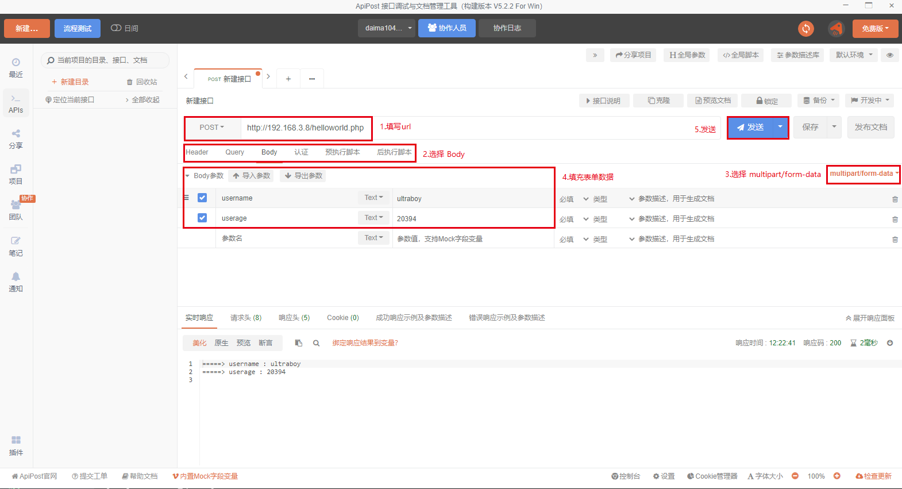

### GET 请求

如下图示例:


### 裸 POST 请求




### 带 json 的 POST 请求

关键词: `application/json`




### 利用 POST 传输二进制文件




### 带表单 POST 请求

http 请求中的`multipart/form-data`，既可以上传文件等二进制数据，也可以上传表单键值对。

可以在后台写一个 php 脚本进行简单测试，比如这里就是 `helloworld.php`。



其执行效果与下面的 html 是等价的:
```html
    <!DOCTYPE html>
    <html>
    <head>  
        <meta http-equiv="content-type" content="text/html;charset=utf-8"/>  
        <title>上传用户信息</title>  
    </head>
    <body>
        <form enctype="multipart/form-data" method="post" action="helloworld.php">  
            <table>  
                <tr><td align="center" colspan="2"><font style="font-size:40px;font-family: 华文彩云;">字符串上传</font></td></tr>  
                <tr><td>请填写用户名~：</td><td><input type="text" name="username" value='xiaoming'/></td></tr>
                <tr><td>请填写年龄：</td><td><input type="text" name="userage" value=18 /></td></tr>
                <tr><td><input type="submit" name="submit "value="Submit me!"/></td><td></td></tr>  
            </table>
        </form>
    </body>
    </html>
```


### 带文本键值对的 POST 请求

`application/x-www-from-urlencoded`能传输文本（不能传输数据流，不能上传）的键值对。
