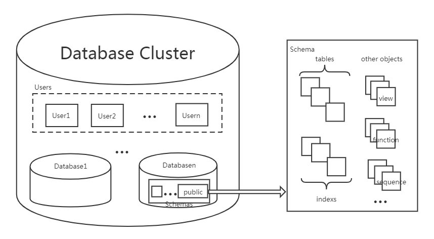

在 PostgreSQL 中有一个数据库集簇(Database Cluster)的概念，它是指单个 PostgreSQL 服务器实例管理的数据库集合，组成数据库集簇的这些数据库使用相同的全局配置文件和监听端口、共有进程和内存结构。在 PostgreSQL 中说的某一个数据库实例通常是指某个数据库集簇。

### 逻辑存储结构

数据库集簇是数据库对象的集合。在关系数据库理论中，`数据库对象`是用于存储或引用数据的数据结构，这包括有表、索引、序列、视图、函数等。在 PostgreSQL 中，数据库本身也是数据库对象，并且在逻辑上彼此分离，除数据库之外的其他数据库对象(例如表、索引等)都属于它们各自的数据库，虽然它们隶属于同一个数据库集簇，但无法直接从集簇中的一个数据库访问该集簇中的另一个数据库中的对象。

一个数据库集簇可以包含多个 Database、多个 User、每个 Database 以及 Database 中的所有对象都有它们的所有者: User 。



创建一个 Database 时会为这个 Database 创建一个名为 public 的默认 Schema，每个 Database 可以有多个 Schema，在这个数据库中创建其他数据库对象时如果没有指定 Schema，都会在 public 这个 Schema 中。

Schema 可以理解为一个数据库中的命名空间，在数据库中创建的所有对象都在 Schema 中创建，一个用户可以从同一个客户端连接中访问不同的 Schema。不同的 Schema 中可以有多个相同名称的 Table、Index、View、Sequence、Function 等数据库对象。

### 物理存储结构

数据库的文件默认保存在 initdb 时创建的数据目录中，除了数据文件之外，还有参数文件、控制文件、数据库运行日志及预写日志等。

1.数据目录结构

用来存放 PostgreSQL 持久化的数据，通常可以将数据目录路径配置为 `PGDATA` 环境变量。这里是 `/pgdata/13/data`，其目录内容如下:
```sh
    ├── base
    ├── global
    ├── pg_commit_ts
    ├── pg_dynshmem
    ├── pg_logical
    ├── pg_multixact
    ├── pg_notify
    ├── pg_replslot
    ├── pg_serial
    ├── pg_snapshots
    ├── pg_stat
    ├── pg_stat_tmp
    ├── pg_subtrans
    ├── pg_tblspc
    ├── pg_twophase
    ├── pg_wal
    └── pg_xact
```

数据目录中主要子目录和文件的用途如下:

| 目录 | 用途 |
|:-----|:-----|
| base | 包含每个数据库对应的子目录的子目录 |
| global | 包含集簇范围的表的子目录，比如 pg_database |
| pg_wal | 保存预写日志 |

| 文件 | 用途 |
|:----|:-----|
| pg_hba.conf | 客户端认证控制文件 |
| postgresql.conf | 参数文件 |
| postgresql.auto.conf | 参数文件，只保存 ALTER SYSTEM 命令修改的参数 |
| postmaster.opts | 记录服务器最后一次启动时使用的命令行参数 |

2.数据文件布局

`base` 子目录是数据文件默认保存的位置，是数据库初始化后的默认表空间。

(1) OID

PostgreSQL 中的所有数据库对象都由各自的对象标识符(OID)进行内部管理，数据库对象和各个 OID 之间的关系存储在适当的系统目录中，具体取决于对象的类型。

数据库的 OID 存储在 `pg_database` 系统表中，其查询方式如下:
```sql
    testdb=> SELECT oid,datname FROM pg_database WHERE datname='testdb';
    oid  | datname 
    -------+---------
    16384 | testdb
    (1 row)
```

数据库中的表、索引、序列等对象的 OID 存储在 `pg_class` 系统表中:
```sql
    testdb=> SELECT oid,relname,relkind FROM pg_class WHERE relname ~ 'test_';
    oid  |      relname      | relkind 
    -------+-------------------+---------
    16386 | test_boolean      | r
    16389 | test_array1       | r
    16417 | test_json1_id_seq | S
    16419 | test_json1        | r
    16426 | test_json1_pkey   | i
    16428 | test_r1_id_seq    | S
    16430 | test_r1           | r
    16475 | test_sample       | r
    16486 | test_array3       | r
    (9 rows)
```

(2) 表空间

PostgreSQL 中最大的逻辑存储单位是表空间，数据库中创建的对象都保存在表空间中。在创建数据库对象时，可以指定数据库对象的表空间，如果不指定则使用默认表空间，也就是数据库对象的文件的位置。

初始化数据库目录会自动创建 `pg_default` 和 `pg_global` 两个表空间:
```sql
    testdb=> \db
        List of tablespaces
        Name    |  Owner   | Location 
    ------------+----------+----------
    pg_default | postgres | 
    pg_global  | postgres | 
    (2 rows)
```
* pg_global 表空间的物理文件位置在数据目录的 global 中，它用来保存系统表。
* pg_default 表空间的物理文件位置在数据目录中的 base 目录，是 template0 和 template1 数据库的默认表空间，默认使用 template1 的表空间。

除了两个默认表空间，用户还可以创建自定义表空间。使用自定义表空间有两个典型的场景:
* 通过创建表空间解决已有表空间磁盘不足并无法逻辑扩展的问题
* 将索引、WAL、数据文件分配在性能不同的，使硬件利用率和性能最大化

(3) 数据文件命名

在数据库中创建对象，例如表、索引时首先会为表和索引分配段。在 PostgreSQL 中，每个表和索引都用一个文件存储，新创建的表文件以表的 OID 命名，如果大小超出 1GB，会自动将其切分为多个文件存储，切分出的文件用 OID.<顺序号> 来命名。真正管理表文件的是 pg_class 表中的 `refilenode` 字段的值，在新创建对象时会在 pg_class 系统表中插入该表的记录，默认会以 OID 作为 refilenode 的值，但经过几次 `VACUUM`、`TRUNCATE` 操作之后，refilenode 的值会发生变化。
```sql
    testdb=# SELECT oid,datname FROM pg_database WHERE datname='testdb';
    oid  | datname 
    -------+---------
    16384 | testdb
    (1 row)

    testdb=# SELECT oid,relfilenode FROM pg_class WHERE relname='test_array3';
    oid  | relfilenode 
    -------+-------------
    16486 |       16486
    (1 row)

    testdb=# \! ls -l /pgdata/13/data/base/16384/16486
    -rw------- 1 postgres postgres 8192 Sep 19 17:54 /pgdata/13/data/base/16384/16486

    testdb=# TRUNCATE test_array3;
    TRUNCATE TABLE
    testdb=# SELECT oid,relfilenode FROM pg_class WHERE relname='test_array3';
    oid  | relfilenode 
    -------+-------------
    16486 |       16493
    (1 row)

    testdb=# \! ls -l /pgdata/13/data/base/16384/16486
    sh: 1: /pgdata/13/data/base/16384/16486: not found
    testdb=# \! ls -l /pgdata/13/data/base/16384/16493
    -rw------- 1 postgres postgres 0 Sep 20 08:39 /pgdata/13/data/base/16384/16493
```

(4) 表文件内部结构

在 PostgreSQL 中，将保存在的块称为 `Page`，而将内存中的块称为 `Buffer`，表和索引称为 `Relation`，行称为 `Tuple`。

数据的读写是以 Page 为最小单位，每个 Page 默认大小为 8KB，在编译 PostgreSQL 时指定的 `BLCKSZ` 大小决定 Page 的大小。每个表文件由多个 BLCKSZ 字节大小的 Page 组成，每个 Page 包含若干 Tuple。

对于 I/O 性能较好的硬件，并且以分析为主的数据库，适当增加 BLCKSZ 大小可以小幅提升数据库性能。
