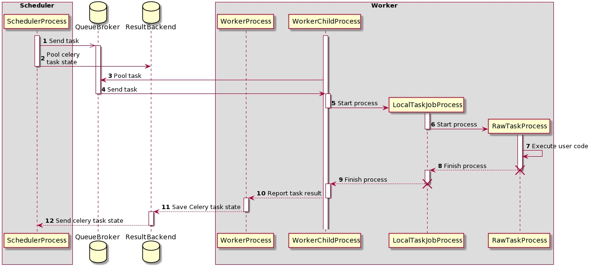

Airflow是一个可编程，调度和监控的工作流平台，基于有向无环图(DAG)。

Airflow可以定义一组有依赖的任务，按照依赖依次执行。

Airflow提供了丰富的命令行工具用于系统管控，而其web管理界面同样也可以方便的管控调度任务，并且对任务运行状态进行实时监控，方便了系统的运维和管理。

### 架构与组件

组件
- Workers: 执行分配的任务(task)
- Scheduler: 添加任务(task)到队列
- Web server: 提供访问 DAG/task 状态信息的 http 服务
- Database: 记录 task,DAG,Variable,connection 等资源的状态信息
- Celery: 分布式任务队列机制
  - Broker: 存储执行的命令
  - Result backend: 存储命令执行完毕后的状态信息

组件通信
1. Web server → Workers: 拉取任务执行日志
2. Web server → DAG files: 得到 DAG 文件内容
3. Web server → Database: 拉取任务状态信息
4. Workers → DAG files: 得到 DAG 文件内容并执行任务
5. Workers → Database: 获取/存储信息，如连接、变量、XCOM 等
6. Workers → Celery’s result backend: 保存任务状态
7. Workers → Celery’s broker: 保存执行的命令
8. Scheduler → DAG files: 得到 DAG 文件内容并调度任务
9. Scheduler → Database: 存储 DAG 及包含的任务
10. Scheduler → Celery’s result backend: 获取已完成任务的状态信息
11. Scheduler → Celery’s broker: 将命令调度给队列执行

### 任务执行

要想执行一个任务，开始时至少要启动两个进程，分别是:
- Scheduler 进程: 使用 CeleryExecutor 处理任务
- Worker 进程: 观察队列，等待新任务加入

还有两个可用的数据库:
- QueueBroker
- ResultBackend

在这两个进程运行过程中，Worker 进程会创建另外两个子进程:
- LocalTaskJobProcess: 使用 TaskRunner 创建，监控 RawTaskProcess。
- RawTaskProcess: 调用 execute() 创建。

说明:
- 1. SchedulerProcess 将准备好的任务发送到队列 QueueBroker
- 2. QueueBroker 也会定期访问 ResultBackend，获取任务状态
- 3. QueueBroker 当意识到有任务加入时，将这个任务的信息发送给 WorkerProcess
- 4. WorkerProcess 将单个任务分配给 WorkerChildProcess
- 5. WorkerChildProcess 根据任务执行合适的任务句柄函数，它会创建一个新进程 LocalTaskJobProcess
- 6. LocalTaskJobProcess 的逻辑由 LocalTaskJob 类定义，它会启动一个新进程执行 TaskRunner
- 7.8. 在任务完成后，执行关于 RawTaskProcess 和 LocalTaskJobProcess 的停止工作
- 10.12. WorkerChildProcess 通知主进程 WorkerProcess 关于任务的最终状态以及后续任务的可用性
- 11. WorkerProcess 将状态信息保存到 ResultBackend
- 13. 当 SchedulerProcess 向 ResultBackend 获取任务的状态信息时，它就会得到

### 部署方式

单节点部署

多节点部署

优点:
- 高可用
- 分布式处理
- 水平扩展 worker 节点
- 垂直扩展 worker 节点

注意:
- 确保集群中只有一个 scheduler 进程
- 确保所有机器使用同一份配置文件
- 确保所有机器使用同一份任务代码，即 DAG 文件

### celery 依赖

1. 任务模块 Task

包含异步任务和定时任务。其中，异步任务通常在业务逻辑中被触发并发往任务队列，而定时任务由 Celery Beat 进程周期性地将任务发往任务队列。

2. 消息中间件 Broker

Broker，即为任务调度队列，接收任务生产者发来的消息（即任务），将任务存入队列。Celery 本身不提供队列服务，官方推荐使用 RabbitMQ 和 Redis 等。

3. 任务执行单元 Worker

Worker 是执行任务的处理单元，它实时监控消息队列，获取队列中调度的任务，并执行它。

4. 任务结果存储 Backend

Backend 用于存储任务的执行结果，以供查询。同消息中间件一样，存储也可使用 RabbitMQ, Redis 和 MongoDB 等。

### 其他

1. 队列

- 当 Airflow 使用 CeleryExecutor 时，在向队列发送任务时，可以指定发送到哪个队列。
- 缺省发送到的队列名称为 `default`。
- Worker 进程可以监听一个或多个任务队列。在启动一个 Worker 进程时，可以指定一组要监听的队列，队列之间通过逗号 `,` 进行分隔。
- Worker 进程只会执行它所监听任务队列中的任务。

2. 概念

- DAG: 利用 DAG 文件创建 DAG 对象，通过传入参数来控制这个 DAG 对象的属性。
- Operators: 通过它构造一个 Task 实例。Airflow 内置了很多 operators，目前常用的有 BashOperator、PythonOperator、EmailOperator、HTTPOperator 等。
- Task:  一个任务。
- Task Instance: Task 的一次运行。Web 界面中可以看到 task instance 有自己的状态，如 `running`、`success`等
- Task Relationships: DAGs 中不同 Tasks 之间的依赖关系，如 Task1 >> Task2，表示 Task2 依赖于 Task1 。
- 通过将 DAGs 和 Operators 结合起来，使用者就可以创建各种复杂的工作流(workflow)。

3. Flower

- flower 是一个守护进程，用于是监控 celery 消息队列。
- 提供 Web 页面访问，默认端口 5555 。
- 非必需。
