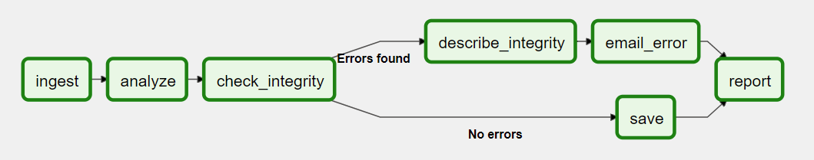
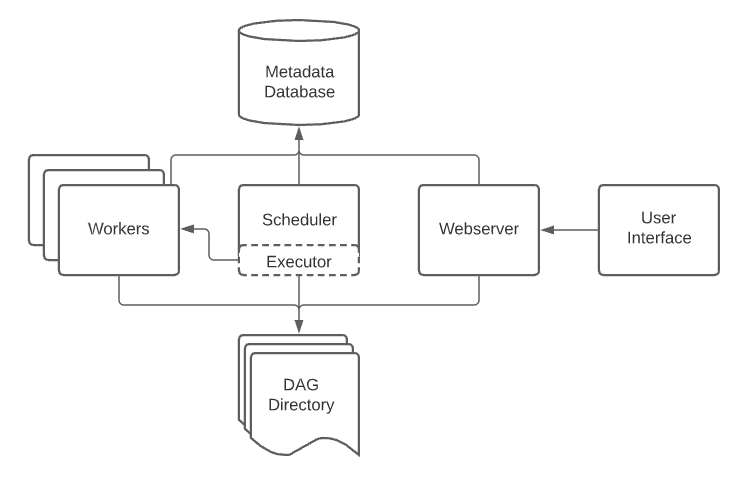

[参考](https://airflow.apache.org/docs/apache-airflow/2.1.3/concepts/overview.html)

Airflow 是一个用于创建并运行工作流(`workflows`)的平台，一个 DAG 就是一个工作流，里面包含一些称为任务(task)的细小工作，并根据依赖关系与数据流向进行安排。



DAG 指定了 task 之间的依赖关系、执行顺序及重试次数。每个 task 自身会定义各自会做什么，如获取数据、运行分析、触发操作等。

Airflow 安装完成后，通常会包含如下组件:
* `scheduler`: 处理调度工作流，以及将 task 提交到执行器(executor)去运行。
* `executor`: 处理正在运行的任务。采用缺省安装的 Airflow，执行器在调度器中运行 task，不过在多数生产环境下执行器通常将 task 的执行交给 workers 。
* `webserver`: 提供了一个方便的用户界面，用于检查、触发、调度 DAG 和 task 的行为。
* `DAG 文件集`: 由调度器和执行器读取。
* `元数据库`: 用于调度器、执行器和 webserver 的数据存储。



多数执行器通常也会引入其他组件用于与 workers 进行会话，就像任务队列一样。不过即使这样，你也可以始终将执行器以及其所处的 worker 进程总体上视为同一个逻辑组件，毕竟它们都是为了 task 的执行而存在。


### Workloads

一个 DAG 会运行一系列 task，通常 task 的类型有 3 种:
* `Operators`: 预定义任务模板，通过它们你可以完成 DAG 的绝大多数拼图。
* `Sensors`: Operators 的特殊子类，用于等待某个外部事件的发生。
* `@task`: TaskFlow-decorated，自定义 Python 函数并打包为一个 task 。

内部实现上，它们都是 `BaseOperator` 的子类，Task 和 Operator 在概念上有时可以互换，不过将它们进行明确区分也很必要。本质上，Operators 和 Sensors 是模板，在 DAG 文件中可以使用它们创建 Task 。

### 流的控制 Control Flow

DAG 可以被运行多次，并且它们的多次运行可以并行运行。DAG 是参数化了的，它们包含了一个它们会"运行到的"日期，称为 `execution_date`，也会选择性地包含其他参数。

Task 互相之间可以建立依赖，这通过 `>>` 和 `<<` 符号实现:
```py
    first_task >> [second_task, third_task]
    third_task << fourth_task
```
或者通过 `set_upstream` 和 `set_downstream` 方法:
```py
    first_task.set_downstream([second_task, third_task])
    third_task.set_upstream(fourth_task)
```

这些依赖构成了有向无环图的"边"， 让 Airflow 确定 task 的运行顺序。缺省地，task 会等待上游所有的任务运行成功之后才开始执行，但也可以使用一些特性进行定制，如:
* `Branching`
* `LatestOnly`
* `Trigger Rules`

在两个 task 之间传递数据的方式有两种:
* `XComs`
* 存储服务器(如公有云)上传和下载文件(一般多用于数据较大的情况)

当空间可用时，Airflow 将 task 发往 Workers 运行，所以一个 DAG 中的各个任务可能分散运行在不同节点或者不同 worker 上。

起初你构建的 DAG 是简单明了的，但是慢慢地，DAG 结构可能会变得很复杂。好在 Airflow 提供了一些延缓这种破败趋势的方法:
* `SubDAGs`: 复用化 DAG ，嵌入到其他 DAG 中使用
* `TaskGroups`: 对 task 进行分组(可以在 UI 中操作)


### 用户界面

Airflow 用户界面可以用来查看 DAG 及其任务正在执行的操作、触发 DAG 的运行、​​查看日志以及对 DAG 进行一些有限的调试和问题解决。


