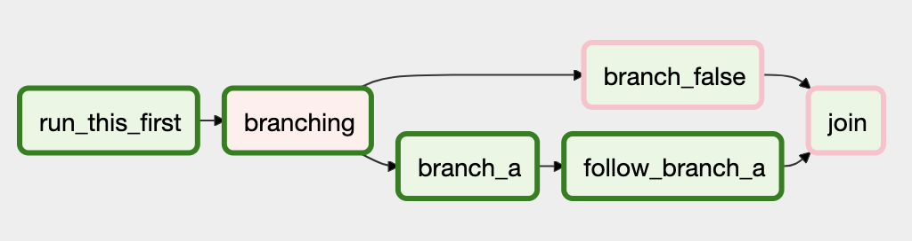

[参考](https://airflow.apache.org/docs/apache-airflow/2.1.3/concepts/dags.html)

DAG(Directed Acyclic Graph) 是 Airflow 的核心概念，它是 task 的容器，并组织它们运行。

以下面的简单 DAG 示例:


这里定义了 4 个 task，并规定了它们的运行组织方式。

DAG 自身不必关心它所包含的每个任务发生了什么，只需要简单考虑应该以何种方式(如规定顺序)运行它们，或者多久之后重新运行它们。

### 声明 DAG

有三种方式声明一个 DAG。

一种是使用上下文管理器，它会将 DAG 的所有东西隐式添加到管理器中:
```py
    with DAG("my_dag_name") as dag:
        op = DummyOperator(task_id="task") 
```

一种是使用标准的构造器，将 dag 传入到指定的 Operator 中:
```py
    my_dag = DAG("my_dag_name")
    op = DummyOperator(task_id="task", dag=my_dag)
```

一种是使用 `@dag` 修饰器，将函数转为一个 DAG 生成器:
```py
    @dag(start_date=days_ago(2))
    def generate_dag():
        op = DummyOperator(task_id="task")

    dag = generate_dag()
```

只有定义了要运行的 task，DAG 才有意义。task 通常以 Operator、Sensors 或 TaskFlow 形式出现。

### 任务依赖

一个 DAG 中通常并不仅仅包含一个 Task/Operator。它们各自可能是一些任务的上游任务，同时又作为另一些任务的下游而存在，对这些任务之间依赖关系的定义，就构成了有向无环图 DAG 的"边"。

有两种方式定义每个单独任务之间的这种依赖。推荐使用 `>>` 和 `<<` 操作符:
```py
    first_task >> [second_task, third_task]
    third_task << fourth_task
```

当然，也可以通过 `set_upstream` 和 `set_downstream` 方法:
```py
    first_task.set_downstream([second_task, third_task])
    third_task.set_upstream(fourth_task)
```

如果你想让一个列表中的 task 依赖于另一个列表中的 task，上面的方法不再行得通，此时需要使用 `cross_downstream`:
```py
    from airflow.models.baseoperator import cross_downstream

    # Replaces
    # [op1, op2] >> op3
    # [op1, op2] >> op4
    cross_downstream([op1, op2], [op3, op4])
```

如果你想对 task 进行串联，可以使用 `chain`:
```py
    from airflow.models.baseoperator import chain

    # Replaces op1 >> op2 >> op3 >> op4
    chain(op1, op2, op3, op4)

    # You can also do it dynamically
    chain([DummyOperator(task_id='op' + i) for i in range(1, 6)])    
```
`chain` 也可以组成同尺寸列表成对依赖(还是看代码吧):
```py
    from airflow.models.baseoperator import chain

    # Replaces
    # op1 >> op2 >> op4 >> op6
    # op1 >> op3 >> op5 >> op6
    chain(op1, [op2, op3], [op4, op5], op6)
```


### 加载 DAG

Airflow 从 Python 资源文件中加载 DAG，Python 文件位于 DAG_FOLDER 路径下。它会获取每个文件，执行并从文件中加载 DAG 对象。

你可以在单个 Python 文件中定义多个 DAG，甚至可以使用 `import` 将一个复杂的 DAG 分散在多个 Python 文件中。

注意，虽然 Airflow 可以从单个 Python 文件中加载多个 DAG 对象，但它只会加载顶格的 DAG 并实例化。如下示例:
```py
    def my_function():
        dag_2 = DAG('but_this_dag_will_not')

    dag_1 = DAG('this_dag_will_be_discovered')

    my_function()
```
dag_1 位于顶格，会被加载到 Airflow 中，而 dag_2 就不会。

在 DAG_FOLDER 路径下，你可以创建一个 `.airflowignore` 文件用于忽略对某些文件的获取。

### 运行 DAG

DAG 以两种方式之一种运行:
* 通过 UI 按钮手动或者通过 API 触发
* 由调度器调度执行

DAG 并不需要调度(毕竟调度的对象是 task 啊)，但通常也会定义一个，这通过参数 `schedule_interval` 来实现:
```py
    with DAG("my_daily_dag", schedule_interval="@daily"):
        ...
```
schedule_interval 参数支持 crontab 语义，所以你可以像下面这样定义:
```py
    with DAG("my_daily_dag", schedule_interval="0 * * * *"):
        ...
```

每次在运行 DAG 时，都会创建一个实例，Airflow 将其称之为 `DAG Run`。由同一个 DAG 产生的 DAG Runs 可以并行运行，每个 DAG Run 都会定义一个 `execution_date`，它标识了运行到的逻辑日期和时间。

DAG Run 的概念很有用，试想一下，有一个处理每日试验数据的 DAG，现在要把它重写为运行处理三个月之前的数据。这没有问题，因为 Airflow 可以通过补录(backfill)方式一次性完成对过去三个月每一天执行一次 DAG 的副本。这些 DAG Runs 虽然是在同一天开始运行的，但是它们的 execution_date 值将涵盖过去三个月，这个值也是 DAG 中的所有 tasks/operators/sensors 在运行时所要查看的内容。

DAG 在每次运行时会实例化为一个 DAG Run，同样地，DAG 中的 Task 在每次运行时也会实例化为对应的 `Task Instances`。


### Default Arguments

同一个 DAG 中的很多 Operator 往往使用一组相同的缺省参数(比如 start_date)。为了避免为每个 Operator 一个一个地指定这些参数，你可以为 DAG 传入 `default_args` 参数，它会将其自动与 Operator 绑定:
```py
    default_args = {
        'start_date': datetime(2016, 1, 1),
        'owner': 'airflow'
    }

    with DAG('my_dag', default_args=default_args) as dag:
        op = DummyOperator(task_id='dummy')
        print(op.owner)  # "airflow"
```

### DAG 装饰器

除了通过 DAG() 声明一个 DAG 这种传统方式之外，自版本 2.0 起，你也可以通过 `@dag` 装饰器将一个普通的函数转化为一个 DAG 生成器函数。
```py
    @dag(default_args=DEFAULT_ARGS, schedule_interval=None, start_date=days_ago(2), tags=['example'])
    def example_dag_decorator(email: str = 'example@example.com'):
        """
        DAG to send server IP to email.

        :param email: Email to send IP to. Defaults to example@example.com.
        :type email: str
        """
        get_ip = GetRequestOperator(task_id='get_ip', url="http://httpbin.org/get")

        @task(multiple_outputs=True)
        def prepare_email(raw_json: Dict[str, Any]) -> Dict[str, str]:
            external_ip = raw_json['origin']
            return {
                'subject': f'Server connected from {external_ip}',
                'body': f'Seems like today your server executing Airflow is connected from IP {external_ip}<br>',
            }

        email_info = prepare_email(get_ip.output)

        EmailOperator(
            task_id='send_email', to=email, subject=email_info['subject'], html_content=email_info['body']
        )


    dag = example_dag_decorator()
```

### 流的控制 Control Flow

缺省地，task 会等待上游所有的任务运行成功之后才开始执行，但也可以通过如下方式改变这种机制。

1.Branching

基于某个条件选择下次要进行的任务。

使用 Branching 方式可以告知 DAG 不用运行所有依赖的上游任务，只是选择一个或几个执行。其通过 BranchPythonOperator 实现。

`BranchPythonOperator` 很像 PythonOperator，只不过它期望一个能够返回一个(或一组)`task_id` 的 `python_callable`。接下来会执行这个(或些) `task_id` 所标识的 task，其他的则被跳过。 

由 Python 函数返回的 task_id 所代表的 task 将不得不作为 BranchPythonOperator 所创建的任务的直接下游。

注意，当一个任务同时作为 branching operator 任务以及另一个(或多个)已选择任务的下游时，这个任务将不会被跳过。如下图示例:


这里分支路径上的任务有 `branch_a`、`join` 和 `branch_b`。`join` 由于作为 `branch_a` 的下游任务存在，所以它始终会被运行，即使它没有被返回作为分支决议的其中一部分。

BranchPythonOperator 也可以通过 `XComs` 使分支上下文环境基于上游任务动态决定接下来哪个任务要被运行:
```py
    def branch_func(ti):
        xcom_value = int(ti.xcom_pull(task_ids='start_task'))
        if xcom_value >= 5:
            return 'continue_task'
        else:
            return 'stop_task'

    start_op = BashOperator(
        task_id='start_task',
        bash_command="echo 5",
        xcom_push=True,
        dag=dag,
    )

    branch_op = BranchPythonOperator(
        task_id='branch_task',
        python_callable=branch_func,
        dag=dag,
    )

    continue_op = DummyOperator(task_id='continue_task', dag=dag)
    stop_op = DummyOperator(task_id='stop_task', dag=dag)

    start_op >> branch_op >> [continue_op, stop_op]
```
如上，这里我们创建了 4 个任务，分别是 `start_op`、`branch_op`、`continue_op` 和 `stop_op`。start_op 作为最上游任务先被执行，之后执行 branch_op，它会执行 python_callable 类型调用 branch_func，在这个函数中会根据条件选择接下来要执行哪个任务(continue_op 或者 stop_op)。这里的分支条件是根据 start_op 任务的命令执行结果进行分支选择，这里接收到到的始终是 5，所以会一直执行 continue_op 任务。

[完整示例程序查看](t/branch_operator.py)

其执行图示如下:


你可以将脚本中 `echo 5` 改为 `echo 4` 再作尝试，观察结果。

使用者可以通过继承 `BaseBranchOperator` 来实现自定义具有分支功能的 operator，其表现行为与 BranchPythonOperator 相似，但是需要使用者自己实现 `choose_branch` 方法。

和 BranchPythonOperator 一样，choose_branch 方法也需要返回要执行的下游任务的一个(或一组)ID，其他的则被跳过:
```py
    class MyBranchOperator(BaseBranchOperator):
        def choose_branch(self, context):
            """
            Run an extra branch on the first day of the month
            """
            if context['execution_date'].day == 1:
                return ['daily_task_id', 'monthly_task_id']
            else:
                return 'daily_task_id'
```

2.Latest Only

Branching 的一种特殊形式。

DAG Runs 经常会执行到一个与当前日期不一样的日期，比如在进行对过去一个月内的数据进行任务补录，这个时候可能会在每次执行时都要运行一次 DAG 的一次副本。但有的时候，我们并不需要这样。

有这样一些情形，你并不想让 DAG 中的一些(甚至所有)任务在之前整个日期内到点时都执行一次副本，这个时候就可以使用 `LatestOnlyOperator`。这个 operator 只会执行最近一次的 DAG run，而在这之前的副本都会被跳过。

```py
    with DAG(
        dag_id='latest_only_with_trigger',
        schedule_interval=dt.timedelta(hours=4),
        start_date=days_ago(1),
        tags=['example3'],
    ) as dag:

        latest_only = LatestOnlyOperator(task_id='latest_only')
        task1 = DummyOperator(task_id='task1')
        task2 = DummyOperator(task_id='task2')
        task3 = DummyOperator(task_id='task3')
        task4 = DummyOperator(task_id='task4', trigger_rule=TriggerRule.ALL_DONE)

        latest_only >> task1 >> [task3, task4]
        task2 >> [task3, task4]
```
其 Graph View 图如下:


上面在 DAG 中共定义了两个 TaskFlow。其执行计划是从过去一天开始，每隔 4 个小时运行一次 DAG 。

也就是说，假如我们现在执行这个脚本，那么可能会运行 5 次或 6 次 DAG 。以下面执行的 Tree View 进行说明:


这里一共执行了 5 次，一共 7 组方框，上面四组(依次为 latest_only、task1、task4、task3)是第一个流的，下面三组(依次为 task2、task4、task3)是第二个流的。

* `task1` 是 `latest_only` 的直接下游，所以 task1 除了最后一次，其他次运行都被跳过。这里 task1 被跳过了 4 次。
* `task2` 与 latest_only 完全无关，所以会正常运行。
* `task3` 同时作为 task1 和 task2 的下游，由于缺省触发规则(all_success)的缘故，它会串联 task1 的运行方式。所以在两个流中，task3 也被跳过了 4 次，只运行最后一次。
* `task4` 也同时作为 task1 和 task2 的下游，由于其将触发规则(`trigger_rule`) 设置为 `all_done`，它将不会被跳过。

[完整示例程序查看](t/latest_only_with_trigger.py)

3.Depends On Past

你可以断言一个任务只有在它前一个任务运行成功之后，它才会运行。为了实现这种需要，你可以在任务(Task)中将 `depends_on_past` 参数设置为 `True`。

注意，如果你在其生命周期的最初阶段运行一个 DAG 时，一个特殊的例子是前面任务的 `execution_date` 在时间线上比后面一个任务的 `start_date` 靠后，那么此时无论前面任务运行成功与否，后面的任务依旧执行。

4.Trigger Rules

缺省时，对于 Airflow 中的某个任务，它会等待所有上游任务都执行成功才会执行。但是你也可以通过 Task 中的 `trigger_rule` 参数来改变这种行为。

trigger_rule 的可选项有:
* `all_success`: (缺省值)
* `all_failed`: 所有的上游任务都处于 `failed` 或 `upstream_failed` 状态时才会触发
* `all_done`: 所有的上游任务都运行完了(不必理会运行怎样)就触发
* `one_failed`: 上游任务只要有一个运行失败就触发
* `one_success`: 上游任务只要有一个运行成功就触发
* `none_failed`: 所有的上游任务即不处于 `failed` 也不处于 `upstream_failed` 状态，也就是说，所有的上游任务要么成功，要么跳过，才会触发
* `none_failed_or_skipped`: 所有的上游任务即不处于 `failed` 也不处于 `upstream_failed` 状态，并且至少一个上游任务运行成功才会触发
* `none_skipped`: 所有的上游任务都不处于 `skipped` 状态，也就是说，上游的任务只有处于 `success`、`failed` 或 `upstream_failed` 状态时才会触发
* `dummy`: 完全没有依赖性，总是会运行这个任务

> 意识到触发规则(trigger rules)与跳过任务(skipped tasks)之间的相互作用很重要，尤其要跳过的任务作为分支operator的一部分存在时，因为这个时候你几乎不想使用 all_success 或 all_failed 进行触发。

触发规则可以与 Depends On Past 一起使用。

要跳过的任务会级联触发器规则 `all_success` 和 `all_failed`，让接下来的任务也被跳过。比如下面的代码:
```py
    dag = DAG(
        dag_id='branch_without_trigger',
        schedule_interval='@once',
        start_date=days_ago(10)
    )

    run_this_first = DummyOperator(task_id='run_this_first', dag=dag)
    branching = BranchPythonOperator(
        task_id='branching', dag=dag,
        python_callable=lambda: 'branch_a'
    )

    branch_a = DummyOperator(task_id='branch_a', dag=dag)
    follow_branch_a = DummyOperator(task_id='follow_branch_a', dag=dag)

    branch_false = DummyOperator(task_id='branch_false', dag=dag)

    join = DummyOperator(task_id='join', dag=dag)

    run_this_first >> branching
    branching >> branch_a >> follow_branch_a >> join
    branching >> branch_false >> join
```
`join` 同时作为 `follow_branch_a` 和 `branch_false` 的下游。按照缺省的触发规则，join 都会被跳过。因为无论如何，也只能执行一路分支，根据级联规则，join 会被置于 `skipped` 状态。其 Graph View 如下:



如果你手动设置 join 任务的触发条件为 `none_failed_or_skipped`，那么它的 Graph View 将如下:


[完整示例程序查看](t/branch_without_trigger.py)

### Dynamic DAGs

由于 DAG 是通过 Python 代码定义的，所以没必要对其在其他地方另作声明。在定义 DAG 的时候，你可以根据需要自由地使用循环、函数甚至其他一些东西。

例如，下面通过一个 for 循环在 DAG 中定义多个任务的示例:
```py
    with DAG("loop_example") as dag:

        first = DummyOperator(task_id="first")
        last = DummyOperator( task_id="last")

        options = ["branch_a", "branch_b", "branch_c", "branch_d"]
        for option in options:
            t = DummyOperator(task_id=option)
            first >> t >> last
```

一般情况下，我们建议你在定义 DAG 时，任务与任务之间在布局上尽量保持相对稳定的拓扑结构，dynamic DAGs 通常更用于动态加载配置项或者改变 operator 选项时的情况。

上面的代码，执行后的 Graph View 如下:


[完整示例程序查看](t/loop_example.py)


### DAG Visualization

如果想要看到 DAG 的视觉呈现，你可以关注这两点:
* 进入 Airflow UI 界面，导航到相应的 DAG，选择 `Graph View`
* 运行 `airflow dags show`，它将以图像文件的形式呈现出来

通过 Graph View 更直观，不过在对 DAG 迭代扩展的过程中，很可能其图像也会愈加复杂。为此，这里提供了两种方法来使 DAG 视图更易理解。

1.任务组 TaskGroups

`TaskGroup` 用来在 GV 图中有等级层次地组织任务(task)，这在创建重复模式和减少视觉混乱时很有用。

不像 `SubDAGs` 一样，TaskGroup 纯粹是一个 UI 上的组织概念。TaskGroup 中的 Tasks 存在于同一个源 DAG 中，共享这个 DAG 的所有环境配置(setting)和池参数配置(pool configurations)。


依赖关系可以通过 `>>` 和 `<<` 适用到 TaskGroup 中的所有任务之间。比如下面的代码:
```py
    with TaskGroup("group1") as group1:
        task1 = DummyOperator(task_id="task1")
        task2 = DummyOperator(task_id="task2")

    task3 = DummyOperator(task_id="task3")

    group1 >> task3
```
将 `task1` 和 `task2` 加入到 TaskGroup `group1` 中，将它们打包作为 `task3` 的上游。

[TaskGroup使用示例程序](t/example_task_group.py)

> 注意，缺省情况下，子 tasks/TaskGroups 的 ID 会以其父 TaskGroup 的 group_id 作为前缀，这确保了在 DAG 中 group_id 和 task_id 的唯一性。
> 在创建 TaskGroup 时可以传入 `prefix_group_id=False` 来禁用这种缺省的前缀命名方式，此时就需要使用者自己来实现保证上述所说的唯一性。

2.边界标记 Edge Labels

就像将任务组织到组里面一样，你也可以在 GV 图中为不同任务之间设置依赖性边界标记。这在 DAG 的分支情况下很有用，您可以标记某些分支可能运行的条件。

你可以直接在 `>>` 和 `<<` 操作符中添加标记:
```py
    from airflow.utils.edgemodifier import Label
    my_task >> Label("When empty") >> other_task
```
[边界标记使用示例程序](t/example_branch_labels.py)

### DAG & Task 文档

[查看这里](https://airflow.apache.org/docs/apache-airflow/2.1.3/concepts/dags.html#dag-task-documentation)


### SubDAGs

有的时候，你会定期地将同样的一组任务准确地添加到每一个 DAG 中，或者你会将很多的任务聚集成一个逻辑单元时，这就是所谓的 `SubDAGs` 。

如下就是拥有很多并行任务的 DAG 图示:


这在视觉上很是混乱，我们可以将所有的 `task-*` 合并为一个单一的 SubDAG，如下所示:


> SubDAG operator 应该包含一个返回一个 DAG 对象的工厂方法，这让 SubDAG 在主 UI 中避免被当作另外一个 DAG 对象，因为毕竟，只能有一个 DAG 对象。
> 始终要记住，Airflow 只要在顶格代码中看到 DAG ，就会将其加载为 DAG 对象。

[SubDAG定义文件代码](t/subdag.py)

[主DAG程序示例](t/example_subdag_operator.py)

使用 SubDAGs 时小贴士:
* 传统上对 SubDAG 的 dag_id 的命名一般是 `parent.child`。
* SubDAG operator 应该共享来自主 DAG 中的参数。
* SubDAGs 必须有一个调度计划并被启用，如果 SubDAG 的调度计划为 `None` 或者 `@once`，那么 SubDAG 将会什么都不做，按运行成功处理。
* 清理 SubDagOperator 也会清理其内部任务的状态。
* 将 SubDagOperator 标识为成功并不会影响其内部任务的状态。
* 对 SubDAG 内部任务要保守使用 Depends On Past 特性，因为这会产生混乱。
* 你可以为 SubDAG 指定一个执行器。如果你想限制其并行，可以选择是 `SequentialExecutor`。使用 LocalExecutor 可能会产生问题，因为它可能会过度订阅 worker，在单个槽中运行多个任务。

### 打包 DAGs

一些很简单的 DAG 可以通过一个独立的 Python 文件定义使用，但更复杂 DAG 可能会跨越多个文件相互依赖，此时就需要进行将它们"量贩"在一起。

在进行这项工作时，你可以将所有文件组织在 DAG_FOLDER 目录下，或者将所有的 DAG 文件压缩成一个 zip 包。例如，以下面这种组织方式打包两个 DAG 及其依赖项为一个 zip 包:
```sh
    my_dag1.py
    my_dag2.py
    package1/__init__.py
    package1/functions.py
```

### DAG 之间的依赖

自 Airflow 2.1 开始引入。

一个 DAG 内部任务与任务之间的上下游依赖关系可以很明确地表示出来，但是 DAG 与 DAG 之间的依赖关系相比会更复杂一点。

通常，有两种方式可以表示 DAG 之间的依赖:
* triggering - TriggerDagRunOperator
* Waiting - ExternalTaskSensor

[更多参考](https://airflow.apache.org/docs/apache-airflow/2.1.3/concepts/dags.html#dag-dependencies)
