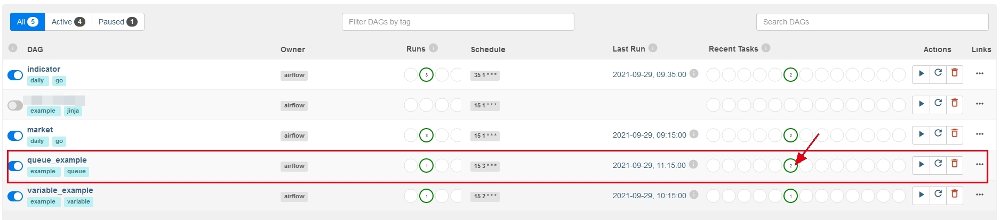
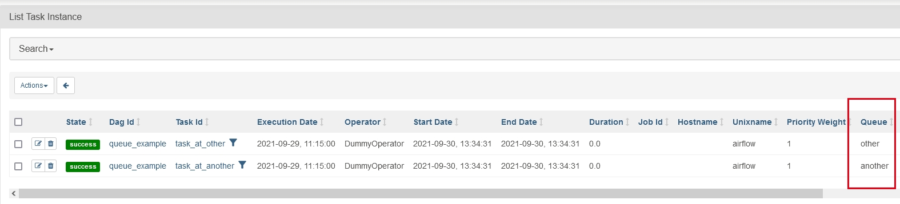

1. 在某个节点上启动 worker 进程时，指定侦听队列

```s
    airflow celery worker -c 1 -q other,another
```
这里在启动 worker 进程的同时，也侦听了 other 和 another 两个队列，队列与队列之间通过 `,` 分隔。

2. 在 DAG 文件的 task 中指定任务要投放到哪个队列

```py
    # The DAG object; we'll need this to instantiate a DAG
    from airflow import DAG
    
    # Operators; we need this to operate!
    from airflow.operators.dummy import DummyOperator
    from airflow.utils.dates import days_ago
    
    with DAG(
        'queue_example',
        default_args= {
            'owner': 'airflow',
            'start_date': days_ago(1),
        },
        schedule_interval='15 3 * * *',
        tags=['example', 'queue'],
    ) as dag:
    
        t1 = DummyOperator(task_id="task_at_other",   queue='other',   dag=dag)
        t2 = DummyOperator(task_id="task_at_another", queue='another', dag=dag)
        
        t1
        t2
```
这里将 t1 投到 other，t2 投到 another。

3. 将 DAG 文件放到相应目录下，在 web 页面上开启执行



点这个绿色按钮，查看是在哪个队列中执行的。


