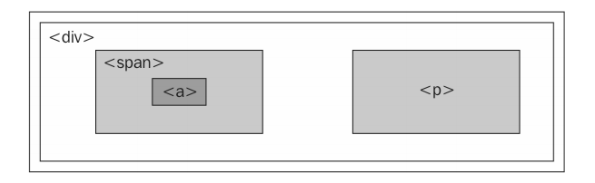
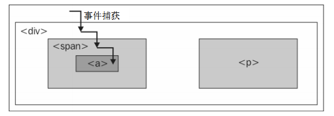
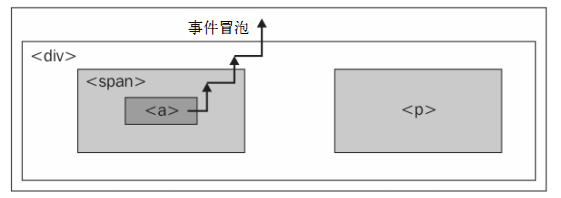

jQuery 的 `.hover` 方法可以让我们在鼠标指针进入元素和离开元素时，通过 JavaScript 来改变元素的样式——事实上是可以执行任意操作。

`.hover()` 方法接受两个函数作为参数。第一个函数会在鼠标指针进入被选择的元素时执行，而第二个函数会在鼠标指针离开该元素时触发。

为按钮添加一种翻转状态:
```css
    .hover {
        cursor: pointer;
        background-color: #afa;
    }
```

```js
    $(document).ready(function() {
        $('#switcher h3').hover(function() {
            $(this).addClass('hover');
        }, function() {
            $(this).removeClass('hover');
        });
    });
```

而且，使用 `.hover()` 也意味着可以避免 JavaScript 中的`事件传播(event propagation)`导致的头痛问题。

### 事件的旅程

当页面上发生一个事件时，每个层次上的 DOM 元素都有机会处理这个事件。以下面的页面模型为例:
```html
    <div class="foo">
        <span class="bar">
            <a href="http://www.example.com">
                The quick brown fox jumps over the lazy dog.
            </a>
        </span>
        <p>
            How razorback-jumping frogs can level six piqued gymnasts!
        </p>
    </div>
```
当在浏览器中形象化地呈现这些嵌套的代码构成的元素时，其效果如下:



从逻辑上看，任何事件都可能会有多个元素负责响应。举例来说，如果单击了页面中的链接元素，那么 `<div>`、`<span>` 和 `<a>` 全都应该得到响应这次单击的机会。毕竟这 3 个元素同时都处于用户鼠标指针之下。而 `<p>` 元素则与这次交互操作无关。

允许多个元素响应单击事件的一种策略叫做`事件捕获`。在事件捕获的过程中，事件首先会交给最外层的元素，接着再交给更具体的元素。在这个例子中，意味着单击事件首先会传递给 `<div>`，然后是 `<span>`，最后是 `<a>`。



另一种相反的策略叫做 `事件冒泡`。即当事件发生时，会首先发送给最具体的元素，在这个元素获得响应机会之后，事件会向上冒泡到更一般的元素。这个例子中，`<a>` 会首先处理事件，然后按照顺序依次是 `<span>` 和 `<div>`。如下图:



为了确保跨浏览器的一致性，jQuery 始终会在模型的冒泡阶段注册事件处理程序。因此，我们总是可以假定最具体的元素会首先获得响应事件的机会。

### 事件冒泡的副作用

事件冒泡可能会导致始料不及的行为，特别是在错误的元素响应 `mouseover` 或 `mouseout` 事件的情况下。

假设在上面的例子中，为`<div>`添加了一个 `mouseout` 事件处理程序。当用户的鼠标指针退出这个 `<div>`，会按照预期运行`mouseout`处理程序。因为这个过程发生在顶层元素上，所以其他元素不会取得这个事件。但是，当指针从`<a>`元素上离开时，`<a>`元素也会取得一个`mouseout`事件。然后，这个事件会向上冒泡到`<span>`和`<div>`，从而触发上述的事件处理程序。这种冒泡序列很可能不是我们所希望的。

而 `mouseenter` 和 `mouseleave` 事件，无论是单独绑定，还是在 `.hover()` 方法中组合绑定，都可以避免这些冒泡问题。在使用它们处理事件的时候，可以不用担心某些非目标元素得到 `mouseover` 或 `mouseout` 事件导致的问题。

虽然 `.hover()` 可以处理这种特殊情况，但在其他情况下，我们可能还需要从空间(阻止事件发送到某些元素)和时间(阻止事件在某些时间段发送)上限制某个事件。

