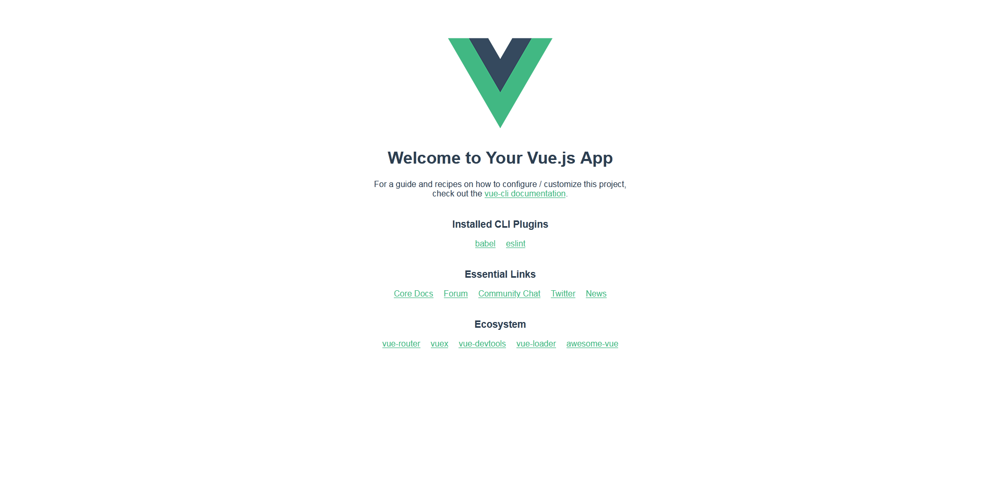

### 工具安装

Vue CLI 是一个需要全局安装的 NPM 包，安装 Vue CLI 的前提是设备已经安装了 Node.js 环境。

```sh
    node -v
    v14.15.1
```

接下来使用 npm 安装 Vue CLI 工具:
```sh
    npm install -g @vue/cli
```
由于有很多依赖包要下载，因此安装过程可能会持续一段时间。

等待安装完成后，通过如下命令检查 Vue CLI 工具是否安装成功:
```sh
    vue --version
    @vue/cli 5.0.6
```

如果官方的 Vue CLI 工具有升级，可以通过如下命令进行升级:
```sh
   npm update -g @vue/cli
```

### 创建运行

在终端执行如下命令来创建 Vue 项目工程:
```sh
    vue create hello-world
```
其中 hello-world 是我们要创建的工程名称。

创建项目工程也要持续一段时间。

创建完成后，会在控制台结尾有如下提示:
```sh
  Successfully created project hello-world.
  Get started with the following commands:

 $ cd hello-world
 $ npm run serve
```
根据上面的提示，进入 hello-world 目录，执行 `npm run serve` 就可以了。

运行成功时，控制台会有如下类似提示:
```sh
 DONE  Compiled successfully in 621ms                                                                                                                                                                                             1:11:13 PM


  App running at:
  - Local:   http://localhost:8080/ 
  - Network: http://192.168.0.105:8080/
```

这个时候通过浏览器访问上面的地址商品，如果出现如下页面，就说明开发服务器启动成功了:



缺省情况下，Vue 项目会运行在 8080 端口上，可以通过如下方式指定端口:
```sh
    npm run serve -- --port 9090
```

当启动了开发服务器后，其默认附带了热重载模块。开发者只需要在修改代码之后进行保存，网页就会自动进行更新。

### 工程管理

Vue CLI 工具也可以使用可交互的图形化页面创建工程。在控制台输入如下命令即可在浏览器中打开一个 Vue 工程管理工具页面:
```sh
    vue ui
    Starting GUI...
    Ready on http://localhost:8000
```
可以看到缺省情况下是不能进行外界访问的。通过 `vue ui --help` 寻找帮助:
```sh
    vue ui --help
    Usage: vue ui [options]

    start and open the vue-cli ui

    Options:
    -H, --host <host>  Host used for the UI server (default: localhost)
    -p, --port <port>  Port used for the UI server (by default search for available port)
    -D, --dev          Run in dev mode
    --quiet            Don't output starting messages
    --headless         Don't open browser on start and output port
    -h, --help         display help for command
```
可以通过相应选项指定地址和端口运行。比如这里是:
```sh
    vue ui --host 0.0.0.0 --port 8081
      Starting GUI...
      Ready on http://0.0.0.0:8081
```