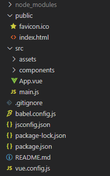

### 目录结构

利用 Vue CLI 创建项目完成后，其工程目录下主要有以下文件:



这其中主要包含 3 个目录和一些文件。这些文件的作用是:
- `.gitignore`: 不必多说。
- `babel.config.js`: 是 Babel 工具的配置文件，Babel 本身是一个 JavaScript 编译器，其会将 ES6 版本的代码转换成向后兼容的 JavaScript 代码，这个文件一般无须修改。
- `jsconfig.json`: ...
- `package.json`: 比较重要，其中存储的是一个 JSON 对象数据，用来配置当前的项目名称、版本号、脚本命令以及模块依赖等。当需要向项目中添加额外的依赖时，其就会被记录到这个文件默认的模板工程中。
- `package-lock.json`: 所依赖模块的具体信息。
- `vue.config.js`: Vue 工程项目的配置。

关于 3 个目录:
- `node_modules`: 存放 NPM 安装的依赖模块。
- `public`: 用来放置一些公有的资源文件，例如网页用到的图标、静态的 HTML 文件等。
- `src`: 核心功能代码都放在这个文件夹下，在默认的模板工程中，这个文件夹还有两个子文件夹，分别是 `assets` 和 `components`。前者存放资源文件，后者存放组件文件。

关于 src 目录，`main.js` 是应用程序的入口文件，其内容如下:
```js
import { createApp } from 'vue'
import App from './App.vue'

createApp(App).mount('#app')
```
第一行代码导入 Vue 框架中的 createApp 方法，第二行代码导入自定义的根组件，第三行代码则是挂载根组件。而根组件是挂载到上面的 `public` 目录下的 `index.html` 文件中去的。

Vue 使用单文件组件的办法，即将组件定义在单独的文件中，具体来说就是一个组件文件中会定义关于组件的 3 部分内容: template模板部分、script脚本代码部分和style样式代码部分。这个可以从 components 目录下的示例组件 HelloWorld.vue 略知一二。

### 插件依赖

Vue CLI 创建的工程使用的是基于插件的架构。

Vue 中的插件，也可以叫做依赖。其依赖信息保存在 package.json 文件中。

插件使用 `npm install` 安装，如:
```sh
    npm install --save axios vue-axios
```

### 工程构建

开发完一个 Vue 项目后，需要将其构建成可发布的代码产品。Vue CLI 提供了对应的工具链来实现这些功能。

在 Vue 工程目录下执行如下命令，可以直接将项目代码编译构建成生产包:
```sh
    npm run build
```

工程构建完成后，在工程的根目录下会生成一个名为 `dist` 的文件夹，这个文件夹就是要发布的软件包。这个文件夹下会包含一个名为 index.html 的文件，它是项目的入口文件，另外还包含一些静态资源与 CSS、JavaScript 等相关文件，这些文件中的代码都是被压缩的。

默认构建的环境是生产环境，开发环境中的依赖不会被添加。
