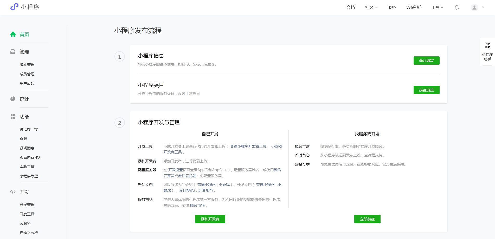
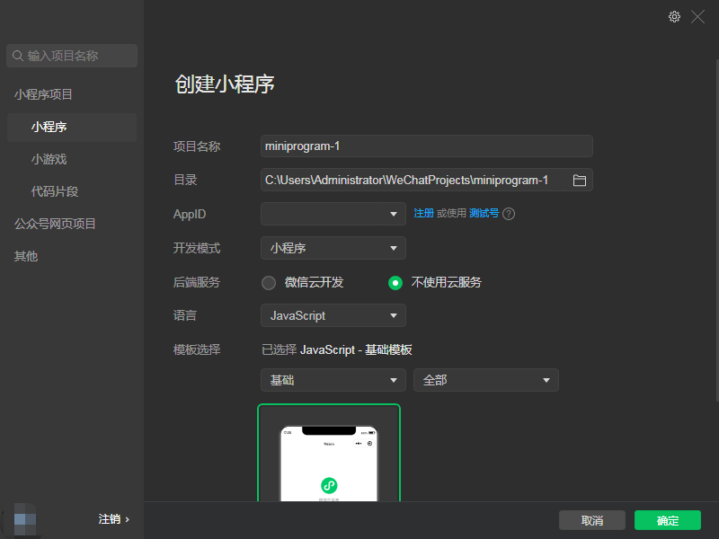

在进入微信小程序开发前，需要先注册微信公众号，并安装微信开发者工具。

### 注册微信公众号

微信公众号主要用来区分每个开发者，以及小程序的发布、审核上线等。

注册完成后，扫码登录。进入如下页面:

该页面是小程序管理后台，提供了针对小程序的开发、发布、管理和统计等一系列的功能。

小程序发布流程共有两个步骤:
1. 填写小程序的基本信息，下载小程序开发工具，进行小程序的开发。
2. 开发完成后，提供代码，等待审核，通过后即可将小程序发布。

通过路径 `开发 > 开发管理 > 开发设置` 进入页面，查看 AppID 。

在微信小程序中，AppID 又称为小程序 ID，是每个小程序的唯一标识。每个小程序账号只有一个 AppID，因此每个账号只能发布一个小程序。如果需要发布多个小程序，需要注册多个小程序账号。

### 安装微信开发者工具

[下载地址](https://developers.weixin.qq.com/miniprogram/dev/devtools/download.html)

### 创建项目

为了方便开发，开发者工具提供了两种开发模式用于创建项目，分别是`小程序`和`插件`，前者用于开发小程序，后者用于开发小程序的插件。

