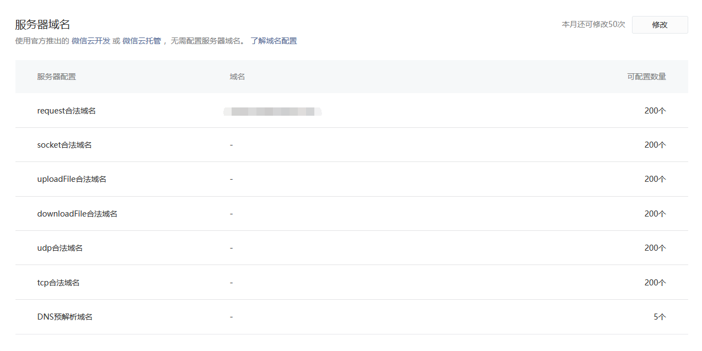
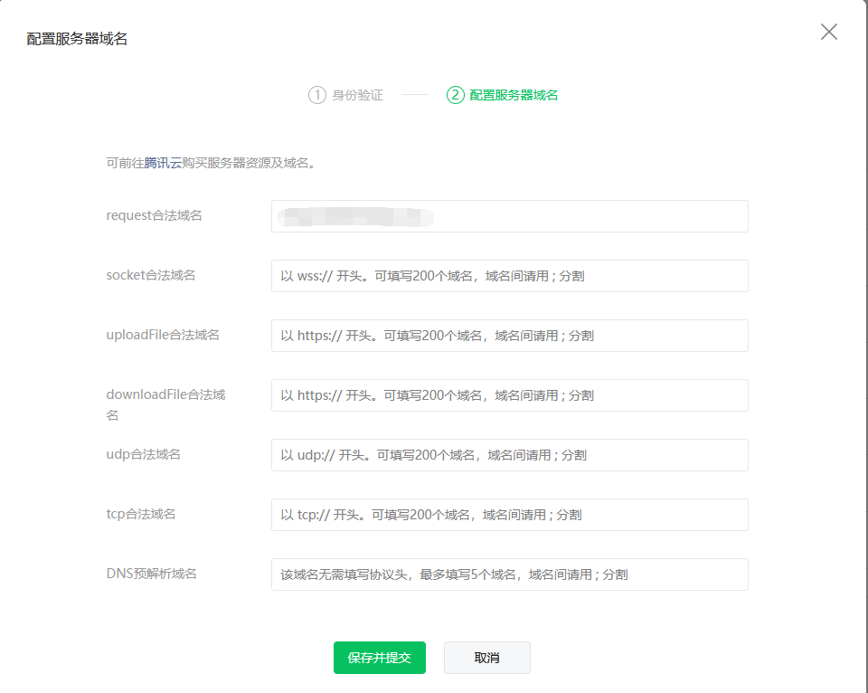
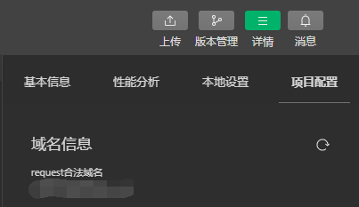
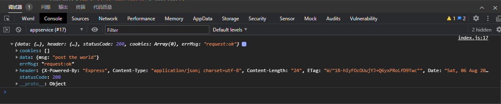

开发者可以通过小程序中的网络 API `wx.request()` 来实现与服务器的交互。

### 配置域名

对于正式上线的项目，小程序要求服务器域名必须在小程序管理后台中添加，域名必须经过 ICP 备案，且只支持 HTTPS 和 WSS 协议。

通过路径 `开发 > 开发管理 > 开发设置` 进入页面，找到 `服务器域名` 部分。



点击右上角，弹出对话框，扫码验证通过后即可在如下页面修改域名:



可以在一个输入框中键入多个域名，域名之间以 `;` 分隔。

修改完成后，点击 `保存并提交` 即可。

打开微信开发者工具，右上角进入`详情`，点击`项目配置` 可以看到当前域名配置:



### 对于开发

可以在微信开发者工具中关闭这些验证，从而利用本地服务器来进行开发测试。

具体操作为打开微信开发者工具，右上角进入`详情`，点击`本地设置`，选中如下选项:


在本地搭建好一个测试服务器，比如这里设置监听端口为 3000。然后在 index.js 中添加如下代码，就可以点击访问了:
```js
  submit: function(e) {
    wx.request({
      method: 'post',
      url: 'http://127.0.0.1:3000/post',
      data: e.detail.value,
      success: function(res) {
        console.log(res)
      }
    })
  },
```
在上述代码中，`method` 表示请求方式，`url` 表示服务器接口地址，`data` 表示请求的参数，`success` 表示接口调用成功的回调函数，其参数 res 表示服务器响应信息。

例如，这里返回的信息如下:



在上面的输出结果中，`data` 表示服务器的响应数据，`errMsg` 表示成功或失败的信息，`header` 表示服务器的响应头，`statusCode` 表示服务器的响应状态码。

### 获取服务器数据初始化页面

很多时候在打开页面时，小程序会主动向服务器请求一些数据用于初始化界面。这里针对这种情形做一个简单示例。

1. 设计好数据结构，根据数据结构制作模板。 [示例](t/questionnaire/pages/home/index.wxml)
2. 在小程序的 `onLoad` 事件函数中向服务器发送请求请求，获取数据，通过 `setData` 实现页面更新。 [示例](t/questionnaire/pages/home/index.js)

测试服务器示例在[这里](t/litserver) 。