在移动应用开发中，经常需要为用户发送一些消息，如支付成功提醒、到账提醒，或者向用户推送一些广告等。

订阅消息是在小程序中向用户发送消息的一种方式，其特点是必须按照小程序提供的模板来给用户发送消息。

### 开通功能

若要使用订阅消息，首先需要在 `小程序管理后台` 中单击左侧菜单中的 `订阅消息`，进入如下页面:

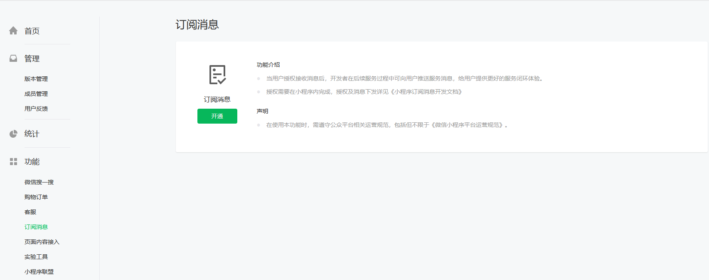

在使用该项功能之前，需要进行开通。点击`开通`会提示 "请先设置小程序类目"。

返回 `小程序管理后台` 首页，找到如下页面内容:

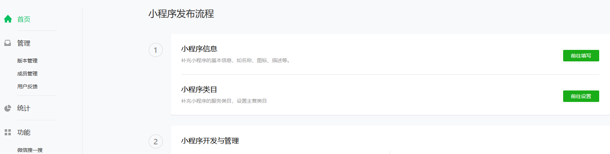

点击 `前往设置`，会进入如下页面:

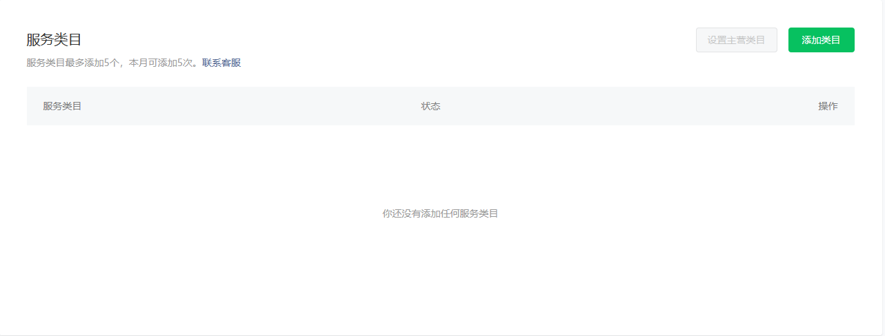

点击 `添加类目` 按钮，扫码验证后，会弹出一个对话框。在这个对话框中只可以从默认给出的已有类目中进行选择:

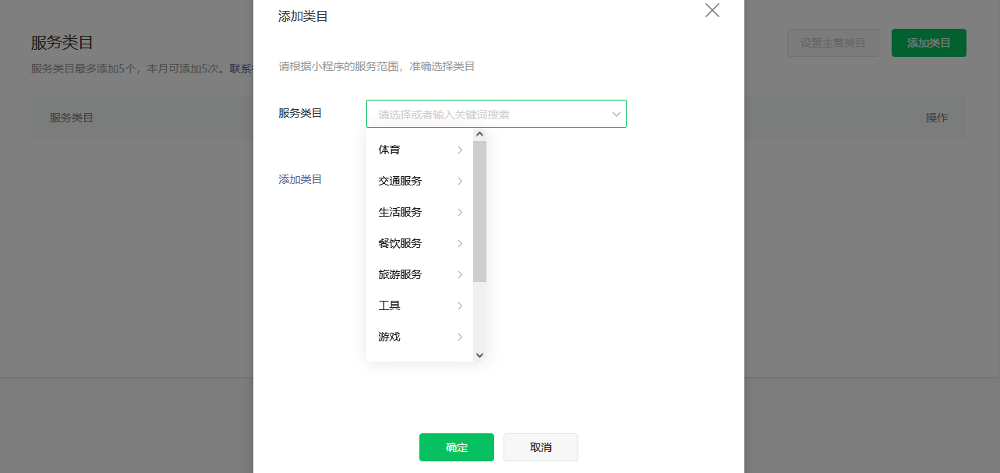

再次进入`订阅消息`页面，点击 `开通` 后，顺利的话会提示 '开通成功'。

### 添加模板

进入 `订阅消息` 后，映入眼帘的是 `我的模板` 页面，一开始是空的:

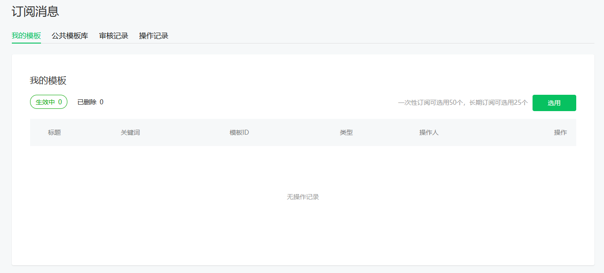

进入`公共模板库`中搜索模板，模板库会根据当前小程序的服务类目提供模板，例如 '生活服务/家政服务' 类目的小程序可以搜索 "下单成功通知"，结果如下:

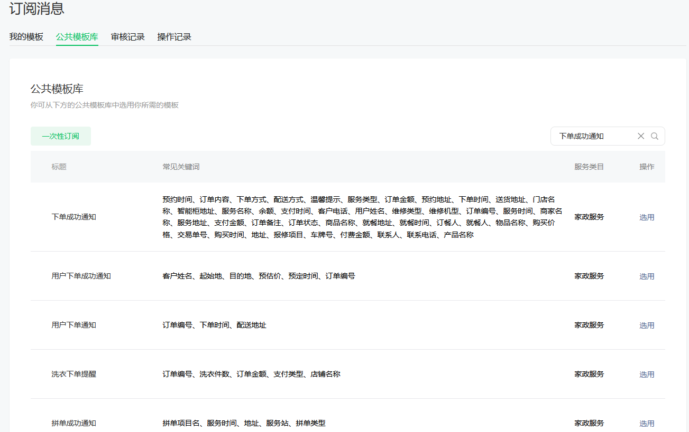

选择`用户下单成功通知`，单击 `选用`，为该条订阅消息进行配置:

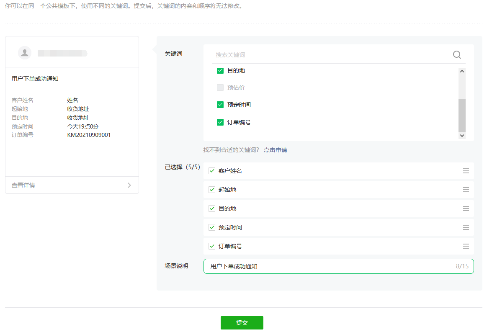

点击 `提交` 后，顺利的话会有 "选用模板成功" 提示。之后页面跳转到 `我的模板` 页面。这个时候就有了一条订阅消息模板:

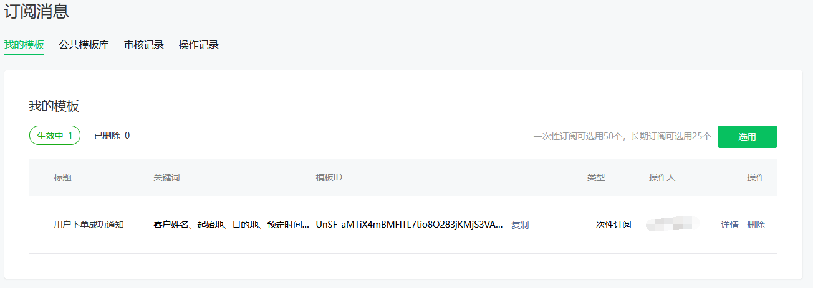

可以点击详情查看模板信息，如模板 ID 和关键词等。

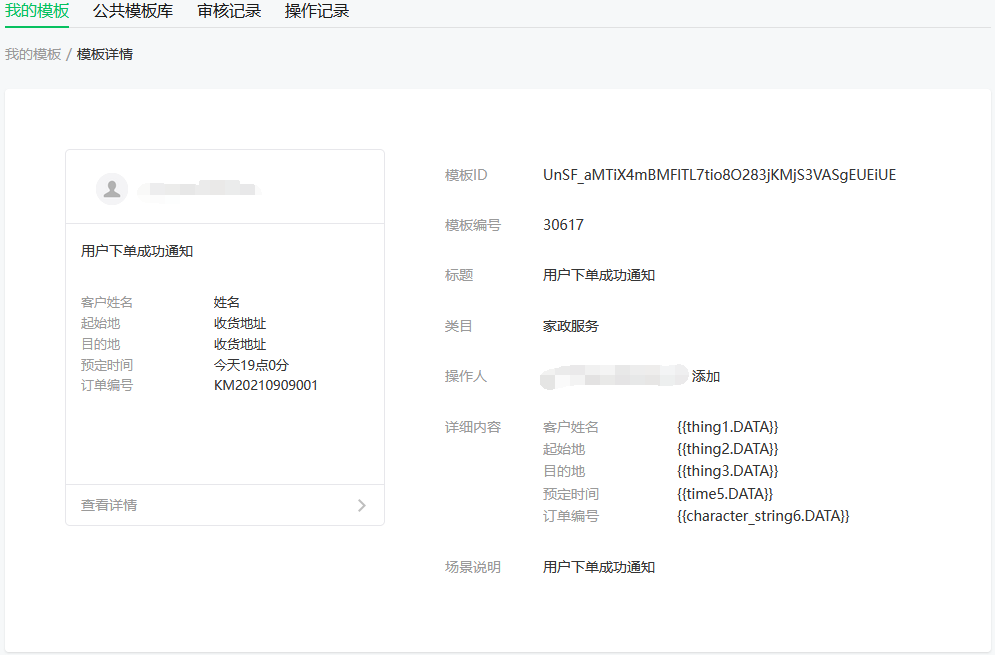

### 消息发送

在实际开发中，订阅消息的发送一般是在服务器端进行，也就是由服务器主动发送给曾经使用过这个小程序的用户，小程序本身并不具备接收消息的功能，而是由微信中的`服务通知`功能将消息转达给用户。并且为了证明某个用户使用过某个小程序，需要满足如下两个条件中的一个。
1. 支付: 用户在小程序内完成过支付行为，可允许开发者向用户在 7 天内推送有限条数的订阅消息，1 次支付可以发 3 条消息。
2. 提交表单: 当用户在小程序内发生过提交表单行为，且该表单声明为要发订阅消息，开发者需要向用户提供服务时，可允许开发者向用户在 7 天内推送有限条数的订阅消息，1 次提交表单可下发 1 条。

### 应用示例

当用户提交表单后，如果服务器收到了表单，就会向用户发送回复通知，这利用订阅消息来实现。

发送订阅消息功能涉及 3 个角色的参与，分别是小程序、服务器和微信接口。具体交互流程如下:
1. 用户在小程序中填写表单，提交给服务器。在提交的时候需要附加上 `code`，这个是通过 `wx.login()` 获取到的登录凭证。
2. 服务器收到表单后，使用自己的 `appid`、`secret` 和用户的 `code` 请求微信接口，获取用户的 `openid`。
3. 服务器向用户发送订阅消息，需要先使用自己的 `appid`、`secret` 请求微信接口，获取 `access_token`(访问令牌)，然后再使用 `access_token` 和用户的 `openid`，以及订阅消息的模板 id 和消息内容请求微信接口，发送订阅消息。
4. `微信接口将订阅消息推送给用户`，用户就会在信息的 `服务通知` 中看到消息。

要充分理解上面的消息流，这是完成订阅消息编码过程的关键。
- `appid` 和 `secret` 确定一个小程序
- `access_token` 让服务端可以与微信接口服务交互
- `openid` 让服务端通过微信接口服务与小程序交互

注: 服务端要使用的 `appid` 和 `secret` 需要从 `小程序管理后台` 中获取。点击 `开发管理`，选择 `开发设置` 标签页进入:

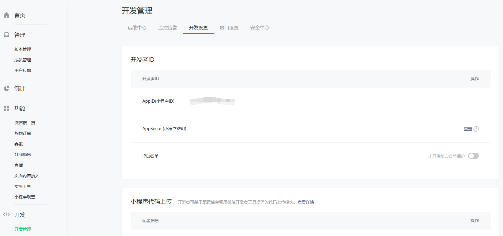

如上图: appid 对应 `AppId`，secret 对应 `AppSecret`。

> 要妥善保护好小程序密钥。

可能的报错:

http 返回码是 200 ok，但是返回的 data 数据如下:
```js
  {
    errcode: 40029,
    errmsg: 'invalid code, rid: 62f74d43-40d197df-1586f510'
  }
```
这并不程序本身的问题，可能是 code 过期了，小程序需要重新调用 `wx.login` 再拿一次 code 。

- [小程序示例](t/subscribe)
- [交互服务器]

运行上面的示例程序后，顺利的话，服务端最终会返回如下格式内容:
```js
  { errcode: 0, errmsg: 'ok', msgid: ??? }
```
同时微信的 `服务通知` 会接收到如下信息:

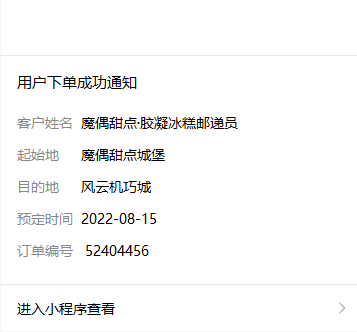
