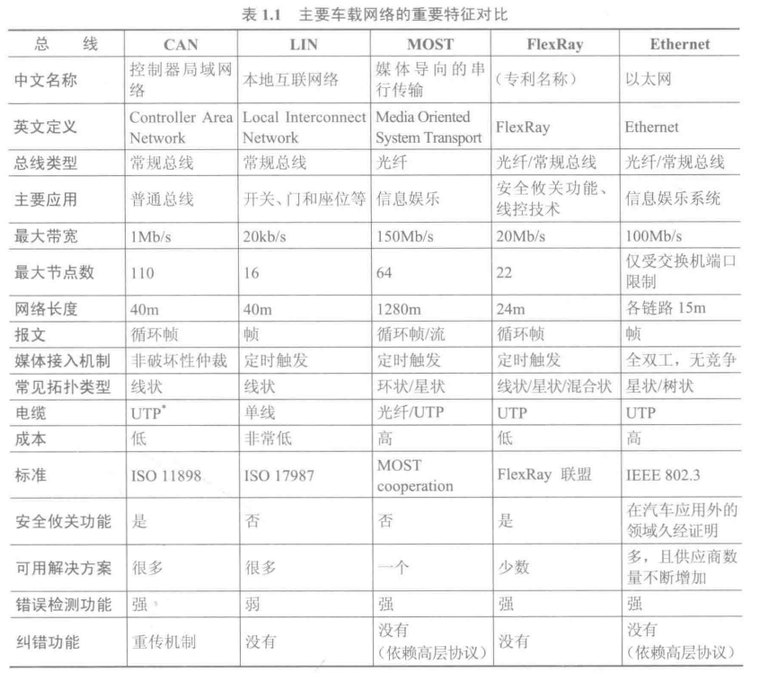

### CAN 总线概述

CAN (Controller Area Network, 控制器局域网络)总线是一种串行数据通信协议，其通信接口集成了 CAN 协议的物理层和数据链路层功能，可完成对通信数据的成帧处理，包括位填充、数据块编码、循环冗余检验、优先级判别等工作。

CAN 总线的特点主要如下:
1. 可以多主方式工作，网络上任意一个节点均可以在任意时刻主动地向网络上的其他节点发送信息，不分主从，通信方式灵活。
2. 采用无破坏的基于优先级的逐位仲裁，标识符越小，优先级越高。若两个节点同时向网络上传送数据，优先级高的报文获得总线访问权，优先级低的报文会在下一个总线周期自动重发。
3. 可以采用点对点、点对多及全局广播等传送方式收发数据。
4. 直接通信距离最远可达 10km(速率 5kb/s 以下)。
5. 通信速率最高可达 1Mb/s(此时距离最长40m)。
6. 节点数实际可达 110 个。
7. 每帧信息都有 CRC 校验及其他检错措施，数据出错率极低。
8. 通信介质可采用双绞线、同轴电缆和光导纤维，一般采用廉价的双绞线即可，无特殊要求。
9. 节点在错误严重的情况下，具有自动关闭总线的功能，以切断它与总线的联系，使总线上的其他操作不受影响。

### LIN 总线概述

LIN(Local Interconnect Network, 局域互联网络)是专门为汽车开发的一种低成本串行通信网络，是对现有汽车多元化网络的一个补充。

LIN 总线是一种串行通信协议，能够有效地支持分布式汽车应用领域内的机电一体化节点控制。

LIN 总线的主要特点如下:
1. 单主控器/多从设备模式，无需仲裁机制。
2. 基于通用 UART 接口几乎所有微控制器都具备 LIN 必需的硬件。
3. 从机节点不需石英或陶瓷振荡器就能实现自同步，节省了从设备的硬件成本。
4. 信号传播时间可预先计算出来的确定性信号传播。
5. 低成本单线实现方式。
6. 传输速率最高可达 20kb/s 。
7. 不需要改变 LIN 从节点的硬件和软件就可以在网络上增加节点。
8. 通常一个 LIN 上节点数目小于 12 个，共有 64 个标志符。
9. 极少的信号线即可实现国际标准 ISO 9141 的规定。

典型的 LIN 总线应用是汽车中的联合装配单元，例如，门、方向盘、座椅、空调、照明、湿度传感器和交流发电机等。在 LIN 实现的系统中，通常将模拟信号量用数字信号量所替换，这将使总线性能得到优化。

### 典型车载网络架构

根据网络成本和复杂度的不同，仅对市场上的车载网络架构粗略的分类为紧凑型和豪华型。

1. 紧凑型(Compact Class)总线架构也是目前国内外汽车厂商主要采用的结构类型，主要包括 Drive CAN(动力CAN)、Instrument Cluster CAN(仪表CAN)、Infotainment CAN(娱乐CAN)、Body CAN(车身CAN)及Diagnostics CAN(诊断CAN)等。根据需要可以在相关 CAN 总线上外加 LIN 总线，实现一些控制和数据传输功能。

2. 豪华型(Luxury Class)结构相对成本比较高，包括 Drive CAN、Instrument Cluster CAN、MOST 环、Body CAN、Diagnostics CAN 及 Distance Control CAN(远程控制总线CAN)等。与紧凑型总线架构的主要区别是使用了 MOST 环和复杂的 Gateway(网关)，实现了多媒体的快速传输。

由于 Ethernet(以太网)总线相对 MOST 总线更加稳定和经济，目前在开发的很多豪华车型已经开始使用 Ethernet 代替 MOST 。

