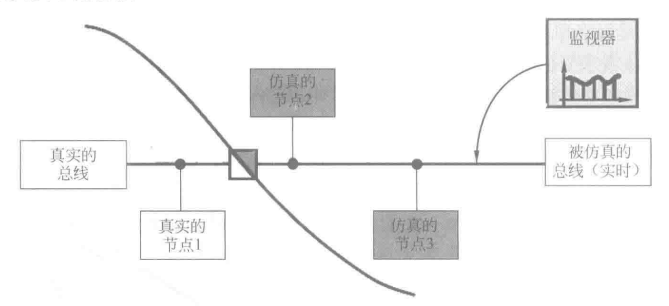

CANoe 是 Vector 公司推出的一款总线开发环境，全称为 CAN open environment 。

CANoe 是网络和 ECU 开发、测试和分析的专业工具，支持总线网络开发从需求分析到系统实现的整个开发过程。

### CANoe 在 ECU 项目开发中的作用

根据车载 ECU 项目的开发进度可以分为以下三个阶段:

1. 全仿真网络系统

CANoe 主要是针对有具体数据定义的报文进行事件处理，也就是借助 CAPL 实现网络节点的行为。CAPL 是专门为 CANoe 设计的一种类似于 C 的语言，利用它可以对报文的接收、系统变量/环境变量的改变、错误的出现等事件进行处理。

在这个阶段，可以利用所设计的完整网络仿真系统进行离线的仿真，检验各个节点功能的完整性及网络的合理性。

2. 真实节点和部分仿真节点共存

接下来，用户可以将自己开发的真实 ECU 节点替换仿真系统中对应的仿真节点，利用总线接口和 CANoe 剩余的节点相连接，测试自己节点的功能，如通信、纠错等。

出于这样的原因，在很多场合项目组成员习惯将 CANoe 仿真工程称为 RBS(Rest Bus Simulation，剩余总线仿真)。这样，每个供应商的节点可以并行开发，不受其他节点开发进程的影响。

3. 全真实节点的网络系统

在开发的最后阶段，所有 ECU 的真实节点都被逐一地连接到总线系统中，此前的仿真节点会逐一从总线上断开。开发者可以在真实节点的条件下，验证总线的负载情况和其他的设计要求是否满足。

在这个阶段，CANoe 主要充当网络系统分析、测试和诊断的工具。在这个过程中，整个系统包括各个功能节点都能被详细地检查到。

### CANoe 的硬件配置

为了能正确接收总线上的报文，还需要设置接收过滤器。用户可以通过配置硬件过滤器，从硬件层直接滤掉不想接收的 CAN 报文。
