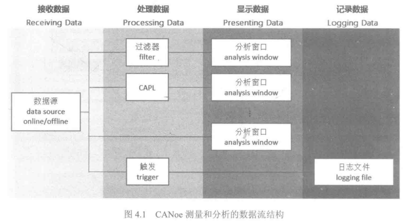

CANoe 的测量和分析是基于数据流方向的，从数据源到处理数据、显示数据和记录数据，数据可以根据需要被单独处理。

- 接收数据: 数据源可以是实时数据(online)或者离线数据(offline)。实时数据可以由仿真节点产生，也可以来自相连的硬件。离线数据是一个包含记录数据的文件。
- 处理数据: 为了更清楚地显示出用户所关心的数据，可以使用过滤器(filter)将期望显示的数据分离出来。过滤器不是必需的，用户可以根据需要添加和设置。
- 显示数据: CANoe 提供各种不同的分析技术，分析窗口可以显示基于总线(bus)、报文(message)或者信号(signal)的数据。有些总线有自己特定的分析窗口。
- 记录数据: 为了便于后续的数据分析，测量数据可以按时序先后记录到 Logging 文件中。可以在 Measurement Setup 窗口中设置是否保存记录文件，为了减少 Logging 文件记录过多的无用数据，可以使用 trigger 设置触发记录的条件。
