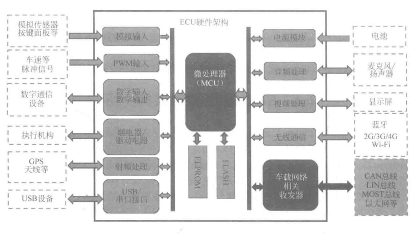
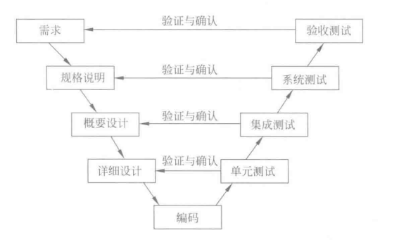

ECU(Electronic Control Unit)，即电子控制单元，泛指汽车上所有电子控制系统，可以是转向 ECU，也可以是调速 ECU、空调 ECU 等。

### ECU 架构

一个 ECU 主要由硬件和软件两大部分组成。硬件主要负责采集输入信号、输出控制信号、通信接口控制等。软件主要是基于嵌入式系统对输入信号进行运算，并将运算结果转换为控制信号输出。

1. 硬件架构

ECU 硬件架构主要由微处理器(Microcontroller Unit,MCU)和外围电路组成。ECU 的核心部件主要是 MCU，根据 ECU 不同的功能需求，可以选用不同型号的 MCU。

2. 软件架构

对于软件构架，不同的 ECU，功能复杂程度不一样，软件需要处理的信号、算法差异也很大。复杂 ECU 的系统如车载导航，需要使用 Linux/Android 等操作系统来处理很多复杂任务。

### 软件开发的 V 模型

又称为 RAD(快速应用开发)模型，它通过开发和测试同时进行的方式缩短开发周期，提高开发效率。

在 V 模型中，测试过程被加在开发过程的后半部分，单元测试关注的是检测代码的开发是否符合详细设计的要求。集成测试所关注的是检测此前测试过的各组成部分是否能完好地结合到一起。系统测试所关注的是检测已集成在一起的产品是否符合系统规格说明书的要求，而验收测试则检测是否符合最终用户的需求。

与一些消费类产品相比，车载 ECU 的软件除了具有一些嵌入式系统的特征，还有一些自己的特殊特征:
- 安全性: 数据存储、通信安全等安全功能需满足相关安全强制要求(如 ISO 26262 等)
- 稳定性: 严格的环境测试和机械性能要求
- 电源管理: 低功耗、电源宽范围和抗干扰等要求
- EMC 要求: 严格抗干扰和低辐射的要求
- 车载网络支持: 目前常见 CAN、LIN、MOST 和以太网等
