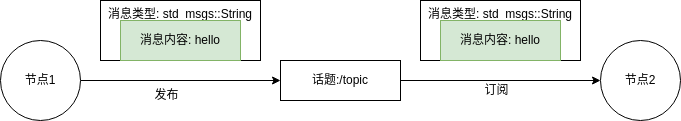
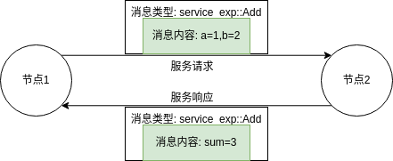
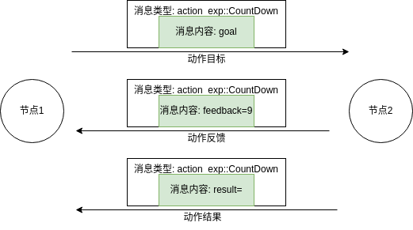

ROS 是一个分布式的通信框架，它通过以下方式进行节点之间的通信。

各节点首先与主节点 master (通过 XMLRPC、XML、RPC、HTTP 等)建立连接，向主节点中注册自己的节点信息。之后各节点之间通过 TCP、UDP 等进行数据的传输。

ROS 网络通信时的环境变量 `ROST_MASTER_URI` 和 `ROS_HOSTNAME`。也可以通过如下方式进行更改:
```sh
    export ROST_MASTER_URI=http://localhost:11311
    export ROS_HOSTNAME=localhost
```

### 话题通信(topic)



标准消息类型:
- [std_msgs](https://wiki.ros.org/std_msgs)
- [sensor_msgs](https://wiki.ros.org/sensor_msgs)
- [geometry_msgs](https://wiki.ros.org/geometry_msgs)
- [nav_msgs](https://wiki.ros.org/nav_msgs)
- [actionlib_msgs](https://wiki.ros.org/actionlib_msgs)

自定义消息类型:
- ...

### 服务通信(service)



有标准服务类型，但一般自定义服务类型。定义格式示例如下:
```s
int64 a
int64 b
---
int64 sum
```
`---` 是分隔符。

### 动作通信(action)



有标准动作类型，但一般自定义动作类型。定义格式示例如下:
```s
#goal define
int32 target_number
int32 target_step
---
#result define
bool finish
---
#feedback define
float32 count_percent
int32 count_current
```
