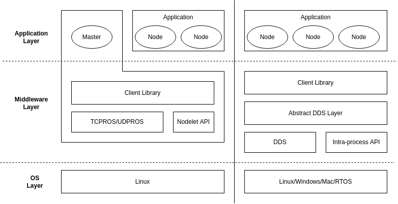

### 内容

- [命令行工具](01_命令行工具.md)
- [节点通信](02_节点通信.md)

### 其他

ROS 和 ROS2.0 的区别:

| ROS1 | ROS2 |
|:-----|:-----|
| 中心化网络 | 去中心化网络 |
| XMLRPC/TCP/UDP | DDS |
| Linux | Linux/Windows/Mac/RTOS |
|       | 向下兼容 ROS1 |

目前多使用 ROS1 ，ROS2 仍待发展完善。

