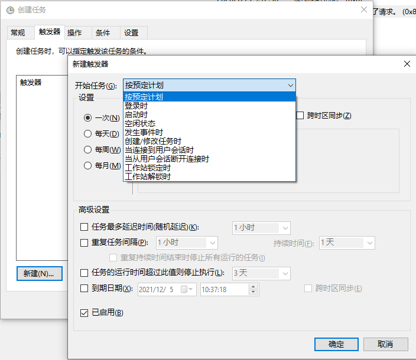

## 说明

**在命令行中运行的一切对象都可以配置为任务计划，包括命令行工具、脚本、应用程序、快捷方式、文档等，也可以在其中指定命令行参数。**

本地系统与远程系统上的任务计划都是通过 `Task Scheduler` 服务激活的，对于需要在其上执行任务计划的任意系统，都必须首先启动该服务。


## 认识 Windows 的任务计划

#### Windows 的任务计划类型

|   类型   | 描述 |
|:---------|:-----|
| 标准任务 | 自动执行的例行任务，执行日常维护操作。对用户可见，并可以在必要时修改 |
| 隐藏任务 | 自动执行的特定系统任务。默认对用户不可见，多数时候也不应该修改 |


#### Windows 系统任务计划

在任务计划程序库中， Microsoft\Windows 下与 Microsoft\Windows Defender 下的任务为系统任务。

Microsoft\Windows 下的任务主要用于完成计算机上很多后台的维护操作， Microsoft\Windows Defender 下的任务则用于自动扫描恶意软件。


#### 任务计划程序要素

可以通过 `taskschd.msc` 命令打开任务计划程序管理界面。

<h1 align="center">
    
</h1>

任务计划程序的一些要素如下:

| 选项   | 描述 |
|:-------|:-----|
| 名称   | 表示任务名，可以是任意字符串 |
| 状态   | 表示任务当前状态 |
| 触发器 | 列出了与该任务相关联的触发器 |
| 下次运行时间 | 表示该任务下次要运行的日期时间。Never表示该任务运行一次之后不再运行 |
| 上次运行时间 | 表示该任务上次运行的日期时间，Never表示该任务尚未运行过 |
| 上次运行结果 | 表示错误退出代码。0表示没有发生错误，其他数值表示发生了某种类型的错误 |
| 创建者 | 表示创建该任务的用户名 |
| 创建时间 | 表示该任务创建的日期与时间 |

*状态*选项可取值描述:

|  可取值  | 描述 |
|:---------|:-----|
| 正在运行 | 任务计划程序已启动该任务，该任务正在运行中 |
| 准备就绪 | 该任务已激活，准备就绪，并等待触发 |
| 禁用     | 该任务被禁用，不再运行 |
| 失败     | 该任务由于某些故障无法启动 |


#### 任务计划属性

| 属性名称 | 描述 |
|:---------|:-----|
| 常规     | 创建该任务时所指定的任务名称与描述，以及安全选项 |
| 触发器   | 指定了任务开始与结束的环境 |
| 操作     | 定义了任务启动时执行的操作，可以是命令行工具、脚本、应用程序等 |
| 条件     | 限定了任务启动与终止的条件 |
| 设置     | 影响任务的行为 |
| 记录     | 展示了任务运行或尝试运行时生成的事件(Win10禁用) |


#### 触发器

<h1 align="center">
    
</h1>

基本配置方式有 3 种

|          配置方式            | 示例 |
|:-----------------------------|:-----|
| 在特定的时间与日期运行       | 比如，在2019年8月10日上午9:45运行 |
| 在指定的时间间隔运行         | 比如，在每个星期一、星期三、星期五的下午5:45运行 |
| 在特定系统事件发生发生时运行 | 比如，在某用户登录系统时运行 |

以上几个运行条件可以进行合理组合后，以其他方式运行。

除了自己设置触发器之外，系统也提供了下面几种触发器:
- 系统启动
- 系统登录
- 系统空闲
- Windows事件
- 用户会话


## 监控计划任务

计划任务程序的运行日志存储于事件查看器(`eventvwr`)的 Applications And Services Logs\Microsoft\Windows\TaskScheduler\Operational 中。

对任务计划程序日志进行检查时，会得到如下信息:
1. 记录了 Task Scheduler 服务启动与退出(终止)的时间
2. 记录了任务启动、完成运行的时间，以及退出代码或结果代码。0意味着该任务正常运行和终止，其他值都表示发生了某种错误
3. 记录了任务计划程序启动任务时产生的告警与错误消息

计划任务程序默认存储在 `%SystemRoot%\System32\Winevt\Logs` 文件夹下，名为 `Miscrosoft-Windows-TaskScheduler/Operational.evtx`


## 创建任务

#### 基本任务创建

建议普通用户在创建任务时在 任务计划程序的 WPD 层次下进行，无论是基本任务或是高级任务。

基本任务包括触发器与操作，用于快速设置常见的计划任务。

默认情况下，某用户创建的基本任务以该用户的登录帐号运行，并且只有在该用户登录的情况下才运行。这些任务以标准用户权限运行，而不会以最高权限运行。*基本任务运行3天后会终止运行。*

创建步骤
1. 打开任务计划程序GUI，在左框中选择要创建的层次，右击需要存储待创建任务的结点，选择<strong>创建基本任务</strong>，之后将启动<strong>创建基本任务</strong>向导。
2. 在<strong>创建基本任务向导</strong>页面，为待创建任务键入任务名称及其描述信息。
3. 在<strong>任务触发器</strong>页面，为该任务选择运行方式。


#### 高级任务创建

高级任务包括触发器、操作、条件、设置，主要提供给高级用户或管理员使用。

默认情况下，任务以创建者帐号或指定用户帐号的标准权限运行，而非最高可能权限。

创建步骤
1. 打开任务计划程序GUI，在左框中选择要创建的层次，右击需要存储待创建任务的结点，选择<strong>创建任务</strong>，之后将启动<strong>创建任务</strong>向导。
2. 在<strong>创建任务</strong>页面，在<strong>常规</strong>选项卡中，为待创建任务键入任务名称及其描述信息。
3. 在<strong>触发器</strong>选项卡上，可以使用其上提供的选项来创建与管理触发器。根据实际需要，可以创建多个互不冲突的触发器。
4. 在<strong>操作</strong>选项卡上，操作可以是启动一个程序、发送一封电子邮件或显示一条信息。


#### 其他任务操作

如果临时性地不使用某任务，可以对其进行禁用。如果需要使用该任务，就可以对其进行激活。通过对任务的激活与禁用，而不是删除，可以节省下重新配置任务设置所需的时间。

导出导入任务
- 可以将任务导出为一个 XML 配置文件供其他计算机使用。
- 可以将上述 XML 导入到一个计算机中任务计划程序中。

可以右击任务，选择<strong>运行</strong>，立即运行任务，而不是要等到运行时间到达。


## 使用 Schtasks 设置任务计划

#### 使用 Schtasks/Create 创建任务计划
   
语法: `Schtasks /Create /TN TaskName /TR TaskToRun /SC ScheduleType [/Mo Modifier]`

说明: TaskName 为字符串形式的任务名， TaskToRun 指定了要运行的程序、命令行工具、脚本所在位置的文件路径， ScheduleType 指定了运行计划， Modifier 用于对运行计划进行修改。

可用于 Schtasks/Create 的调度类型

|   调度类型   |   描述  | Modifier值 |
|:-------------|:--------|:-----------|
|   Minute     |  任务在指定的时间间隔(以分钟为计数单位)运行 | /mo 1~1439, 任务两次运行之间间隔的分钟数，默认值为 1 |
|   Hourly     |  任务在指定的时间间隔（以小时为计数单位）运行 | /mo 1~23, 任务两次运行之间间隔的小时数，默认值为 1 |
|   Daily      |  每天运行任务，或每隔 n 天运行任务 | /mo 1~365, 任务两次运行之间间隔的天数，默认值为 1 |
|   Weekly     |  每星期或每隔 n 个星期的某天运行任务 | /mo 1~52, 任务两次运行之间间隔的星期数，可以使用 /d 指定在星期的具体哪几天运行。 Mon, Tue, Wed, Thu, Fri, Sat, Sun 分别指代周一到周日, * 指代星期中的每一天。默认周一运行一次 |
|   Monthly    |  每个月或每隔 N 个月的某天运行任务 | /mo 1~12, 任务两次运行之间间隔的月数，可以使用 /d Mon-Sun 指定在某个月的星期几运行, * 指代某个月的每一天。默认每个月第一天运行一次 |
|   Once       |  任务在指定的日期与时间运行一次 | |
|   OnEvent    |  指定的事件发生或指定的事件日志中有事件发生时运行任务 | /mo XPathString, 其中, XPathString 为 XPath 事件查询字符串,用于标识触发任务的事件 |
|   OnStart    |  系统启动时运行任务 | |
|   OnLogon    |  有用户登录时运行任务 | |
|   OnIdle     |  系统空闲了指定的时间间隔后运行任务 | /i 1~999, 任务启动前系统空闲的分钟数 |
   
关于 `Monthly` 的更细节使用:

- 用于指定每个月的特定日期，参数包括 /mo 与 /m, 或 /m 与 /d

    <pre>/mo lastday, 代表某个月的最后一天, /m Jan, Feb,...,DEC, 设置具体哪一个月份, /d 1~31, 设定某月的哪一天</pre>

- 用于指定某个月的特定星期

    <pre>/mo first|Second|Third|Fourth|Last,设置某月中的哪个星期. /d Mon-Sun, 设置某星期的星期几. /m Jan,Feb,...,Dec,设置具体哪一个月份</pre>


示例:

<pre>
<strong>/ST StartTime</strong>
<strong>/ET EndTime</strong>
<strong>/SD StartDay</strong>
<strong>/ED EndDay</strong>
</pre>

创建一个任务,该任务在系统启动时运行
```
   Schtasks /Create /TN "SysChecks" /TR /path/to/helloworld.bat /SC OnStart
```

创建一个任务,该任务在系统空闲时间超过10分钟后运行
```
   Schtasks /Create /TN "SysChecks" /TR /path/to/helloworld.bat /SC OnIdle /i 10
```

创建一个任务,该任务每隔15分钟运行一次
```
   Schtasks /Create /TN "SysChecks" /TR /path/to/helloworld.bat /SC Minute /mo 15
```
 
创建一个任务,该任务每隔5小时运行一次
```
   Schtasks /Create /TN "SysChecks" /TR /path/to/helloworld.bat /SC Hourly /mo 5
```
 
创建一个任务,该任务每隔2天运行一次
```
   Schtasks /Create /TN "SysChecks" /TR /path/to/helloworld.bat /SC Daily /mo 2
```
 
创建一个任务,该任务每隔两个星期的星期一(默认的运行日期)运行一次
```
   Schtasks /Create /TN "SysChecks" /TR /path/to/helloworld.bat /SC Weekly /mo 2
```
 
创建一个任务,该任务在每个星期的周一与周五运行一次
```
   Schtasks /Create /TN "SysChecks" /TR /path/to/helloworld.bat /SC Weekly /d mon,fri
```
 
创建一个任务,该任务在每个月的第一天运行一次
```
   Schtasks /Create /TN "SysChecks" /TR /path/to/helloworld.bat /SC Monthly
```

创建一个任务,该任务在每隔一个月的第5天运行一次    
```
   Schtasks /Create /TN "SysChecks" /TR /path/to/helloworld.bat /SC Monthly /mo 2 /d 5
```

创建一任务,该任务在4月、8月、12月的第一个星期一运行
``` 
   Schtasks /Create /TN "SysChecks" /TR /path/to/helloworld.bat /SC monthly /mo first /d mon /m apr,aug,dec
```

在午夜启动每小时执行一次的任务
```
   Schtasks /Create /TN "SysChecks" /TR /path/to/helloworld.bat /SC Hourly /ST 00:00
```

在上午3点启动每小时执行一次的任务，在上午7点结束
```
   Schtasks /Create /TN "SysChecks" /TR /path/to/helloworld.bat /SC Hourly /ST 03:00 /ET 07:00
```

在2019年2月20日上午3点启动任务，每星期执行一次
```
   Schtasks /Create /TN "SysChecks" /TR /path/to/helloworld.bat /SC Weekly /ST 03:00 /SD 2019/02/20
```
 
在2019年2月20日上午3点启动任务，每星期执行一次，在2019年3月15日上午2:59终止任务
```
   Schtasks /Create /TN "SysChecks" /TR /path/to/helloworld.bat /SC Weekly /ST 03:00 /SD 2019/02/20 /ET 02:59 /ED 2019/03/15
```
 
如果路径包含空格，需要用双引号进行封装。如果需要向任务指定的程序、工具、脚本传递参数，可以将其附加在指定该任务的文件路径之后。如果参数中包含空格，也应该使用双引号对其进行封装。
```
   Schtasks /Create /TN "SysChecks" /TR "C:\My Scripts\sch.bat" "Full Checks"
```


#### 使用 Schtasks/Change 改变任务计划

语法: `Schtasks /Change /TN TaskName ParametersToChange`

说明: 基本参数大致可以参考 `Schtasks /Create`

示例:

改变要运行的脚本
```
   Schtasks /Change /TN "SysChecks" /TR F:\arrange\windows\bat\for.bat
```
 
将任务改变为在2009年3月1日上午7点开始，每星期运行一次，在2019年3月30日上午6:59结束
```
   Schtasks /Change /TN "SysChecks" /ST 07:00 /SD 2019/01/08 /ET 06:59 /ED 2019/03/30
```

禁用任务
```
   Schtasks /Change /TN "SysChecks" /Disable
```

激活任务
```
   Schtasks /Change /TN "SysChecks" /Enable
```


#### 使用 Schtasks/Query 查询已配置的任务

语法: `Schtasks /Query [/FO format] [/V] [/TN TaskName] [/XML xml_type]`

说明: `/FO` 指定输出格式，可取值为 `table` `list` `csv`，缺省为 `table`。 `/V` 表示详细输出。 `/TN` 指定任务名。 `/XML` 指定以xml格式输出，xml_type 一般取 `One`。 `/XML` 不能与 `/FO` `/V` `/NH` 合用。

如果运行时显示 "错误: 无法加载列资源"，可以先在运行命令之前运行 chcp 437 命令。

示例:

以列表形式显示所有任务
```
   Schtasks /Query /FO list
```

查询指定任务
```
   Schtasks /Query /FO list /TN "SysChecks"
```

以xml格式显示查询的任务
```
   Schtasks /Query /TN "SysChecks" /XML one
```

   
#### 使用 Schtasks /Run 立即运行任务

语法: `Schtasks /Run /TN TaskName`

实例:

使用 `Schtasks /Run` 运行命令并不会影响该任务的调度计划，也不会影响下一次任务运行的时间
```
   Schtasks /Run /TN "SysChecks"
```

#### 使用 Schtasks /End 终止运行中的任务

语法: `Schtasks /End /TN TaskName`

实例:

如果该任务本来正处于运行状态，则执行上面命令后，该任务被终止
```
   Schtasks /End /TN "SysChecks"
```


#### 使用 Schtasks /Delete 删除任务

语法: Schtasks /Delete /TN TaskName [/F]

实例:

```
   Schtasks /Delete /TN "SysChecks"
```
